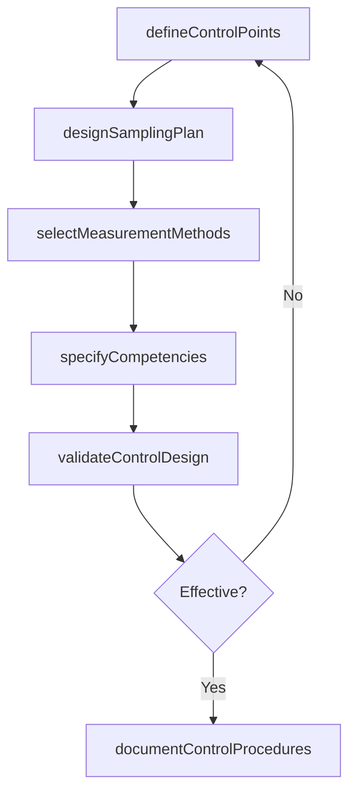

# Develop quality controls

> Business-as-Code definition for quality control development. Models the design of control points, sampling plans, measurement methods, and competency requirements for enterprise quality assurance.

## Overview

Developing controls for managing the quality of enterprise. Define the process steps for quality controls and the sampling plan. Identify the tools and methods to measure quality. Define the competencies required.

## Process Hierarchy

```mermaid
graph TD
    A[Develop quality controls]
    A --> B[Define process steps for controls (or integration points)]
    A --> C[Define sampling plan]
    A --> D[Identify measurement methods]
    A --> E[Define required competencies]
```

## GraphDL

```yaml
develop:
  object: Quality Controls
  actor: QualityEngineer
  result: QualityControlPlan
```

## Actions

| Action | Description |
|--------|-------------|
| defineControlPoints | Establish inspection and verification steps within process flows |
| designSamplingPlan | Create statistical sampling parameters including size, frequency, and acceptance criteria |
| selectMeasurementMethods | Choose tools and techniques for quality measurement at each control point |
| specifyCompetencies | Define the skills and certifications required for quality control personnel |
| validateControlDesign | Test control effectiveness through pilot runs and alpha testing |
| documentControlProcedures | Record standardized procedures for each quality control activity |

## Events

| Event | Description |
|-------|-------------|
| controlPointsDefined | Quality control integration points established in process flow |
| samplingPlanDesigned | Statistical sampling plan created with acceptance criteria |
| measurementMethodsSelected | Quality measurement tools and techniques chosen |
| competenciesSpecified | Required skills and certifications documented for QC roles |
| controlDesignValidated | Quality controls tested and confirmed effective |
| controlProceduresDocumented | Standardized QC procedures recorded and approved |

## Searches

| Search | Description |
|--------|-------------|
| getControlPlans | Retrieve quality control plans by process, product, or facility |
| findSamplingPlans | List sampling plans by type, product line, or status |
| getMeasurementMethods | Retrieve approved measurement methods by control point |
| getCompetencyRequirements | List required competencies by quality control role |

## Process Flow



## RACI Matrix

| Activity | Responsible | Accountable | Consulted | Informed |
|----------|-------------|-------------|-----------|----------|
| defineControlPoints | QualityEngineer | QualityManager | ProcessOwners | Operations |
| designSamplingPlan | QualityEngineer | QualityManager | Statistician | ProductionManagers |
| selectMeasurementMethods | QualityEngineer | QualityManager | Metrology | IT |
| specifyCompetencies | QualityManager | VP Quality | HR | TrainingDepartment |

## Sub-Processes

| ID | Name | Description |
|----|------|-------------|
| 13.3.1.3.1 | Define process steps for controls (or integration points) | Establishing the steps for developing quality controls. Conduct Alpha testing. Have the product team |
| 13.3.1.3.2 | Define sampling plan | Establishing a detailed summary including measures, on which material, in what manner, and by whom.  |
| 13.3.1.3.3 | Identify measurement methods | Using tools to measure quality. Use tools such as quality improvement oversight system tool, perform |
| 13.3.1.3.4 | Define required competencies | Defining the competencies required for developing quality controls. Define the required competencies |

## Related Processes

| Process | Relationship |
|---------|-------------|
| 13.3.1.1 Identify quality requirements | Upstream - requirements define what controls must assure |
| 13.3.1.2 Develop quality standards | Upstream - standards provide the criteria for control design |
| 13.3.2.1 Test against quality plan | Downstream - controls are exercised through quality testing |

## Related Departments

| Department | Role |
|-----------|------|
| Quality Assurance | Primary owner of quality control design and validation |
| Operations | Implements controls within production and service processes |
| Metrology | Provides measurement expertise and tool calibration |
| Human Resources | Manages competency certifications and training records |

## Related Occupations

| Occupation | Involvement |
|-----------|-------------|
| Quality Engineer | Designs control points, sampling plans, and measurement methods |
| Statistician | Advises on sampling plan statistical validity |
| Metrologist | Selects and validates measurement instruments |

## KPIs

| KPI | Description | Unit |
|-----|-------------|------|
| Control Coverage | Percentage of critical process steps with defined quality controls | % |
| Sampling Plan Validity | Percentage of sampling plans meeting statistical confidence requirements | % |
| Competency Compliance | Percentage of QC personnel meeting defined competency requirements | % |
| Control Effectiveness Rate | Percentage of controls detecting defects before downstream impact | % |

## Usage

```typescript
import { developQualityControls } from '@headlessly/develop-quality-controls'

const controls = developQualityControls()

// Define control points for a manufacturing process
const controlPlan = await controls.defineControlPoints({
  processId: 'PRC-circuit-board-assembly',
  stages: ['incoming-materials', 'solder-application', 'component-placement', 'final-test'],
  controlType: 'in-process'
})

// Design a sampling plan for incoming inspection
const samplingPlan = await controls.designSamplingPlan({
  controlPointId: controlPlan.points[0].id,
  standard: 'ANSI-ASQ-Z1.4',
  inspectionLevel: 'II',
  aql: 1.0
})
```
