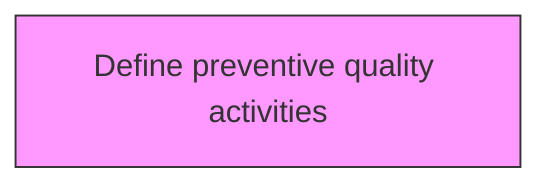
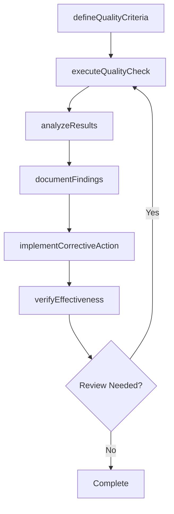

# Define preventive quality activities

> Business-as-Code definition for define preventive quality activities. Models the process of identifying gaps in customer requirements and determining whether the gap will be mitigated through preventive quality activities or deemed as acceptable risk.

## Overview

Identifying gaps in customer requirements and determining whether the gap will be mitigated through preventive Quality activities or deemed as acceptable risk. The goal of any preventive quality activities is to create provisions to prevent, control, or reduce the risk of not meeting the CtQCs. In addition, any standard methodology that will be used to design or conduct preventive Quality activities are defined and documented.

## Process Hierarchy



## GraphDL

```yaml
define:
  object: Preventive Quality Activities
  actor: QualityManager
  result: preventiveQualityActivitiesResult
```

## Actions

| Action | Description |
|--------|-------------|
| defineQualityCriteria | Establish measurable quality criteria for preventive quality activities |
| executeQualityCheck | Perform quality inspection or test for preventive quality activities |
| analyzeResults | Evaluate quality data and identify trends for preventive quality activities |
| documentFindings | Record quality findings and observations for preventive quality activities |
| implementCorrectiveAction | Take corrective action based on preventive quality activities findings |
| verifyEffectiveness | Confirm that corrective actions resolved preventive quality activities issues |

## Events

| Event | Description |
|-------|-------------|
| qualityCriteriaDefined | Measurable quality criteria established |
| qualityCheckExecuted | Quality inspection or test performed |
| resultsAnalyzed | Quality data evaluated and trends identified |
| findingsDocumented | Quality findings and observations recorded |
| correctiveActionImplemented | Corrective action taken based on findings |
| effectivenessVerified | Corrective action effectiveness confirmed |

## Searches

| Search | Description |
|--------|-------------|
| findPreventiveQualityActivities | Retrieve preventive quality activities records filtered by status, date, or scope |
| getPreventiveQualityActivitiesDetails | Get detailed information for a specific preventive quality activities record |
| listPreventiveQualityActivitiesHistory | Query the history of changes and updates to preventive quality activities |
| getActiveItems | List currently active items related to preventive quality activities |

## Process Flow



## RACI Matrix

| Activity | Responsible | Accountable | Consulted | Informed |
|----------|-------------|-------------|-----------|----------|
| defineQualityCriteria | QualityEngineer | QualityManager | ProcessOwners | Stakeholders |
| executeQualityCheck | QualityAuditor | QualityManager | RegulatoryAffairs | Stakeholders |
| analyzeResults | QualityManager | VPQuality | Operations | Stakeholders |
| documentFindings | QualityEngineer | QualityManager | Manufacturing | Stakeholders |

## Related Processes

| Process | Relationship |
|---------|-------------|
| 13.3.1 Establish quality requirements | Upstream - requirements drive quality activities |
| 13.3.2 Evaluate performance to requirements | Parallel - testing validates quality |
| 13.3.3 Manage non-conformance | Downstream - non-conformances trigger corrective actions |

## Related Departments

| Department | Role |
|-----------|------|
| Quality | Primary owner of enterprise quality management |
| Operations | Implements quality controls in operational processes |
| Manufacturing | Applies quality standards in production environments |
| Regulatory Affairs | Ensures quality compliance with regulatory requirements |

## Related Occupations

| Occupation | Involvement |
|-----------|-------------|
| Quality Manager | Leads quality management programs |
| Quality Engineer | Designs and implements quality controls |
| Quality Auditor | Conducts quality audits and assessments |

## KPIs

| KPI | Description | Unit |
|-----|-------------|------|
| Defect Rate | Number of defects per unit of output | Per Unit |
| First Pass Yield | Percentage of units passing quality check on first attempt | % |
| Corrective Action Closure Time | Average time to close corrective actions | Days |
| Audit Finding Rate | Number of findings per audit conducted | Count |

## Usage

```typescript
import { definePreventiveQualityActivities } from '@headlessly/define-preventive-quality-activities'

const client = definePreventiveQualityActivities()

// Establish measurable quality criteria for preventive quality activities
const result = await client.defineQualityCriteria({
  scope: 'enterprise',
  period: 'Q1-2025'
})

// Perform quality inspection or test for preventive quality activities
const assessment = await client.executeQualityCheck({
  resultId: result.id,
  criteria: 'standard'
})

// Evaluate quality data and identify trends for preventive quality activities
await client.analyzeResults({
  resultId: result.id,
  format: 'detailed',
  recipients: ['stakeholders']
})
```
