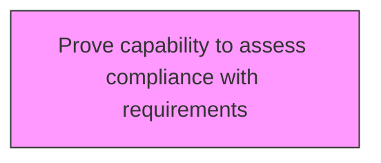
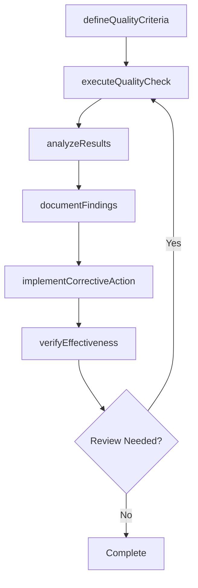

# Prove capability to assess compliance with requirements

> Business-as-Code definition for prove capability to assess compliance with requirements. Models the process of demonstrating the ability and capability to confirm and fulfill the quality requirements in front of customers, managers, employees, board members, associations, regulatory bodies, and creditors.

## Overview

Demonstrating the ability and capability to confirm and fulfill the quality requirements in front of customers, managers, employees, board members, associations, regulatory bodies, and creditors. Leverage tools and techniques such as process behavior or control charts, statistical process control, measurement system analysis, gage calibration management, and process capability analysis.

## Process Hierarchy



## GraphDL

```yaml
prove:
  object: Capability To Assess Compliance With Requirements
  actor: QualityManager
  result: capabilityToAssessComplianceWithRequirementsResult
```

## Actions

| Action | Description |
|--------|-------------|
| defineQualityCriteria | Establish measurable quality criteria for capability to assess compliance with requirements |
| executeQualityCheck | Perform quality inspection or test for capability to assess compliance with requirements |
| analyzeResults | Evaluate quality data and identify trends for capability to assess compliance with requirements |
| documentFindings | Record quality findings and observations for capability to assess compliance with requirements |
| implementCorrectiveAction | Take corrective action based on capability to assess compliance with requirements findings |
| verifyEffectiveness | Confirm that corrective actions resolved capability to assess compliance with requirements issues |

## Events

| Event | Description |
|-------|-------------|
| qualityCriteriaDefined | Measurable quality criteria established |
| qualityCheckExecuted | Quality inspection or test performed |
| resultsAnalyzed | Quality data evaluated and trends identified |
| findingsDocumented | Quality findings and observations recorded |
| correctiveActionImplemented | Corrective action taken based on findings |
| effectivenessVerified | Corrective action effectiveness confirmed |

## Searches

| Search | Description |
|--------|-------------|
| findCapabilityToAssessComplianceWithRequirements | Retrieve capability to assess compliance with requirements records filtered by status, date, or scope |
| getCapabilityToAssessComplianceWithRequirementsDetails | Get detailed information for a specific capability to assess compliance with requirements record |
| listCapabilityToAssessComplianceWithRequirementsHistory | Query the history of changes and updates to capability to assess compliance with requirements |
| getActiveItems | List currently active items related to capability to assess compliance with requirements |

## Process Flow



## RACI Matrix

| Activity | Responsible | Accountable | Consulted | Informed |
|----------|-------------|-------------|-----------|----------|
| defineQualityCriteria | QualityEngineer | QualityManager | ProcessOwners | Stakeholders |
| executeQualityCheck | QualityAuditor | QualityManager | RegulatoryAffairs | Stakeholders |
| analyzeResults | QualityManager | VPQuality | Operations | Stakeholders |
| documentFindings | QualityEngineer | QualityManager | Manufacturing | Stakeholders |

## Related Processes

| Process | Relationship |
|---------|-------------|
| 13.3.1 Establish quality requirements | Upstream - requirements drive quality activities |
| 13.3.2 Evaluate performance to requirements | Parallel - testing validates quality |
| 13.3.3 Manage non-conformance | Downstream - non-conformances trigger corrective actions |

## Related Departments

| Department | Role |
|-----------|------|
| Quality | Primary owner of enterprise quality management |
| Operations | Implements quality controls in operational processes |
| Manufacturing | Applies quality standards in production environments |
| Regulatory Affairs | Ensures quality compliance with regulatory requirements |

## Related Occupations

| Occupation | Involvement |
|-----------|-------------|
| Quality Manager | Leads quality management programs |
| Quality Engineer | Designs and implements quality controls |
| Quality Auditor | Conducts quality audits and assessments |

## KPIs

| KPI | Description | Unit |
|-----|-------------|------|
| Defect Rate | Number of defects per unit of output | Per Unit |
| First Pass Yield | Percentage of units passing quality check on first attempt | % |
| Corrective Action Closure Time | Average time to close corrective actions | Days |
| Audit Finding Rate | Number of findings per audit conducted | Count |

## Usage

```typescript
import { proveCapabilityToAssessComplianceWithRequirements } from '@headlessly/prove-capability-to-assess-compliance-with-requirements'

const client = proveCapabilityToAssessComplianceWithRequirements()

// Establish measurable quality criteria for capability to assess compliance with requirements
const result = await client.defineQualityCriteria({
  scope: 'enterprise',
  period: 'Q1-2025'
})

// Perform quality inspection or test for capability to assess compliance with requirements
const assessment = await client.executeQualityCheck({
  resultId: result.id,
  criteria: 'standard'
})

// Evaluate quality data and identify trends for capability to assess compliance with requirements
await client.analyzeResults({
  resultId: result.id,
  format: 'detailed',
  recipients: ['stakeholders']
})
```
