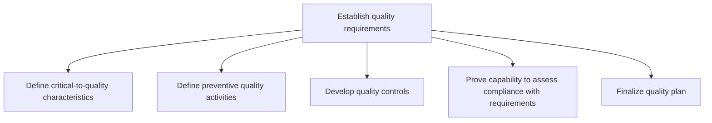
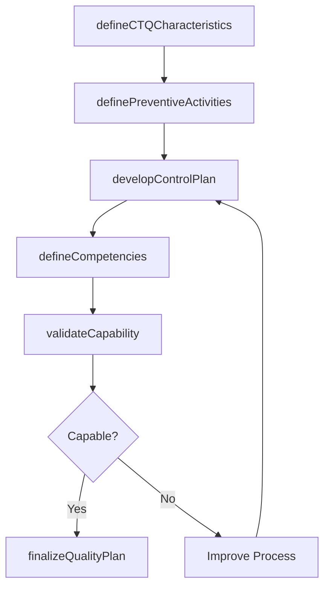

# Establish quality requirements

> Business-as-Code definition for quality requirements establishment. Models the process of defining critical-to-quality characteristics, preventive activities, control plans, capability validation, and quality plan finalization.

## Overview

Determining essential activities, processes, and attributes for securing enterprise quality. Outline critical characteristics for quality. Outline activities encouraging the preservation of quality. Create quality controls. Confirm capabilities in accordance with quality requirements. Finalize the plan for quality maintenance.

## Process Hierarchy



## GraphDL

```yaml
establish:
  object: Quality Requirements
  actor: QualityEngineer
  result: QualityPlan
```

## Actions

| Action | Description |
|--------|-------------|
| defineCTQCharacteristics | Translate customer needs into measurable critical-to-quality attributes |
| definePreventiveActivities | Identify preventive measures to eliminate quality failures at the source |
| developControlPlan | Create control plans with sampling methods, measurement tools, and checkpoints |
| validateCapability | Demonstrate measurement system capability through gauge studies and process audits |
| finalizeQualityPlan | Consolidate all quality requirements into an approved quality plan |
| defineCompetencies | Specify skill and certification requirements for quality roles |

## Events

| Event | Description |
|-------|-------------|
| ctqCharacteristicsDefined | Critical-to-quality characteristics documented and validated |
| preventiveActivitiesDefined | Preventive quality activities identified and documented |
| controlPlanDeveloped | Quality control plan with sampling and measurement methods approved |
| capabilityValidated | Measurement system and process capability demonstrated |
| qualityPlanFinalized | Comprehensive quality plan approved and released |
| competenciesDefined | Quality role competency requirements documented |

## Searches

| Search | Description |
|--------|-------------|
| getCTQCharacteristics | Retrieve critical-to-quality characteristics for a product or process |
| getControlPlan | Retrieve the quality control plan for a specific process |
| findCapabilityStudies | List measurement system and process capability study results |
| getQualityPlan | Retrieve the finalized quality plan for a product or process |

## Process Flow



## RACI Matrix

| Activity | Responsible | Accountable | Consulted | Informed |
|----------|-------------|-------------|-----------|----------|
| defineCTQCharacteristics | QualityEngineer | QualityManager | ProductEngineering | Customer |
| developControlPlan | QualityEngineer | QualityManager | ProcessOwner | Production |
| validateCapability | QualityEngineer | QualityManager | MetrologyTeam | Regulatory |
| finalizeQualityPlan | QualityManager | VP Quality | Engineering | Operations |

## Sub-Processes

| ID | Name | Description |
|----|------|-------------|
| 13.3.1.1 | Define critical-to-quality characteristics | Outlining characteristics crucial for managing enterprise quality. Translate broad customer needs in |
| 13.3.1.2 | Define preventive quality activities | Identifying gaps in customer requirements and determining whether the gap will be mitigated through  |
| 13.3.1.3 | Develop quality controls | Developing controls for managing the quality of enterprise. Define the process steps for quality con |
| 13.3.1.4 | Prove capability to assess compliance with requirements | Demonstrating the ability and capability to confirm and fulfill the quality requirements in front of |
| 13.3.1.5 | Finalize quality plan | Establishing how the critical-to-quality characteristics will be achieved, controlled, ensured, and  |

## Related Processes

| Process | Relationship |
|---------|-------------|
| 13.3.2 Evaluate performance to requirements | Downstream - quality plan defines the testing criteria |
| 13.3.3 Manage non-conformance | Downstream - requirements define what constitutes non-conformance |
| 13.3.4 Implement and maintain the EQMS | Parallel - requirements feed into EQMS governance |

## Related Departments

| Department | Role |
|-----------|------|
| Quality Assurance | Primary owner of quality requirements definition |
| Engineering | Translates customer needs into technical specifications |
| Operations | Implements quality controls on the production floor |
| Regulatory Affairs | Ensures requirements meet regulatory standards |

## Related Occupations

| Occupation | Involvement |
|-----------|-------------|
| Quality Engineer | Designs CTQ characteristics, controls, and capability studies |
| Quality Manager | Approves and governs the quality plan |
| Metrology Technician | Validates measurement systems and calibration |

## KPIs

| KPI | Description | Unit |
|-----|-------------|------|
| CTQ Coverage | Percentage of customer requirements mapped to CTQ characteristics | % |
| Control Plan Completeness | Percentage of critical processes with active control plans | % |
| Capability Index (Cpk) | Process capability index for critical characteristics | Index |
| Quality Plan Approval Cycle | Time from draft to approved quality plan | Days |

## Usage

```typescript
import { establishQualityRequirements } from '@headlessly/establish-quality-requirements'

const quality = establishQualityRequirements()

// Define critical-to-quality characteristics
const ctq = await quality.defineCTQCharacteristics({
  productId: 'PROD-sensor-v3',
  customerNeeds: ['precision', 'reliability', 'fast-response'],
  specifications: [
    { characteristic: 'accuracy', target: 0.01, unit: 'mm', tolerance: 0.005 }
  ]
})

// Validate measurement capability
const capability = await quality.validateCapability({
  ctqId: ctq.id,
  studyType: 'gauge-R-and-R',
  sampleSize: 30
})
```
