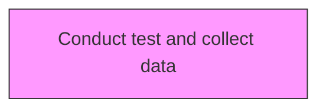
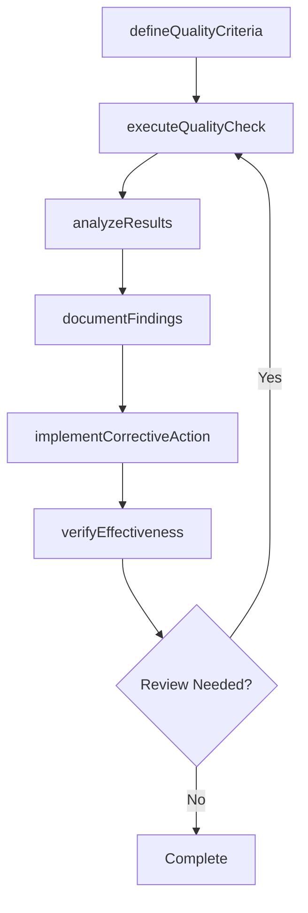

# Conduct test and collect data

> Business-as-Code definition for conduct test and collect data. Models the process of evaluating quality performance through periodic or episodic testing against the established standards for quality characteristics.

## Overview

Evaluating quality performance through periodic or episodic testing against the established standards for quality characteristics. For periodic testing, design a schedule with sufficient time to make any required adjustments to the process or system to maintain the desired level of quality. For episodic testing, conduct a test whenever a known non-conformance or fault occurs, which results in outputs or outcomes known to be unsatisfactory to performance requirements.

## Process Hierarchy



## GraphDL

```yaml
conduct:
  object: Test And Collect Data
  actor: QualityManager
  result: testAndCollectDataResult
```

## Actions

| Action | Description |
|--------|-------------|
| defineQualityCriteria | Establish measurable quality criteria for test and collect data |
| executeQualityCheck | Perform quality inspection or test for test and collect data |
| analyzeResults | Evaluate quality data and identify trends for test and collect data |
| documentFindings | Record quality findings and observations for test and collect data |
| implementCorrectiveAction | Take corrective action based on test and collect data findings |
| verifyEffectiveness | Confirm that corrective actions resolved test and collect data issues |

## Events

| Event | Description |
|-------|-------------|
| qualityCriteriaDefined | Measurable quality criteria established |
| qualityCheckExecuted | Quality inspection or test performed |
| resultsAnalyzed | Quality data evaluated and trends identified |
| findingsDocumented | Quality findings and observations recorded |
| correctiveActionImplemented | Corrective action taken based on findings |
| effectivenessVerified | Corrective action effectiveness confirmed |

## Searches

| Search | Description |
|--------|-------------|
| findTestAndCollectData | Retrieve test and collect data records filtered by status, date, or scope |
| getTestAndCollectDataDetails | Get detailed information for a specific test and collect data record |
| listTestAndCollectDataHistory | Query the history of changes and updates to test and collect data |
| getActiveItems | List currently active items related to test and collect data |

## Process Flow



## RACI Matrix

| Activity | Responsible | Accountable | Consulted | Informed |
|----------|-------------|-------------|-----------|----------|
| defineQualityCriteria | QualityEngineer | QualityManager | ProcessOwners | Stakeholders |
| executeQualityCheck | QualityAuditor | QualityManager | RegulatoryAffairs | Stakeholders |
| analyzeResults | QualityManager | VPQuality | Operations | Stakeholders |
| documentFindings | QualityEngineer | QualityManager | Manufacturing | Stakeholders |

## Related Processes

| Process | Relationship |
|---------|-------------|
| 13.3.1 Establish quality requirements | Upstream - requirements drive quality activities |
| 13.3.2 Evaluate performance to requirements | Parallel - testing validates quality |
| 13.3.3 Manage non-conformance | Downstream - non-conformances trigger corrective actions |

## Related Departments

| Department | Role |
|-----------|------|
| Quality | Primary owner of enterprise quality management |
| Operations | Implements quality controls in operational processes |
| Manufacturing | Applies quality standards in production environments |
| Regulatory Affairs | Ensures quality compliance with regulatory requirements |

## Related Occupations

| Occupation | Involvement |
|-----------|-------------|
| Quality Manager | Leads quality management programs |
| Quality Engineer | Designs and implements quality controls |
| Quality Auditor | Conducts quality audits and assessments |

## KPIs

| KPI | Description | Unit |
|-----|-------------|------|
| Defect Rate | Number of defects per unit of output | Per Unit |
| First Pass Yield | Percentage of units passing quality check on first attempt | % |
| Corrective Action Closure Time | Average time to close corrective actions | Days |
| Audit Finding Rate | Number of findings per audit conducted | Count |

## Usage

```typescript
import { conductTestAndCollectData } from '@headlessly/conduct-test-and-collect-data'

const client = conductTestAndCollectData()

// Establish measurable quality criteria for test and collect data
const result = await client.defineQualityCriteria({
  scope: 'enterprise',
  period: 'Q1-2025'
})

// Perform quality inspection or test for test and collect data
const assessment = await client.executeQualityCheck({
  resultId: result.id,
  criteria: 'standard'
})

// Evaluate quality data and identify trends for test and collect data
await client.analyzeResults({
  resultId: result.id,
  format: 'detailed',
  recipients: ['stakeholders']
})
```
