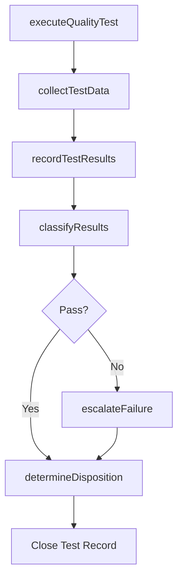

# Test against quality plan

> Business-as-Code definition for quality plan testing. Models the execution of quality tests, data collection, result recording, and disposition determination against established quality standards.

## Overview

Examining the quality of organizational processes. Conduct tests. Collect information and data. Record the results of these tests. Determine the dispositions of the test results.

## Process Hierarchy

```mermaid
graph TD
    A[Test against quality plan]
    A --> B[Conduct test and collect data]
    A --> C[Record result(s)]
    A --> D[Determine disposition of result(s)]
```

## GraphDL

```yaml
test:
  object: Against Quality Plan
  actor: QualityInspector
  result: QualityTestReport
```

## Actions

| Action | Description |
|--------|-------------|
| executeQualityTest | Perform inspections and tests per the quality plan specifications |
| collectTestData | Gather measurement data, observations, and sample results |
| recordTestResults | Log test outcomes in the quality management system with timestamps |
| classifyResults | Categorize results as pass, fail, or conditional based on acceptance criteria |
| determineDisposition | Decide on accept, reject, rework, or use-as-is disposition for tested items |
| escalateFailure | Route critical test failures to quality management for review |

## Events

| Event | Description |
|-------|-------------|
| qualityTestExecuted | Quality test completed per plan specifications |
| testDataCollected | Measurement data and observations gathered and validated |
| testResultsRecorded | Test outcomes logged in quality management system |
| resultsClassified | Test results categorized against acceptance criteria |
| dispositionDetermined | Accept, reject, or rework decision made for tested items |
| failureEscalated | Critical quality failure routed for management review |

## Searches

| Search | Description |
|--------|-------------|
| getTestResults | Retrieve test results by product, batch, or date range |
| findFailedTests | List tests with results outside acceptance criteria |
| getDispositionHistory | Retrieve disposition decisions by item, lot, or inspector |
| getTestSchedule | List upcoming quality tests by control point or product |

## Process Flow



## RACI Matrix

| Activity | Responsible | Accountable | Consulted | Informed |
|----------|-------------|-------------|-----------|----------|
| executeQualityTest | QualityInspector | QualityManager | ProcessOwner | ProductionSupervisor |
| collectTestData | QualityInspector | QualityManager | Laboratory | DataManagement |
| recordTestResults | QualityInspector | QualityManager | IT | RegulatoryAffairs |
| determineDisposition | QualityManager | VP Quality | Engineering | SupplyChain |

## Sub-Processes

| ID | Name | Description |
|----|------|-------------|
| 13.3.2.1.1 | Conduct test and collect data | Evaluating quality performance through periodic or episodic testing against the established standard |
| 13.3.2.1.2 | Record result(s) | Maintaining and recording the results of Test against the quality plan [17483] electronically and in |
| 13.3.2.1.3 | Determine disposition of result(s) | Deciding whether to take any additional actions based on the results of quality tests. Initiate a qu |

## Related Processes

| Process | Relationship |
|---------|-------------|
| 13.3.1.3 Develop quality controls | Upstream - controls define what is tested and how |
| 13.3.2.2 Assess results of tests | Downstream - test results feed assessment and analysis |
| 13.3.3 Manage non-conformance | Downstream - failed tests may trigger non-conformance reports |

## Related Departments

| Department | Role |
|-----------|------|
| Quality Assurance | Primary owner of test execution and result recording |
| Production | Provides samples and access to in-process items for testing |
| Laboratory | Conducts specialized analytical and physical tests |
| Regulatory Affairs | Ensures testing meets regulatory documentation requirements |

## Related Occupations

| Occupation | Involvement |
|-----------|-------------|
| Quality Inspector | Executes tests, collects data, and records results |
| Laboratory Technician | Performs specialized analytical testing |
| Quality Manager | Reviews dispositions and approves escalated decisions |

## KPIs

| KPI | Description | Unit |
|-----|-------------|------|
| First Pass Yield | Percentage of items passing quality tests on first attempt | % |
| Test Cycle Time | Average time from test initiation to disposition decision | Hours |
| Disposition Accuracy | Percentage of disposition decisions not reversed on appeal | % |
| Test Schedule Adherence | Percentage of planned quality tests executed on time | % |

## Usage

```typescript
import { testAgainstQualityPlan } from '@headlessly/test-against-quality-plan'

const testing = testAgainstQualityPlan()

// Execute a quality test for a production batch
const result = await testing.executeQualityTest({
  qualityPlanId: 'QP-2026-PCB-assembly',
  batchId: 'BATCH-20260115-A',
  controlPoint: 'final-electrical-test',
  sampleSize: 13
})

// Determine disposition based on results
const disposition = await testing.determineDisposition({
  testResultId: result.id,
  failureCount: result.failures,
  acceptanceCriteria: 'ANSI-ASQ-Z1.4-AQL-1.0'
})
```
