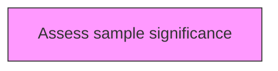
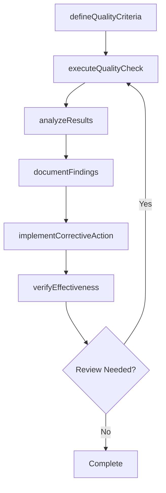

# Assess sample significance

> Business-as-Code definition for assess sample significance. Models the process of assessing the significance of the sample chosen for the test in order to determine whether or not the sample is representative of the larger output or outcome.

## Overview

Assessing the significance of the sample chosen for the test in order to determine whether or not the sample is representative of the larger output or outcome. Determine if the sample meets or does not meet the requirements. Identify the conditions for acceptance, rejection, remediation, and prevention.

## Process Hierarchy



## GraphDL

```yaml
assess:
  object: Sample Significance
  actor: QualityManager
  result: sampleSignificanceResult
```

## Actions

| Action | Description |
|--------|-------------|
| defineQualityCriteria | Establish measurable quality criteria for sample significance |
| executeQualityCheck | Perform quality inspection or test for sample significance |
| analyzeResults | Evaluate quality data and identify trends for sample significance |
| documentFindings | Record quality findings and observations for sample significance |
| implementCorrectiveAction | Take corrective action based on sample significance findings |
| verifyEffectiveness | Confirm that corrective actions resolved sample significance issues |

## Events

| Event | Description |
|-------|-------------|
| qualityCriteriaDefined | Measurable quality criteria established |
| qualityCheckExecuted | Quality inspection or test performed |
| resultsAnalyzed | Quality data evaluated and trends identified |
| findingsDocumented | Quality findings and observations recorded |
| correctiveActionImplemented | Corrective action taken based on findings |
| effectivenessVerified | Corrective action effectiveness confirmed |

## Searches

| Search | Description |
|--------|-------------|
| findSampleSignificance | Retrieve sample significance records filtered by status, date, or scope |
| getSampleSignificanceDetails | Get detailed information for a specific sample significance record |
| listSampleSignificanceHistory | Query the history of changes and updates to sample significance |
| getActiveItems | List currently active items related to sample significance |

## Process Flow



## RACI Matrix

| Activity | Responsible | Accountable | Consulted | Informed |
|----------|-------------|-------------|-----------|----------|
| defineQualityCriteria | QualityEngineer | QualityManager | ProcessOwners | Stakeholders |
| executeQualityCheck | QualityAuditor | QualityManager | RegulatoryAffairs | Stakeholders |
| analyzeResults | QualityManager | VPQuality | Operations | Stakeholders |
| documentFindings | QualityEngineer | QualityManager | Manufacturing | Stakeholders |

## Related Processes

| Process | Relationship |
|---------|-------------|
| 13.3.1 Establish quality requirements | Upstream - requirements drive quality activities |
| 13.3.2 Evaluate performance to requirements | Parallel - testing validates quality |
| 13.3.3 Manage non-conformance | Downstream - non-conformances trigger corrective actions |

## Related Departments

| Department | Role |
|-----------|------|
| Quality | Primary owner of enterprise quality management |
| Operations | Implements quality controls in operational processes |
| Manufacturing | Applies quality standards in production environments |
| Regulatory Affairs | Ensures quality compliance with regulatory requirements |

## Related Occupations

| Occupation | Involvement |
|-----------|-------------|
| Quality Manager | Leads quality management programs |
| Quality Engineer | Designs and implements quality controls |
| Quality Auditor | Conducts quality audits and assessments |

## KPIs

| KPI | Description | Unit |
|-----|-------------|------|
| Defect Rate | Number of defects per unit of output | Per Unit |
| First Pass Yield | Percentage of units passing quality check on first attempt | % |
| Corrective Action Closure Time | Average time to close corrective actions | Days |
| Audit Finding Rate | Number of findings per audit conducted | Count |

## Usage

```typescript
import { assessSampleSignificance } from '@headlessly/assess-sample-significance'

const client = assessSampleSignificance()

// Establish measurable quality criteria for sample significance
const result = await client.defineQualityCriteria({
  scope: 'enterprise',
  period: 'Q1-2025'
})

// Perform quality inspection or test for sample significance
const assessment = await client.executeQualityCheck({
  resultId: result.id,
  criteria: 'standard'
})

// Evaluate quality data and identify trends for sample significance
await client.analyzeResults({
  resultId: result.id,
  format: 'detailed',
  recipients: ['stakeholders']
})
```
