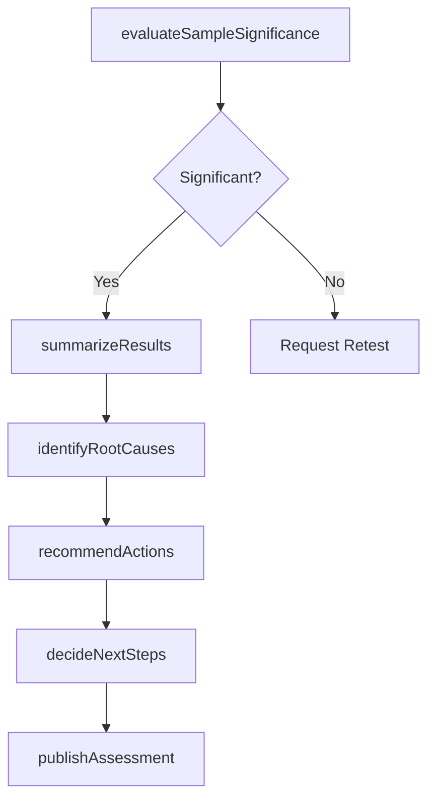

# Assess results of tests

> Business-as-Code definition for quality test result assessment. Models the statistical evaluation of sample significance, result summarization, improvement recommendation, and next-step decision-making.

## Overview

Assessing the significance of the sample. Summarize the results of the test. Recommend improvement actions. Decide what steps to take next.

## Process Hierarchy

```mermaid
graph TD
    A[Assess results of tests]
    A --> B[Assess sample significance]
    A --> C[Summarize result(s)]
    A --> D[Recommend actions]
    A --> E[Decide next steps]
```

## GraphDL

```yaml
assess:
  object: Results Of Tests
  actor: QualityAnalyst
  result: TestAssessmentReport
```

## Actions

| Action | Description |
|--------|-------------|
| evaluateSampleSignificance | Determine whether sample size and method yield statistically valid conclusions |
| summarizeResults | Aggregate test data into concise findings with key metrics and trends |
| identifyRootCauses | Analyze failure patterns to determine underlying causes of quality deviations |
| recommendActions | Propose corrective and preventive actions based on assessment findings |
| decideNextSteps | Select the appropriate follow-up actions from recommended options |
| publishAssessment | Distribute the completed assessment report to stakeholders |

## Events

| Event | Description |
|-------|-------------|
| sampleSignificanceEvaluated | Statistical validity of test sample confirmed or flagged |
| resultsSummarized | Test data aggregated into findings report |
| rootCausesIdentified | Underlying causes of quality deviations determined |
| actionsRecommended | Corrective and preventive actions proposed to stakeholders |
| nextStepsDecided | Follow-up actions selected and assigned |
| assessmentPublished | Assessment report distributed to stakeholders |

## Searches

| Search | Description |
|--------|-------------|
| getTestAssessments | Retrieve assessment reports by product, period, or quality plan |
| findRecurringDefects | List defect patterns appearing across multiple test cycles |
| getRecommendationStatus | Track status of recommended actions by assessment |
| getStatisticalSummaries | Retrieve statistical analysis results by test type or control point |

## Process Flow



## RACI Matrix

| Activity | Responsible | Accountable | Consulted | Informed |
|----------|-------------|-------------|-----------|----------|
| evaluateSampleSignificance | QualityAnalyst | QualityManager | Statistician | QualityInspectors |
| summarizeResults | QualityAnalyst | QualityManager | ProcessOwners | Operations |
| recommendActions | QualityAnalyst | QualityManager | Engineering | ContinuousImprovement |
| decideNextSteps | QualityManager | VP Quality | Operations | Executive |

## Sub-Processes

| ID | Name | Description |
|----|------|-------------|
| 13.3.2.2.1 | Assess sample significance | Assessing the significance of the sample chosen for the test in order to determine whether or not th |
| 13.3.2.2.2 | Summarize result(s) | Outlining the major facts and figures of the quality test results in order to provide insights and i |
| 13.3.2.2.3 | Recommend actions | Recommending measures for improvement. Assess the summarized results to identify areas which can be  |
| 13.3.2.2.4 | Decide next steps | Selecting the subsequent actions that the organization can adopt for improving the enterprise qualit |

## Related Processes

| Process | Relationship |
|---------|-------------|
| 13.3.2.1 Test against quality plan | Upstream - provides the raw test results for assessment |
| 13.3.3 Manage non-conformance | Downstream - assessment findings may trigger non-conformance actions |
| 13.3.1.3 Develop quality controls | Feedback - assessment outcomes refine control design |

## Related Departments

| Department | Role |
|-----------|------|
| Quality Assurance | Primary owner of test result assessment and analysis |
| Operations | Implements recommended corrective actions on the floor |
| Engineering | Provides root cause analysis expertise for design-related defects |
| Continuous Improvement | Integrates assessment findings into improvement roadmap |

## Related Occupations

| Occupation | Involvement |
|-----------|-------------|
| Quality Analyst | Evaluates statistical significance and summarizes findings |
| Quality Manager | Approves recommendations and decides next steps |
| Statistician | Advises on sample validity and analytical methods |

## KPIs

| KPI | Description | Unit |
|-----|-------------|------|
| Assessment Turnaround Time | Average time from test completion to published assessment | Days |
| Recommendation Adoption Rate | Percentage of recommended actions approved and implemented | % |
| Root Cause Identification Rate | Percentage of quality failures with confirmed root causes | % |
| Retest Rate | Percentage of assessments requiring additional testing due to sample issues | % |

## Usage

```typescript
import { assessResultsOfTests } from '@headlessly/assess-results-of-tests'

const assessment = assessResultsOfTests()

// Evaluate sample significance for a batch test
const significance = await assessment.evaluateSampleSignificance({
  testResultId: 'TR-2026-0142',
  sampleSize: 50,
  populationSize: 5000,
  confidenceLevel: 0.95
})

// Recommend actions based on summarized findings
const recommendations = await assessment.recommendActions({
  assessmentId: 'ASMT-2026-0089',
  defectCategories: ['solder-bridge', 'component-misalignment'],
  severity: 'major'
})
```
