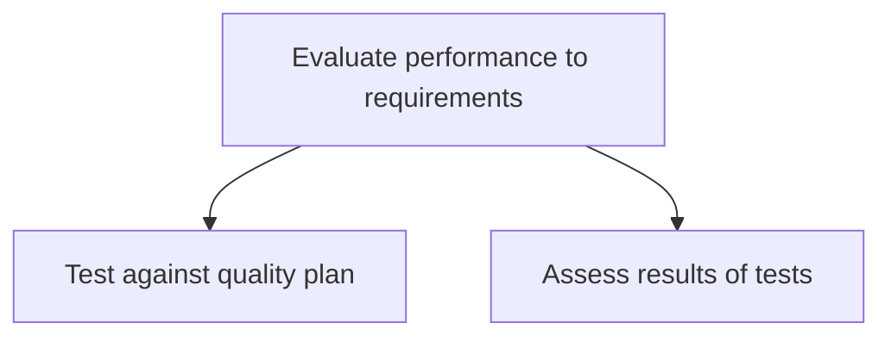
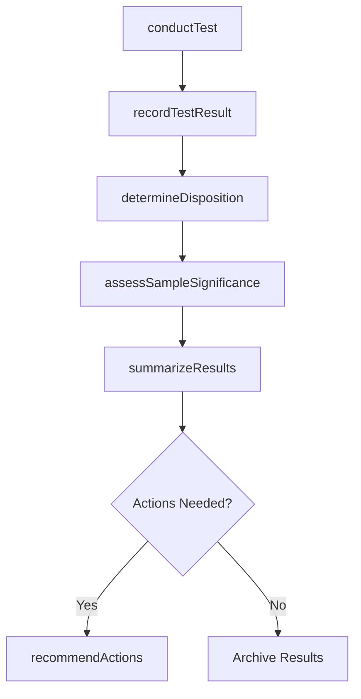

# Evaluate performance to requirements

> Business-as-Code definition for quality performance evaluation. Models the testing of deliverables against quality plans, statistical assessment of test results, and determination of corrective actions based on conformance findings.

## Overview

Analyzing if the performance of the quality plan has achieved the estimated and desired requirements. Conduct tests against the quality plan. Assess the results of these tests.

## Process Hierarchy



## GraphDL

```yaml
evaluate:
  object: Performance To Requirements
  actor: QualityInspector
  result: TestAssessmentReport
```

## Actions

| Action | Description |
|--------|-------------|
| conductTest | Execute quality tests according to the sampling plan and collect data |
| recordTestResult | Document test outcomes including measurements and observations |
| determineDisposition | Classify test results as pass, fail, or conditional |
| assessSampleSignificance | Evaluate the statistical significance of test samples |
| summarizeResults | Aggregate and summarize test outcomes for reporting |
| recommendActions | Propose corrective or preventive actions based on test findings |

## Events

| Event | Description |
|-------|-------------|
| testConducted | Quality test executed and raw data collected |
| testResultRecorded | Test outcome documented in the quality system |
| dispositionDetermined | Test result classified and disposition assigned |
| sampleSignificanceAssessed | Statistical analysis of sample data completed |
| resultsSummarized | Test outcomes aggregated and summary report generated |
| actionsRecommended | Corrective or preventive actions proposed to stakeholders |

## Searches

| Search | Description |
|--------|-------------|
| findTestResults | List test results filtered by product, process, date, or disposition |
| getTestSummary | Retrieve aggregated test results and trend data |
| findFailedTests | List tests with non-conforming results |
| getRecommendedActions | Retrieve recommended actions from quality assessments |

## Process Flow



## RACI Matrix

| Activity | Responsible | Accountable | Consulted | Informed |
|----------|-------------|-------------|-----------|----------|
| conductTest | QualityInspector | QualityManager | ProcessOwner | Production |
| assessSampleSignificance | QualityEngineer | QualityManager | Statistician | Engineering |
| summarizeResults | QualityEngineer | QualityManager | ProcessOwner | Executive |
| recommendActions | QualityEngineer | QualityManager | Engineering | Operations |

## Sub-Processes

| ID | Name | Description |
|----|------|-------------|
| 13.3.2.1 | Test against quality plan | Examining the quality of organizational processes. Conduct tests. Collect information and data. Reco |
| 13.3.2.2 | Assess results of tests | Assessing the significance of the sample. Summarize the results of the test. Recommend improvement a |

## Related Processes

| Process | Relationship |
|---------|-------------|
| 13.3.1 Establish quality requirements | Upstream - quality plan defines the test criteria |
| 13.3.3 Manage non-conformance | Downstream - failed tests trigger non-conformance management |
| 13.3.4 Implement and maintain the EQMS | Parallel - test data feeds EQMS performance dashboards |

## Related Departments

| Department | Role |
|-----------|------|
| Quality Assurance | Primary owner of testing and assessment activities |
| Operations | Provides access to products and processes for testing |
| Engineering | Consults on specification interpretation and root cause analysis |
| Laboratory | Conducts specialized tests and calibration verification |

## Related Occupations

| Occupation | Involvement |
|-----------|-------------|
| Quality Inspector | Conducts tests and records results |
| Quality Engineer | Analyzes data and determines statistical significance |
| Laboratory Technician | Performs specialized measurement and testing |

## KPIs

| KPI | Description | Unit |
|-----|-------------|------|
| Test Completion Rate | Percentage of scheduled tests completed on time | % |
| First Pass Yield | Percentage of items passing inspection on first attempt | % |
| Test Turnaround Time | Average time from test initiation to result reporting | Hours |
| Action Implementation Rate | Percentage of recommended actions implemented within target timeline | % |

## Usage

```typescript
import { evaluatePerformanceToRequirements } from '@headlessly/evaluate-performance-to-requirements'

const evaluation = evaluatePerformanceToRequirements()

// Conduct quality test
const test = await evaluation.conductTest({
  qualityPlanId: 'QP-2026-sensor-v3',
  batchId: 'BATCH-4421',
  sampleSize: 25,
  characteristics: ['accuracy', 'response-time']
})

// Assess sample significance
const assessment = await evaluation.assessSampleSignificance({
  testId: test.id,
  confidenceLevel: 0.95,
  method: 'hypothesis-test'
})
```
