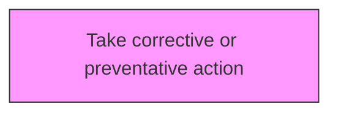
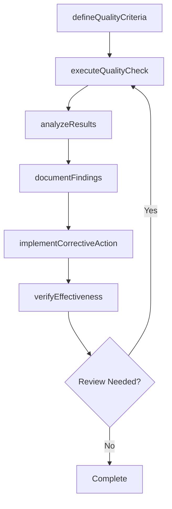

# Take corrective or preventative action

> Business-as-Code definition for take corrective or preventative action. Models the process of pursuing corrective and preventative activities to eliminate the cause of a detected nonconformity.

## Overview

Pursuing corrective and preventative activities to eliminate the cause of a detected nonconformity. Define the nonconformity. Communicate and assign responsibility. Identify the appropriate corrective and preventive action. Implement and monitor for reoccurrence.

## Process Hierarchy



## GraphDL

```yaml
take:
  object: Corrective Or Preventative Action
  actor: QualityManager
  result: correctiveOrPreventativeActionResult
```

## Actions

| Action | Description |
|--------|-------------|
| defineQualityCriteria | Establish measurable quality criteria for corrective or preventative action |
| executeQualityCheck | Perform quality inspection or test for corrective or preventative action |
| analyzeResults | Evaluate quality data and identify trends for corrective or preventative action |
| documentFindings | Record quality findings and observations for corrective or preventative action |
| implementCorrectiveAction | Take corrective action based on corrective or preventative action findings |
| verifyEffectiveness | Confirm that corrective actions resolved corrective or preventative action issues |

## Events

| Event | Description |
|-------|-------------|
| qualityCriteriaDefined | Measurable quality criteria established |
| qualityCheckExecuted | Quality inspection or test performed |
| resultsAnalyzed | Quality data evaluated and trends identified |
| findingsDocumented | Quality findings and observations recorded |
| correctiveActionImplemented | Corrective action taken based on findings |
| effectivenessVerified | Corrective action effectiveness confirmed |

## Searches

| Search | Description |
|--------|-------------|
| findCorrectiveOrPreventativeAction | Retrieve corrective or preventative action records filtered by status, date, or scope |
| getCorrectiveOrPreventativeActionDetails | Get detailed information for a specific corrective or preventative action record |
| listCorrectiveOrPreventativeActionHistory | Query the history of changes and updates to corrective or preventative action |
| getActiveItems | List currently active items related to corrective or preventative action |

## Process Flow



## RACI Matrix

| Activity | Responsible | Accountable | Consulted | Informed |
|----------|-------------|-------------|-----------|----------|
| defineQualityCriteria | QualityEngineer | QualityManager | ProcessOwners | Stakeholders |
| executeQualityCheck | QualityAuditor | QualityManager | RegulatoryAffairs | Stakeholders |
| analyzeResults | QualityManager | VPQuality | Operations | Stakeholders |
| documentFindings | QualityEngineer | QualityManager | Manufacturing | Stakeholders |

## Related Processes

| Process | Relationship |
|---------|-------------|
| 13.3.1 Establish quality requirements | Upstream - requirements drive quality activities |
| 13.3.2 Evaluate performance to requirements | Parallel - testing validates quality |
| 13.3.3 Manage non-conformance | Downstream - non-conformances trigger corrective actions |

## Related Departments

| Department | Role |
|-----------|------|
| Quality | Primary owner of enterprise quality management |
| Operations | Implements quality controls in operational processes |
| Manufacturing | Applies quality standards in production environments |
| Regulatory Affairs | Ensures quality compliance with regulatory requirements |

## Related Occupations

| Occupation | Involvement |
|-----------|-------------|
| Quality Manager | Leads quality management programs |
| Quality Engineer | Designs and implements quality controls |
| Quality Auditor | Conducts quality audits and assessments |

## KPIs

| KPI | Description | Unit |
|-----|-------------|------|
| Defect Rate | Number of defects per unit of output | Per Unit |
| First Pass Yield | Percentage of units passing quality check on first attempt | % |
| Corrective Action Closure Time | Average time to close corrective actions | Days |
| Audit Finding Rate | Number of findings per audit conducted | Count |

## Usage

```typescript
import { takeCorrectiveOrPreventativeAction } from '@headlessly/take-corrective-or-preventative-action'

const client = takeCorrectiveOrPreventativeAction()

// Establish measurable quality criteria for corrective or preventative action
const result = await client.defineQualityCriteria({
  scope: 'enterprise',
  period: 'Q1-2025'
})

// Perform quality inspection or test for corrective or preventative action
const assessment = await client.executeQualityCheck({
  resultId: result.id,
  criteria: 'standard'
})

// Evaluate quality data and identify trends for corrective or preventative action
await client.analyzeResults({
  resultId: result.id,
  format: 'detailed',
  recipients: ['stakeholders']
})
```
