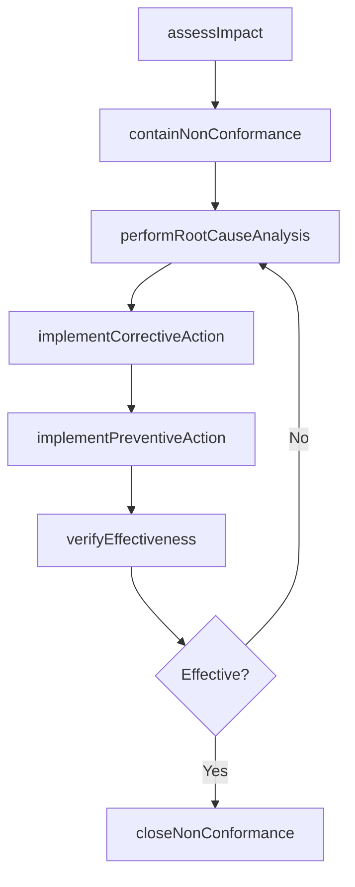

# Manage non-conformance

> Business-as-Code definition for non-conformance management. Models the complete CAPA lifecycle from impact assessment and containment through root cause analysis, corrective and preventive action implementation, and formal closure.

## Overview

Handling any nonconformance activities or events. Assess the potential impact of the nonconformity. Decide the immediate actions to take. Identify the root causes. Take corrective or preventive action. Ensure future conformance.

## Process Hierarchy

```mermaid
graph TD
    A[Manage non-conformance]
    A --> B[Assess potential impact]
    A --> C[Determine immediate action(s)]
    A --> D[Identify root cause(s)]
    A --> E[Take corrective or preventative action]
    A --> F[Close non-conformance]
```

## GraphDL

```yaml
manage:
  object: Non-conformance
  actor: QualityEngineer
  result: NonConformanceResolution
```

## Actions

| Action | Description |
|--------|-------------|
| assessImpact | Evaluate the severity, scope, and potential consequences of a non-conformance |
| containNonConformance | Implement immediate containment actions to prevent further impact |
| performRootCauseAnalysis | Investigate underlying causes using methods such as 5-Why or fishbone analysis |
| implementCorrectiveAction | Execute corrective actions to eliminate the root cause |
| implementPreventiveAction | Deploy preventive measures to avoid recurrence |
| verifyEffectiveness | Confirm that corrective and preventive actions resolved the issue |
| closeNonConformance | Complete formal closure with documentation and lessons learned |

## Events

| Event | Description |
|-------|-------------|
| impactAssessed | Non-conformance severity and scope evaluation completed |
| nonConformanceContained | Immediate containment actions executed |
| rootCauseIdentified | Root cause analysis completed with findings documented |
| correctiveActionImplemented | Corrective action executed and evidence collected |
| preventiveActionImplemented | Preventive measure deployed to avoid recurrence |
| effectivenessVerified | CAPA effectiveness confirmed through follow-up verification |
| nonConformanceClosed | Non-conformance record formally closed and archived |

## Searches

| Search | Description |
|--------|-------------|
| findNonConformances | List non-conformance records filtered by severity, status, or source |
| getRootCauseAnalysis | Retrieve the root cause analysis for a specific non-conformance |
| findOpenCAPAs | List open corrective and preventive actions by due date or owner |
| getNonConformanceTrends | Retrieve trend data for non-conformance occurrence by category |

## Process Flow



## RACI Matrix

| Activity | Responsible | Accountable | Consulted | Informed |
|----------|-------------|-------------|-----------|----------|
| assessImpact | QualityEngineer | QualityManager | ProcessOwner | Production |
| performRootCauseAnalysis | QualityEngineer | QualityManager | Engineering | SupplyChain |
| implementCorrectiveAction | ProcessOwner | QualityManager | QualityEngineer | Operations |
| verifyEffectiveness | QualityEngineer | QualityManager | InternalAuditor | Executive |
| closeNonConformance | QualityEngineer | QualityManager | RegulatoryAffairs | Board |

## Sub-Processes

| ID | Name | Description |
|----|------|-------------|
| 13.3.3.1 | Assess potential impact | Analyzing any nonconformance events. Determine the need for corrective and/or preventative action(s) |
| 13.3.3.2 | Determine immediate action(s) | Initiating immediate corrective, preventative, or no action based upon the impact and likelihood of  |
| 13.3.3.3 | Identify root cause(s) | Recognizing the reasons that have triggered the nonconformance events or activities. Perform a root- |
| 13.3.3.4 | Take corrective or preventative action | Pursuing corrective and preventative activities to eliminate the cause of a detected nonconformity.  |
| 13.3.3.5 | Close non-conformance | Closing nonconformance. Perform all the final processes related to the nonconformance, including doc |

## Related Processes

| Process | Relationship |
|---------|-------------|
| 13.3.2 Evaluate performance to requirements | Upstream - test failures generate non-conformance records |
| 13.3.1 Establish quality requirements | Upstream - requirements define conformance criteria |
| 13.3.4 Implement and maintain the EQMS | Parallel - non-conformance data feeds EQMS performance tracking |

## Related Departments

| Department | Role |
|-----------|------|
| Quality Assurance | Primary owner of non-conformance investigation and CAPA |
| Engineering | Provides technical expertise for root cause analysis |
| Operations | Implements containment and corrective actions on the floor |
| Supply Chain | Manages supplier non-conformances and corrective actions |

## Related Occupations

| Occupation | Involvement |
|-----------|-------------|
| Quality Engineer | Leads root cause analysis and CAPA management |
| Quality Inspector | Identifies and documents non-conformances during inspection |
| Process Engineer | Implements corrective actions in production processes |

## KPIs

| KPI | Description | Unit |
|-----|-------------|------|
| CAPA Closure Rate | Percentage of corrective actions closed within target timeframe | % |
| Non-Conformance Recurrence Rate | Percentage of non-conformances that recur after closure | % |
| Root Cause Resolution Time | Average time from non-conformance detection to root cause identification | Days |
| Containment Effectiveness | Percentage of containment actions that prevent further customer impact | % |

## Usage

```typescript
import { manageNonConformance } from '@headlessly/manage-non-conformance'

const ncr = manageNonConformance()

// Assess the impact of a non-conformance
const impact = await ncr.assessImpact({
  nonConformanceId: 'NCR-2026-0089',
  source: 'incoming-inspection',
  description: 'Supplier batch fails dimensional tolerance check',
  affectedQuantity: 500
})

// Perform root cause analysis
const rca = await ncr.performRootCauseAnalysis({
  nonConformanceId: 'NCR-2026-0089',
  method: 'five-why',
  team: ['quality-engineer', 'supplier-quality', 'process-engineer']
})
```
