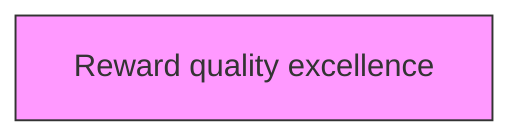
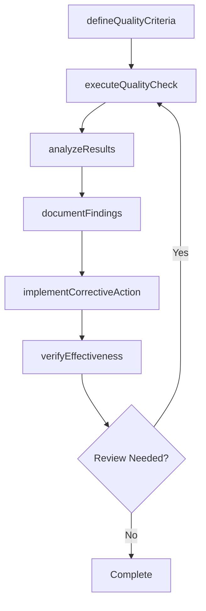

# Reward quality excellence

> Business-as-Code definition for reward quality excellence. Models the process of provisioning rewards for achieving quality excellence.

## Overview

Provisioning rewards for achieving quality excellence. Provide monetary and nonmonetary rewards such as compensation, vacations, gift cards, and reimbursements to employees in in recognition of their services, efforts, and achievements in quality excellence.

## Process Hierarchy



## GraphDL

```yaml
reward:
  object: Quality Excellence
  actor: QualityManager
  result: qualityExcellenceResult
```

## Actions

| Action | Description |
|--------|-------------|
| defineQualityCriteria | Establish measurable quality criteria for quality excellence |
| executeQualityCheck | Perform quality inspection or test for quality excellence |
| analyzeResults | Evaluate quality data and identify trends for quality excellence |
| documentFindings | Record quality findings and observations for quality excellence |
| implementCorrectiveAction | Take corrective action based on quality excellence findings |
| verifyEffectiveness | Confirm that corrective actions resolved quality excellence issues |

## Events

| Event | Description |
|-------|-------------|
| qualityCriteriaDefined | Measurable quality criteria established |
| qualityCheckExecuted | Quality inspection or test performed |
| resultsAnalyzed | Quality data evaluated and trends identified |
| findingsDocumented | Quality findings and observations recorded |
| correctiveActionImplemented | Corrective action taken based on findings |
| effectivenessVerified | Corrective action effectiveness confirmed |

## Searches

| Search | Description |
|--------|-------------|
| findQualityExcellence | Retrieve quality excellence records filtered by status, date, or scope |
| getQualityExcellenceDetails | Get detailed information for a specific quality excellence record |
| listQualityExcellenceHistory | Query the history of changes and updates to quality excellence |
| getActiveItems | List currently active items related to quality excellence |

## Process Flow



## RACI Matrix

| Activity | Responsible | Accountable | Consulted | Informed |
|----------|-------------|-------------|-----------|----------|
| defineQualityCriteria | QualityEngineer | QualityManager | ProcessOwners | Stakeholders |
| executeQualityCheck | QualityAuditor | QualityManager | RegulatoryAffairs | Stakeholders |
| analyzeResults | QualityManager | VPQuality | Operations | Stakeholders |
| documentFindings | QualityEngineer | QualityManager | Manufacturing | Stakeholders |

## Related Processes

| Process | Relationship |
|---------|-------------|
| 13.3.1 Establish quality requirements | Upstream - requirements drive quality activities |
| 13.3.2 Evaluate performance to requirements | Parallel - testing validates quality |
| 13.3.3 Manage non-conformance | Downstream - non-conformances trigger corrective actions |

## Related Departments

| Department | Role |
|-----------|------|
| Quality | Primary owner of enterprise quality management |
| Operations | Implements quality controls in operational processes |
| Manufacturing | Applies quality standards in production environments |
| Regulatory Affairs | Ensures quality compliance with regulatory requirements |

## Related Occupations

| Occupation | Involvement |
|-----------|-------------|
| Quality Manager | Leads quality management programs |
| Quality Engineer | Designs and implements quality controls |
| Quality Auditor | Conducts quality audits and assessments |

## KPIs

| KPI | Description | Unit |
|-----|-------------|------|
| Defect Rate | Number of defects per unit of output | Per Unit |
| First Pass Yield | Percentage of units passing quality check on first attempt | % |
| Corrective Action Closure Time | Average time to close corrective actions | Days |
| Audit Finding Rate | Number of findings per audit conducted | Count |

## Usage

```typescript
import { rewardQualityExcellence } from '@headlessly/reward-quality-excellence'

const client = rewardQualityExcellence()

// Establish measurable quality criteria for quality excellence
const result = await client.defineQualityCriteria({
  scope: 'enterprise',
  period: 'Q1-2025'
})

// Perform quality inspection or test for quality excellence
const assessment = await client.executeQualityCheck({
  resultId: result.id,
  criteria: 'standard'
})

// Evaluate quality data and identify trends for quality excellence
await client.analyzeResults({
  resultId: result.id,
  format: 'detailed',
  recipients: ['stakeholders']
})
```
