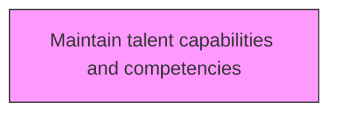
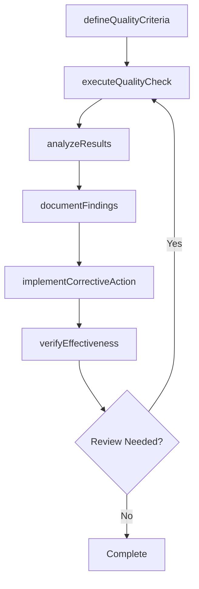

# Maintain talent capabilities and competencies

> Business-as-Code definition for maintain talent capabilities and competencies. Models the process of maintaining a common denominator for the competency level within the organization's talent circle.

## Overview

Maintaining a common denominator for the competency level within the organization's talent circle. Conduct training sessions, skill development activities, and quality excellence activities to ensure that the resources of the organization are competent enough and have the capabilities to achieve the required level of quality.

## Process Hierarchy



## GraphDL

```yaml
maintain:
  object: Talent Capabilities And Competencies
  actor: QualityManager
  result: talentCapabilitiesAndCompetenciesResult
```

## Actions

| Action | Description |
|--------|-------------|
| defineQualityCriteria | Establish measurable quality criteria for talent capabilities and competencies |
| executeQualityCheck | Perform quality inspection or test for talent capabilities and competencies |
| analyzeResults | Evaluate quality data and identify trends for talent capabilities and competencies |
| documentFindings | Record quality findings and observations for talent capabilities and competencies |
| implementCorrectiveAction | Take corrective action based on talent capabilities and competencies findings |
| verifyEffectiveness | Confirm that corrective actions resolved talent capabilities and competencies issues |

## Events

| Event | Description |
|-------|-------------|
| qualityCriteriaDefined | Measurable quality criteria established |
| qualityCheckExecuted | Quality inspection or test performed |
| resultsAnalyzed | Quality data evaluated and trends identified |
| findingsDocumented | Quality findings and observations recorded |
| correctiveActionImplemented | Corrective action taken based on findings |
| effectivenessVerified | Corrective action effectiveness confirmed |

## Searches

| Search | Description |
|--------|-------------|
| findTalentCapabilitiesAndCompetencies | Retrieve talent capabilities and competencies records filtered by status, date, or scope |
| getTalentCapabilitiesAndCompetenciesDetails | Get detailed information for a specific talent capabilities and competencies record |
| listTalentCapabilitiesAndCompetenciesHistory | Query the history of changes and updates to talent capabilities and competencies |
| getActiveItems | List currently active items related to talent capabilities and competencies |

## Process Flow



## RACI Matrix

| Activity | Responsible | Accountable | Consulted | Informed |
|----------|-------------|-------------|-----------|----------|
| defineQualityCriteria | QualityEngineer | QualityManager | ProcessOwners | Stakeholders |
| executeQualityCheck | QualityAuditor | QualityManager | RegulatoryAffairs | Stakeholders |
| analyzeResults | QualityManager | VPQuality | Operations | Stakeholders |
| documentFindings | QualityEngineer | QualityManager | Manufacturing | Stakeholders |

## Related Processes

| Process | Relationship |
|---------|-------------|
| 13.3.1 Establish quality requirements | Upstream - requirements drive quality activities |
| 13.3.2 Evaluate performance to requirements | Parallel - testing validates quality |
| 13.3.3 Manage non-conformance | Downstream - non-conformances trigger corrective actions |

## Related Departments

| Department | Role |
|-----------|------|
| Quality | Primary owner of enterprise quality management |
| Operations | Implements quality controls in operational processes |
| Manufacturing | Applies quality standards in production environments |
| Regulatory Affairs | Ensures quality compliance with regulatory requirements |

## Related Occupations

| Occupation | Involvement |
|-----------|-------------|
| Quality Manager | Leads quality management programs |
| Quality Engineer | Designs and implements quality controls |
| Quality Auditor | Conducts quality audits and assessments |

## KPIs

| KPI | Description | Unit |
|-----|-------------|------|
| Defect Rate | Number of defects per unit of output | Per Unit |
| First Pass Yield | Percentage of units passing quality check on first attempt | % |
| Corrective Action Closure Time | Average time to close corrective actions | Days |
| Audit Finding Rate | Number of findings per audit conducted | Count |

## Usage

```typescript
import { maintainTalentCapabilitiesAndCompetencies } from '@headlessly/maintain-talent-capabilities-and-competencies'

const client = maintainTalentCapabilitiesAndCompetencies()

// Establish measurable quality criteria for talent capabilities and competencies
const result = await client.defineQualityCriteria({
  scope: 'enterprise',
  period: 'Q1-2025'
})

// Perform quality inspection or test for talent capabilities and competencies
const assessment = await client.executeQualityCheck({
  resultId: result.id,
  criteria: 'standard'
})

// Evaluate quality data and identify trends for talent capabilities and competencies
await client.analyzeResults({
  resultId: result.id,
  format: 'detailed',
  recipients: ['stakeholders']
})
```
