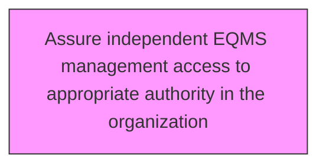
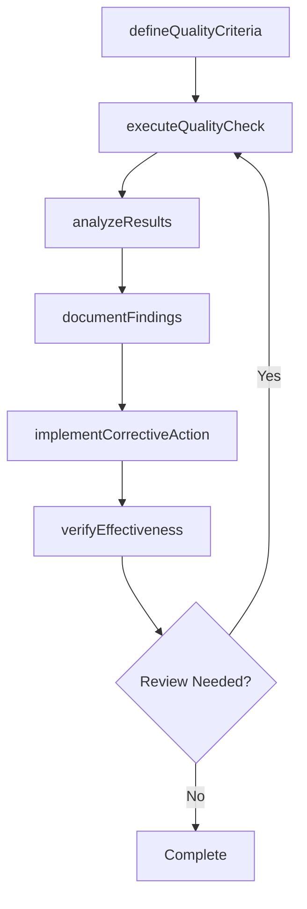

# Assure independent EQMS management access to appropriate authority in the organization

> Business-as-Code definition for assure independent eqms management access to appropriate authority in the organization. Models the process of ensuring eqms access to the person in charge of the quality management process.

## Overview

Ensuring EQMS access to the person in charge of the quality management process. Establish who has the authority to manage the EQMS. Ensure access of EQMS to only the person(s) in authority.

## Process Hierarchy



## GraphDL

```yaml
assure:
  object: Independent EQMS Management Access To Appropriate Authority In Organization
  actor: QualityManager
  result: independentEqmsManagementAccessToAppropriateAuthorityInOrganizationResult
```

## Actions

| Action | Description |
|--------|-------------|
| defineQualityCriteria | Establish measurable quality criteria for independent eqms management access to appropriate authority in organization |
| executeQualityCheck | Perform quality inspection or test for independent eqms management access to appropriate authority in organization |
| analyzeResults | Evaluate quality data and identify trends for independent eqms management access to appropriate authority in organization |
| documentFindings | Record quality findings and observations for independent eqms management access to appropriate authority in organization |
| implementCorrectiveAction | Take corrective action based on independent eqms management access to appropriate authority in organization findings |
| verifyEffectiveness | Confirm that corrective actions resolved independent eqms management access to appropriate authority in organization issues |

## Events

| Event | Description |
|-------|-------------|
| qualityCriteriaDefined | Measurable quality criteria established |
| qualityCheckExecuted | Quality inspection or test performed |
| resultsAnalyzed | Quality data evaluated and trends identified |
| findingsDocumented | Quality findings and observations recorded |
| correctiveActionImplemented | Corrective action taken based on findings |
| effectivenessVerified | Corrective action effectiveness confirmed |

## Searches

| Search | Description |
|--------|-------------|
| findIndependentEqmsManagementAccessToAppropriateAuthorityInOrganization | Retrieve independent eqms management access to appropriate authority in organization records filtered by status, date, or scope |
| getIndependentEqmsManagementAccessToAppropriateAuthorityInOrganizationDetails | Get detailed information for a specific independent eqms management access to appropriate authority in organization record |
| listIndependentEqmsManagementAccessToAppropriateAuthorityInOrganizationHistory | Query the history of changes and updates to independent eqms management access to appropriate authority in organization |
| getActiveItems | List currently active items related to independent eqms management access to appropriate authority in organization |

## Process Flow



## RACI Matrix

| Activity | Responsible | Accountable | Consulted | Informed |
|----------|-------------|-------------|-----------|----------|
| defineQualityCriteria | QualityEngineer | QualityManager | ProcessOwners | Stakeholders |
| executeQualityCheck | QualityAuditor | QualityManager | RegulatoryAffairs | Stakeholders |
| analyzeResults | QualityManager | VPQuality | Operations | Stakeholders |
| documentFindings | QualityEngineer | QualityManager | Manufacturing | Stakeholders |

## Related Processes

| Process | Relationship |
|---------|-------------|
| 13.3.1 Establish quality requirements | Upstream - requirements drive quality activities |
| 13.3.2 Evaluate performance to requirements | Parallel - testing validates quality |
| 13.3.3 Manage non-conformance | Downstream - non-conformances trigger corrective actions |

## Related Departments

| Department | Role |
|-----------|------|
| Quality | Primary owner of enterprise quality management |
| Operations | Implements quality controls in operational processes |
| Manufacturing | Applies quality standards in production environments |
| Regulatory Affairs | Ensures quality compliance with regulatory requirements |

## Related Occupations

| Occupation | Involvement |
|-----------|-------------|
| Quality Manager | Leads quality management programs |
| Quality Engineer | Designs and implements quality controls |
| Quality Auditor | Conducts quality audits and assessments |

## KPIs

| KPI | Description | Unit |
|-----|-------------|------|
| Defect Rate | Number of defects per unit of output | Per Unit |
| First Pass Yield | Percentage of units passing quality check on first attempt | % |
| Corrective Action Closure Time | Average time to close corrective actions | Days |
| Audit Finding Rate | Number of findings per audit conducted | Count |

## Usage

```typescript
import { assureIndependentEqmsManagementAccessToAppropriateAuthorityInTheOrganization } from '@headlessly/assure-independent-eqms-management-access-to-appropriate-authority-in-the-organization'

const client = assureIndependentEqmsManagementAccessToAppropriateAuthorityInTheOrganization()

// Establish measurable quality criteria for independent eqms management access to appropriate authority in organization
const result = await client.defineQualityCriteria({
  scope: 'enterprise',
  period: 'Q1-2025'
})

// Perform quality inspection or test for independent eqms management access to appropriate authority in organization
const assessment = await client.executeQualityCheck({
  resultId: result.id,
  criteria: 'standard'
})

// Evaluate quality data and identify trends for independent eqms management access to appropriate authority in organization
await client.analyzeResults({
  resultId: result.id,
  format: 'detailed',
  recipients: ['stakeholders']
})
```
