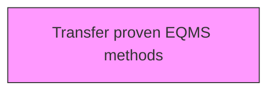
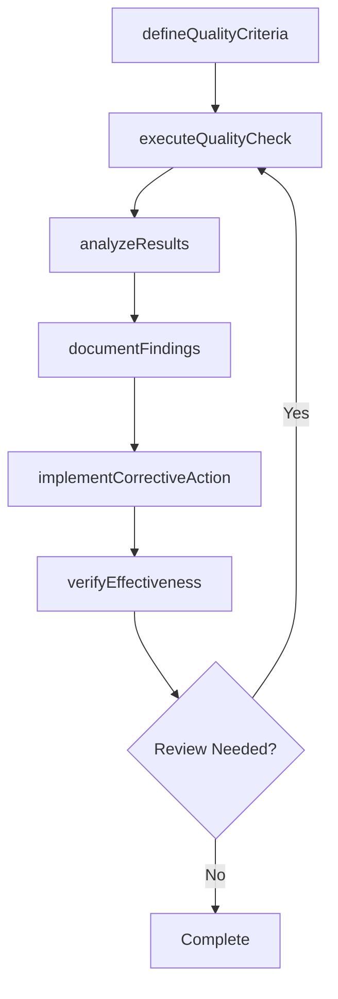

# Transfer proven EQMS methods

> Business-as-Code definition for transfer proven eqms methods. Models the process of recording and transferring the best practices and proven methods associated with enterprise quality management systems (eqms) that can be leveraged in improving the organization's framework.

## Overview

Recording and transferring the best practices and proven methods associated with enterprise quality management systems (EQMS) that can be leveraged in improving the organization's framework. Record proven methodologies and approaches with the objective of communicating them for upgrading, refining, and enhancing the organization's systems.

## Process Hierarchy



## GraphDL

```yaml
transfer:
  object: Proven EQMS Methods
  actor: QualityManager
  result: provenEqmsMethodsResult
```

## Actions

| Action | Description |
|--------|-------------|
| defineQualityCriteria | Establish measurable quality criteria for proven eqms methods |
| executeQualityCheck | Perform quality inspection or test for proven eqms methods |
| analyzeResults | Evaluate quality data and identify trends for proven eqms methods |
| documentFindings | Record quality findings and observations for proven eqms methods |
| implementCorrectiveAction | Take corrective action based on proven eqms methods findings |
| verifyEffectiveness | Confirm that corrective actions resolved proven eqms methods issues |

## Events

| Event | Description |
|-------|-------------|
| qualityCriteriaDefined | Measurable quality criteria established |
| qualityCheckExecuted | Quality inspection or test performed |
| resultsAnalyzed | Quality data evaluated and trends identified |
| findingsDocumented | Quality findings and observations recorded |
| correctiveActionImplemented | Corrective action taken based on findings |
| effectivenessVerified | Corrective action effectiveness confirmed |

## Searches

| Search | Description |
|--------|-------------|
| findProvenEqmsMethods | Retrieve proven eqms methods records filtered by status, date, or scope |
| getProvenEqmsMethodsDetails | Get detailed information for a specific proven eqms methods record |
| listProvenEqmsMethodsHistory | Query the history of changes and updates to proven eqms methods |
| getActiveItems | List currently active items related to proven eqms methods |

## Process Flow



## RACI Matrix

| Activity | Responsible | Accountable | Consulted | Informed |
|----------|-------------|-------------|-----------|----------|
| defineQualityCriteria | QualityEngineer | QualityManager | ProcessOwners | Stakeholders |
| executeQualityCheck | QualityAuditor | QualityManager | RegulatoryAffairs | Stakeholders |
| analyzeResults | QualityManager | VPQuality | Operations | Stakeholders |
| documentFindings | QualityEngineer | QualityManager | Manufacturing | Stakeholders |

## Related Processes

| Process | Relationship |
|---------|-------------|
| 13.3.1 Establish quality requirements | Upstream - requirements drive quality activities |
| 13.3.2 Evaluate performance to requirements | Parallel - testing validates quality |
| 13.3.3 Manage non-conformance | Downstream - non-conformances trigger corrective actions |

## Related Departments

| Department | Role |
|-----------|------|
| Quality | Primary owner of enterprise quality management |
| Operations | Implements quality controls in operational processes |
| Manufacturing | Applies quality standards in production environments |
| Regulatory Affairs | Ensures quality compliance with regulatory requirements |

## Related Occupations

| Occupation | Involvement |
|-----------|-------------|
| Quality Manager | Leads quality management programs |
| Quality Engineer | Designs and implements quality controls |
| Quality Auditor | Conducts quality audits and assessments |

## KPIs

| KPI | Description | Unit |
|-----|-------------|------|
| Defect Rate | Number of defects per unit of output | Per Unit |
| First Pass Yield | Percentage of units passing quality check on first attempt | % |
| Corrective Action Closure Time | Average time to close corrective actions | Days |
| Audit Finding Rate | Number of findings per audit conducted | Count |

## Usage

```typescript
import { transferProvenEqmsMethods } from '@headlessly/transfer-proven-eqms-methods'

const client = transferProvenEqmsMethods()

// Establish measurable quality criteria for proven eqms methods
const result = await client.defineQualityCriteria({
  scope: 'enterprise',
  period: 'Q1-2025'
})

// Perform quality inspection or test for proven eqms methods
const assessment = await client.executeQualityCheck({
  resultId: result.id,
  criteria: 'standard'
})

// Evaluate quality data and identify trends for proven eqms methods
await client.analyzeResults({
  resultId: result.id,
  format: 'detailed',
  recipients: ['stakeholders']
})
```
