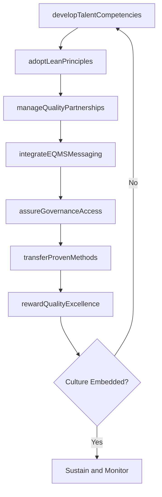

# Create environment and capability for EQMS improvement(s)

> Business-as-Code definition for EQMS improvement environment creation. Models the cultivation of a quality culture through recognition programs, partnerships, talent development, communications, governance, and best practice transfer.

## Overview

Rewarding excellence in quality. Create and maintain quality partnerships. Maintain talent capabilities and competencies. Incorporate EQMS messaging into communication channels. Transfer proven EQMS methods. Consider factors such as EQMS reviews and gap assessments and the alignment and compatibility of business processes and quality. Adopt Lean principles.

## Process Hierarchy

```mermaid
graph TD
    A[Create environment and capability for EQMS improvement(s)]
    A --> B[Reward quality excellence]
    A --> C[Create and maintain quality partnerships]
    A --> D[Maintain talent capabilities and competencies]
    A --> E[Incorporate EQMS messaging into communication channels]
    A --> F[Assure independent EQMS management access to appropriate authority in the organization]
    A --> G[Transfer proven EQMS methods]
```

## GraphDL

```yaml
create:
  object: Environment And Capability For EQMS Improvement(s)
  actor: EQMSManager
  result: EQMSImprovementReadinessAssessment
```

## Actions

| Action | Description |
|--------|-------------|
| rewardQualityExcellence | Administer monetary and nonmonetary recognition for quality achievements |
| manageQualityPartnerships | Establish and maintain partnerships with external quality organizations and suppliers |
| developTalentCompetencies | Maintain and upgrade quality-related skills across the workforce |
| integrateEQMSMessaging | Embed EQMS updates and quality messaging into organizational communication channels |
| assureGovernanceAccess | Ensure EQMS leadership has independent access to appropriate organizational authority |
| transferProvenMethods | Document and propagate validated quality improvement methods across business units |
| adoptLeanPrinciples | Integrate Lean methodologies into EQMS improvement activities |

## Events

| Event | Description |
|-------|-------------|
| qualityExcellenceRewarded | Quality achievement recognition issued to individuals or teams |
| qualityPartnershipEstablished | New quality partnership created or existing partnership renewed |
| talentCompetenciesDeveloped | Quality competency development program completed for a cohort |
| eqmsMessagingIntegrated | Quality messaging incorporated into organizational communication channels |
| governanceAccessAssured | EQMS management authority access verified and documented |
| provenMethodsTransferred | Validated quality methods documented and deployed to new units |
| leanPrinciplesAdopted | Lean methodology integrated into EQMS improvement workflow |

## Searches

| Search | Description |
|--------|-------------|
| getQualityRecognitions | Retrieve quality excellence awards by recipient, period, or type |
| findQualityPartnerships | List active quality partnerships by partner type or domain |
| getCompetencyGaps | Retrieve quality competency gaps by role or department |
| getMethodTransferStatus | Track proven method transfer progress across business units |

## Process Flow



## RACI Matrix

| Activity | Responsible | Accountable | Consulted | Informed |
|----------|-------------|-------------|-----------|----------|
| rewardQualityExcellence | EQMSManager | VP Quality | HR | AllEmployees |
| manageQualityPartnerships | EQMSManager | VP Quality | Procurement | SupplyChain |
| developTalentCompetencies | QualityTrainer | EQMSManager | HR | DepartmentManagers |
| transferProvenMethods | ContinuousImprovementLead | EQMSManager | ProcessOwners | QualityTeam |
| assureGovernanceAccess | EQMSManager | ChiefQualityOfficer | Legal | Executive |

## Sub-Processes

| ID | Name | Description |
|----|------|-------------|
| 13.3.4.6.1 | Reward quality excellence | Provisioning rewards for achieving quality excellence. Provide monetary and nonmonetary rewards such |
| 13.3.4.6.2 | Create and maintain quality partnerships | Establishing and maintaining partnerships with third-party sources to achieve quality excellence. So |
| 13.3.4.6.3 | Maintain talent capabilities and competencies | Maintaining a common denominator for the competency level within the organization's talent circle. C |
| 13.3.4.6.4 | Incorporate EQMS messaging into communication channels | Assimilating all the communication related to the EQMS into the organization's already established c |
| 13.3.4.6.5 | Assure independent EQMS management access to appropriate authority in the organization | Ensuring EQMS access to the person in charge of the quality management process. Establish who has th |
| 13.3.4.6.6 | Transfer proven EQMS methods | Recording and transferring the best practices and proven methods associated with enterprise quality  |

## Related Processes

| Process | Relationship |
|---------|-------------|
| 13.3.4.5 Assess EQMS performance | Upstream - performance assessments identify improvement needs |
| 13.3.4.4 Control EQMS documents and records | Parallel - document control supports method transfer |
| 13.3.4.1 Define EQMS scope and governance | Upstream - governance framework defines authority structures |

## Related Departments

| Department | Role |
|-----------|------|
| Quality Management | Primary owner of EQMS improvement environment |
| Human Resources | Manages recognition programs and competency development |
| Communications | Supports integration of EQMS messaging into channels |
| Continuous Improvement | Drives Lean adoption and method transfer initiatives |
| Procurement | Manages quality partnership agreements with suppliers |

## Related Occupations

| Occupation | Involvement |
|-----------|-------------|
| EQMS Manager | Orchestrates improvement environment creation and sustainment |
| Quality Trainer | Develops and delivers competency programs |
| Continuous Improvement Lead | Facilitates Lean adoption and method transfer |

## KPIs

| KPI | Description | Unit |
|-----|-------------|------|
| Quality Recognition Rate | Number of quality excellence awards issued per 1000 employees per year | Rate |
| Partnership Satisfaction Score | Average satisfaction rating from quality partnership assessments | Score (1-5) |
| Competency Gap Closure Rate | Percentage of identified quality competency gaps closed within target timeline | % |
| Method Transfer Adoption Rate | Percentage of business units adopting transferred quality methods | % |

## Usage

```typescript
import { createEnvironmentAndCapabilityForEqmsImprovements } from '@headlessly/create-environment-and-capability-for-eqms-improvements'

const eqmsEnvironment = createEnvironmentAndCapabilityForEqmsImprovements()

// Reward quality excellence for a team
const recognition = await eqmsEnvironment.rewardQualityExcellence({
  recipientType: 'team',
  recipientId: 'TEAM-manufacturing-quality',
  achievementType: 'zero-defects-quarter',
  rewardType: 'monetary-bonus'
})

// Transfer a proven EQMS method to a new business unit
const transfer = await eqmsEnvironment.transferProvenMethods({
  methodId: 'METHOD-statistical-process-control',
  sourceUnit: 'BU-automotive',
  targetUnit: 'BU-aerospace',
  adaptationRequired: true
})
```
