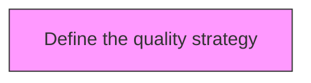
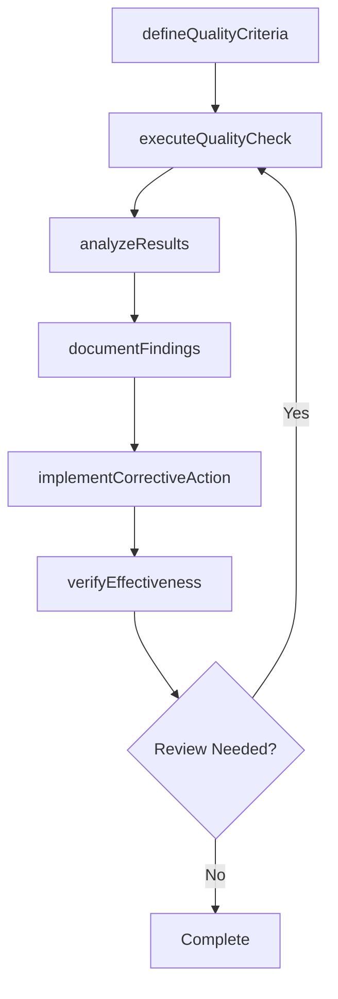

# Define the quality strategy

> Business-as-Code definition for define the quality strategy. Models the process of outlining the strategy for managing enterprise quality.

## Overview

Outlining the strategy for managing enterprise quality. Define and formalize quality techniques and standards. Assign responsibilities for achieving the required quality levels. Standardize the quality maintenance procedure, tools and techniques, recording and reporting, the timing of quality maintenance activities, and the roles and responsibilities for the quality management team.

## Process Hierarchy



## GraphDL

```yaml
define:
  object: Quality Strategy
  actor: QualityManager
  result: qualityStrategyResult
```

## Actions

| Action | Description |
|--------|-------------|
| defineQualityCriteria | Establish measurable quality criteria for quality strategy |
| executeQualityCheck | Perform quality inspection or test for quality strategy |
| analyzeResults | Evaluate quality data and identify trends for quality strategy |
| documentFindings | Record quality findings and observations for quality strategy |
| implementCorrectiveAction | Take corrective action based on quality strategy findings |
| verifyEffectiveness | Confirm that corrective actions resolved quality strategy issues |

## Events

| Event | Description |
|-------|-------------|
| qualityCriteriaDefined | Measurable quality criteria established |
| qualityCheckExecuted | Quality inspection or test performed |
| resultsAnalyzed | Quality data evaluated and trends identified |
| findingsDocumented | Quality findings and observations recorded |
| correctiveActionImplemented | Corrective action taken based on findings |
| effectivenessVerified | Corrective action effectiveness confirmed |

## Searches

| Search | Description |
|--------|-------------|
| findQualityStrategy | Retrieve quality strategy records filtered by status, date, or scope |
| getQualityStrategyDetails | Get detailed information for a specific quality strategy record |
| listQualityStrategyHistory | Query the history of changes and updates to quality strategy |
| getActiveItems | List currently active items related to quality strategy |

## Process Flow



## RACI Matrix

| Activity | Responsible | Accountable | Consulted | Informed |
|----------|-------------|-------------|-----------|----------|
| defineQualityCriteria | QualityEngineer | QualityManager | ProcessOwners | Stakeholders |
| executeQualityCheck | QualityAuditor | QualityManager | RegulatoryAffairs | Stakeholders |
| analyzeResults | QualityManager | VPQuality | Operations | Stakeholders |
| documentFindings | QualityEngineer | QualityManager | Manufacturing | Stakeholders |

## Related Processes

| Process | Relationship |
|---------|-------------|
| 13.3.1 Establish quality requirements | Upstream - requirements drive quality activities |
| 13.3.2 Evaluate performance to requirements | Parallel - testing validates quality |
| 13.3.3 Manage non-conformance | Downstream - non-conformances trigger corrective actions |

## Related Departments

| Department | Role |
|-----------|------|
| Quality | Primary owner of enterprise quality management |
| Operations | Implements quality controls in operational processes |
| Manufacturing | Applies quality standards in production environments |
| Regulatory Affairs | Ensures quality compliance with regulatory requirements |

## Related Occupations

| Occupation | Involvement |
|-----------|-------------|
| Quality Manager | Leads quality management programs |
| Quality Engineer | Designs and implements quality controls |
| Quality Auditor | Conducts quality audits and assessments |

## KPIs

| KPI | Description | Unit |
|-----|-------------|------|
| Defect Rate | Number of defects per unit of output | Per Unit |
| First Pass Yield | Percentage of units passing quality check on first attempt | % |
| Corrective Action Closure Time | Average time to close corrective actions | Days |
| Audit Finding Rate | Number of findings per audit conducted | Count |

## Usage

```typescript
import { defineTheQualityStrategy } from '@headlessly/define-the-quality-strategy'

const client = defineTheQualityStrategy()

// Establish measurable quality criteria for quality strategy
const result = await client.defineQualityCriteria({
  scope: 'enterprise',
  period: 'Q1-2025'
})

// Perform quality inspection or test for quality strategy
const assessment = await client.executeQualityCheck({
  resultId: result.id,
  criteria: 'standard'
})

// Evaluate quality data and identify trends for quality strategy
await client.analyzeResults({
  resultId: result.id,
  format: 'detailed',
  recipients: ['stakeholders']
})
```
