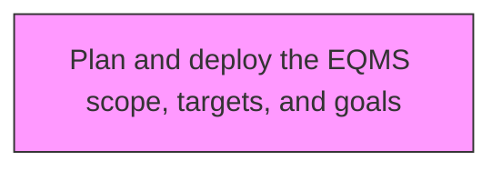
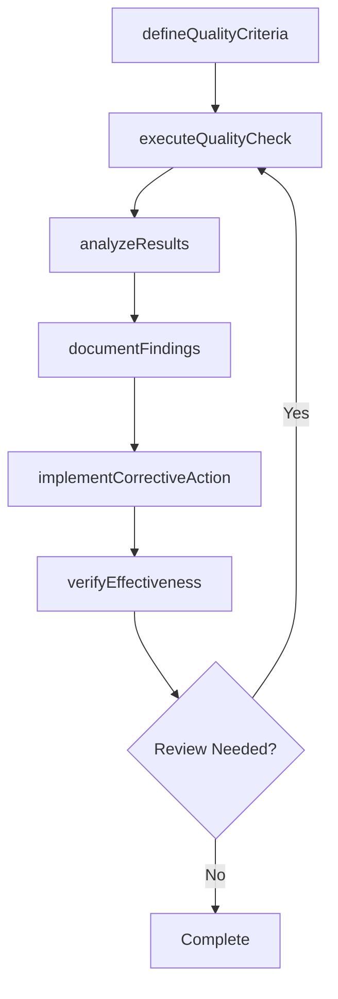

# Plan and deploy the EQMS scope, targets, and goals

> Business-as-Code definition for plan and deploy the eqms scope, targets, and goals. Models the process of establishing and effectively deploying the scope, targets, and goals of eqms.

## Overview

Establishing and effectively deploying the scope, targets, and goals of EQMS. Define the role of EQMS through nonconformance/corrective and preventive action, compliance/audit management, risk management, failure mode and effects analysis, and statistical process control. Implement EQMS into operational activities. Define the goals and objectives that are to be achieved by the EQMS.

## Process Hierarchy



## GraphDL

```yaml
plan:
  object: And Deploy EQMS Scope, Targets, And Goals
  actor: QualityManager
  result: deployEqmsScopeTargetsAndGoalsResult
```

## Actions

| Action | Description |
|--------|-------------|
| defineQualityCriteria | Establish measurable quality criteria for deploy eqms scope, targets, and goals |
| executeQualityCheck | Perform quality inspection or test for deploy eqms scope, targets, and goals |
| analyzeResults | Evaluate quality data and identify trends for deploy eqms scope, targets, and goals |
| documentFindings | Record quality findings and observations for deploy eqms scope, targets, and goals |
| implementCorrectiveAction | Take corrective action based on deploy eqms scope, targets, and goals findings |
| verifyEffectiveness | Confirm that corrective actions resolved deploy eqms scope, targets, and goals issues |

## Events

| Event | Description |
|-------|-------------|
| qualityCriteriaDefined | Measurable quality criteria established |
| qualityCheckExecuted | Quality inspection or test performed |
| resultsAnalyzed | Quality data evaluated and trends identified |
| findingsDocumented | Quality findings and observations recorded |
| correctiveActionImplemented | Corrective action taken based on findings |
| effectivenessVerified | Corrective action effectiveness confirmed |

## Searches

| Search | Description |
|--------|-------------|
| findDeployEqmsScopeTargetsAndGoals | Retrieve deploy eqms scope, targets, and goals records filtered by status, date, or scope |
| getDeployEqmsScopeTargetsAndGoalsDetails | Get detailed information for a specific deploy eqms scope, targets, and goals record |
| listDeployEqmsScopeTargetsAndGoalsHistory | Query the history of changes and updates to deploy eqms scope, targets, and goals |
| getActiveItems | List currently active items related to deploy eqms scope, targets, and goals |

## Process Flow



## RACI Matrix

| Activity | Responsible | Accountable | Consulted | Informed |
|----------|-------------|-------------|-----------|----------|
| defineQualityCriteria | QualityEngineer | QualityManager | ProcessOwners | Stakeholders |
| executeQualityCheck | QualityAuditor | QualityManager | RegulatoryAffairs | Stakeholders |
| analyzeResults | QualityManager | VPQuality | Operations | Stakeholders |
| documentFindings | QualityEngineer | QualityManager | Manufacturing | Stakeholders |

## Related Processes

| Process | Relationship |
|---------|-------------|
| 13.3.1 Establish quality requirements | Upstream - requirements drive quality activities |
| 13.3.2 Evaluate performance to requirements | Parallel - testing validates quality |
| 13.3.3 Manage non-conformance | Downstream - non-conformances trigger corrective actions |

## Related Departments

| Department | Role |
|-----------|------|
| Quality | Primary owner of enterprise quality management |
| Operations | Implements quality controls in operational processes |
| Manufacturing | Applies quality standards in production environments |
| Regulatory Affairs | Ensures quality compliance with regulatory requirements |

## Related Occupations

| Occupation | Involvement |
|-----------|-------------|
| Quality Manager | Leads quality management programs |
| Quality Engineer | Designs and implements quality controls |
| Quality Auditor | Conducts quality audits and assessments |

## KPIs

| KPI | Description | Unit |
|-----|-------------|------|
| Defect Rate | Number of defects per unit of output | Per Unit |
| First Pass Yield | Percentage of units passing quality check on first attempt | % |
| Corrective Action Closure Time | Average time to close corrective actions | Days |
| Audit Finding Rate | Number of findings per audit conducted | Count |

## Usage

```typescript
import { planAndDeployTheEqmsScopeTargetsAndGoals } from '@headlessly/plan-and-deploy-the-eqms-scope-targets-and-goals'

const client = planAndDeployTheEqmsScopeTargetsAndGoals()

// Establish measurable quality criteria for deploy eqms scope, targets, and goals
const result = await client.defineQualityCriteria({
  scope: 'enterprise',
  period: 'Q1-2025'
})

// Perform quality inspection or test for deploy eqms scope, targets, and goals
const assessment = await client.executeQualityCheck({
  resultId: result.id,
  criteria: 'standard'
})

// Evaluate quality data and identify trends for deploy eqms scope, targets, and goals
await client.analyzeResults({
  resultId: result.id,
  format: 'detailed',
  recipients: ['stakeholders']
})
```
