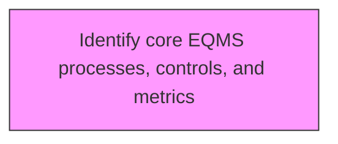
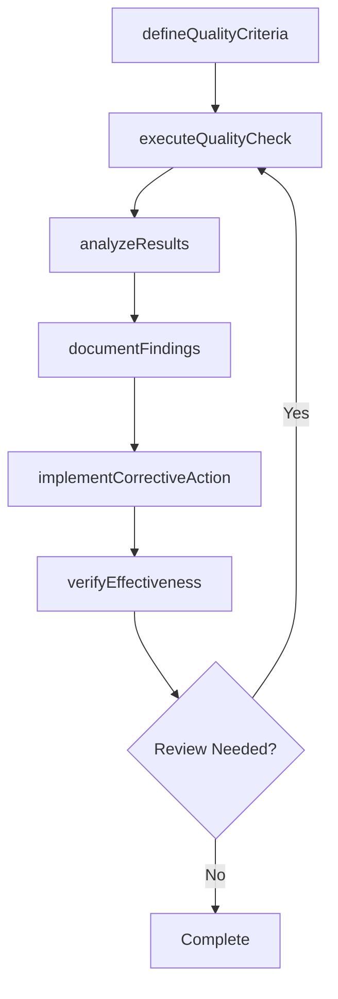

# Identify core EQMS processes, controls, and metrics

> Business-as-Code definition for identify core eqms processes, controls, and metrics. Models the process of recognizing and implementing the processes, controls, and metrics for maintenance of eqms.

## Overview

Recognizing and implementing the processes, controls, and metrics for maintenance of EQMS. Define the role of EQMS in failure mode and effects analysis, complaint handling, and advanced product quality planning. Establish the role of EQMS in evaluating metrics such as cost of quality, overall equipment effectiveness, on-time and complete shipments, percentage of products in compliance, and new product introductions.

## Process Hierarchy



## GraphDL

```yaml
identify:
  object: Core EQMS Processes, Controls, And Metrics
  actor: QualityManager
  result: coreEqmsProcessesControlsAndMetricsResult
```

## Actions

| Action | Description |
|--------|-------------|
| defineQualityCriteria | Establish measurable quality criteria for core eqms processes, controls, and metrics |
| executeQualityCheck | Perform quality inspection or test for core eqms processes, controls, and metrics |
| analyzeResults | Evaluate quality data and identify trends for core eqms processes, controls, and metrics |
| documentFindings | Record quality findings and observations for core eqms processes, controls, and metrics |
| implementCorrectiveAction | Take corrective action based on core eqms processes, controls, and metrics findings |
| verifyEffectiveness | Confirm that corrective actions resolved core eqms processes, controls, and metrics issues |

## Events

| Event | Description |
|-------|-------------|
| qualityCriteriaDefined | Measurable quality criteria established |
| qualityCheckExecuted | Quality inspection or test performed |
| resultsAnalyzed | Quality data evaluated and trends identified |
| findingsDocumented | Quality findings and observations recorded |
| correctiveActionImplemented | Corrective action taken based on findings |
| effectivenessVerified | Corrective action effectiveness confirmed |

## Searches

| Search | Description |
|--------|-------------|
| findCoreEqmsProcessesControlsAndMetrics | Retrieve core eqms processes, controls, and metrics records filtered by status, date, or scope |
| getCoreEqmsProcessesControlsAndMetricsDetails | Get detailed information for a specific core eqms processes, controls, and metrics record |
| listCoreEqmsProcessesControlsAndMetricsHistory | Query the history of changes and updates to core eqms processes, controls, and metrics |
| getActiveItems | List currently active items related to core eqms processes, controls, and metrics |

## Process Flow



## RACI Matrix

| Activity | Responsible | Accountable | Consulted | Informed |
|----------|-------------|-------------|-----------|----------|
| defineQualityCriteria | QualityEngineer | QualityManager | ProcessOwners | Stakeholders |
| executeQualityCheck | QualityAuditor | QualityManager | RegulatoryAffairs | Stakeholders |
| analyzeResults | QualityManager | VPQuality | Operations | Stakeholders |
| documentFindings | QualityEngineer | QualityManager | Manufacturing | Stakeholders |

## Related Processes

| Process | Relationship |
|---------|-------------|
| 13.3.1 Establish quality requirements | Upstream - requirements drive quality activities |
| 13.3.2 Evaluate performance to requirements | Parallel - testing validates quality |
| 13.3.3 Manage non-conformance | Downstream - non-conformances trigger corrective actions |

## Related Departments

| Department | Role |
|-----------|------|
| Quality | Primary owner of enterprise quality management |
| Operations | Implements quality controls in operational processes |
| Manufacturing | Applies quality standards in production environments |
| Regulatory Affairs | Ensures quality compliance with regulatory requirements |

## Related Occupations

| Occupation | Involvement |
|-----------|-------------|
| Quality Manager | Leads quality management programs |
| Quality Engineer | Designs and implements quality controls |
| Quality Auditor | Conducts quality audits and assessments |

## KPIs

| KPI | Description | Unit |
|-----|-------------|------|
| Defect Rate | Number of defects per unit of output | Per Unit |
| First Pass Yield | Percentage of units passing quality check on first attempt | % |
| Corrective Action Closure Time | Average time to close corrective actions | Days |
| Audit Finding Rate | Number of findings per audit conducted | Count |

## Usage

```typescript
import { identifyCoreEqmsProcessesControlsAndMetrics } from '@headlessly/identify-core-eqms-processes-controls-and-metrics'

const client = identifyCoreEqmsProcessesControlsAndMetrics()

// Establish measurable quality criteria for core eqms processes, controls, and metrics
const result = await client.defineQualityCriteria({
  scope: 'enterprise',
  period: 'Q1-2025'
})

// Perform quality inspection or test for core eqms processes, controls, and metrics
const assessment = await client.executeQualityCheck({
  resultId: result.id,
  criteria: 'standard'
})

// Evaluate quality data and identify trends for core eqms processes, controls, and metrics
await client.analyzeResults({
  resultId: result.id,
  format: 'detailed',
  recipients: ['stakeholders']
})
```
