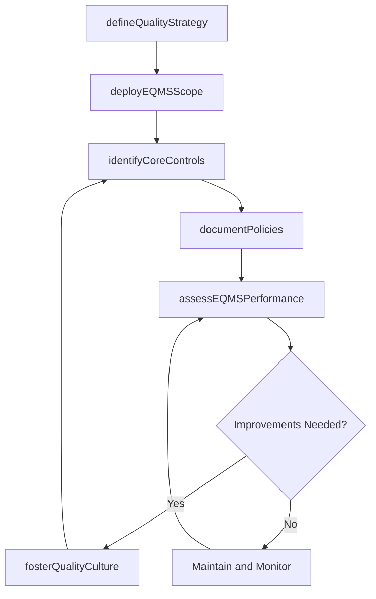

# Implement and maintain the enterprise quality management system (EQMS)

> Business-as-Code definition for enterprise quality management system governance. Models the strategy, deployment, process control, documentation, performance assessment, and continuous improvement of the EQMS across the value chain.

## Overview

Establishing and administering the software that manages content and business processes for quality and compliance across the value chain. Define the quality strategy. Plan and deploy the EQMS scope, targets, and goals. Identify core process controls and metric. Develop EQMS governance. Assess the performance of EQMS. Encourage improvements in EQMS.

## Process Hierarchy

```mermaid
graph TD
    A[Implement and maintain the enterprise quality management system (EQMS)]
    A --> B[Define the quality strategy]
    A --> C[Plan and deploy the EQMS scope, targets, and goals]
    A --> D[Identify core EQMS processes, controls, and metrics]
    A --> E[Develop and document EQMS policies, procedures, standards, and measures]
    A --> F[Assess the EQMS performance]
    A --> G[Create environment and capability for EQMS improvement(s)]
```

## GraphDL

```yaml
implement:
  object: And Maintain Enterprise Quality Management System (EQMS)
  actor: EQMSManager
  result: EQMSPerformanceAssessment
```

## Actions

| Action | Description |
|--------|-------------|
| defineQualityStrategy | Formalize quality vision, techniques, and strategic objectives |
| deployEQMSScope | Establish and communicate EQMS scope, targets, and goals across the organization |
| identifyCoreControls | Define the critical processes, controls, and metrics for the EQMS |
| documentPolicies | Develop and publish EQMS policies, procedures, standards, and measures |
| assessEQMSPerformance | Benchmark current EQMS performance and identify improvement gaps |
| fosterQualityCulture | Build an environment that rewards quality excellence and continuous improvement |

## Events

| Event | Description |
|-------|-------------|
| qualityStrategyDefined | Quality strategy formalized and approved by leadership |
| eqmsScopeDeployed | EQMS scope, targets, and goals communicated to all business units |
| coreControlsIdentified | Critical EQMS processes, controls, and metrics documented |
| policiesDocumented | EQMS policies and procedures published in the document control system |
| eqmsPerformanceAssessed | EQMS performance benchmark completed with gap analysis |
| qualityCultureFostered | Quality culture initiatives launched with recognition programs |

## Searches

| Search | Description |
|--------|-------------|
| getEQMSPolicies | Retrieve current EQMS policies and procedures by category |
| getEQMSMetrics | Retrieve EQMS performance metrics by business unit or process |
| findEQMSGaps | List performance gaps identified in the most recent EQMS assessment |
| getQualityPartners | Retrieve quality partnership agreements and their status |

## Process Flow



## RACI Matrix

| Activity | Responsible | Accountable | Consulted | Informed |
|----------|-------------|-------------|-----------|----------|
| defineQualityStrategy | EQMSManager | VP Quality | Executive | AllEmployees |
| deployEQMSScope | EQMSManager | VP Quality | BusinessUnitLeads | Operations |
| documentPolicies | QualityDocumentController | EQMSManager | ProcessOwners | RegulatoryAffairs |
| assessEQMSPerformance | InternalAuditor | VP Quality | EQMSManager | Board |
| fosterQualityCulture | EQMSManager | VP Quality | HR | AllEmployees |

## Sub-Processes

| ID | Name | Description |
|----|------|-------------|
| 13.3.4.1 | Define the quality strategy | Outlining the strategy for managing enterprise quality. Define and formalize quality techniques and  |
| 13.3.4.2 | Plan and deploy the EQMS scope, targets, and goals | Establishing and effectively deploying the scope, targets, and goals of EQMS. Define the role of EQM |
| 13.3.4.3 | Identify core EQMS processes, controls, and metrics | Recognizing and implementing the processes, controls, and metrics for maintenance of EQMS. Define th |
| 13.3.4.4 | Develop and document EQMS policies, procedures, standards, and measures | Setting the process limits. Gather required information. Align with other documents and processes. D |
| 13.3.4.5 | Assess the EQMS performance | Benchmarking current performance in quality metrics that span across the value chain. Identify gaps  |
| 13.3.4.6 | Create environment and capability for EQMS improvement(s) | Rewarding excellence in quality. Create and maintain quality partnerships. Maintain talent capabilit |

## Related Processes

| Process | Relationship |
|---------|-------------|
| 13.3.1 Establish quality requirements | Upstream - quality requirements feed EQMS controls |
| 13.3.2 Evaluate performance to requirements | Parallel - test data feeds EQMS dashboards |
| 13.3.3 Manage non-conformance | Parallel - CAPA data is managed within the EQMS |
| 13.1 Manage business processes | Upstream - process definitions underpin EQMS process controls |

## Related Departments

| Department | Role |
|-----------|------|
| Quality Assurance | Primary owner of EQMS strategy and governance |
| IT | Provides the technology platform and integrations for EQMS |
| Operations | Implements EQMS processes and controls on the floor |
| Regulatory Affairs | Ensures EQMS compliance with external standards and regulations |
| Human Resources | Supports quality culture and competency development |

## Related Occupations

| Occupation | Involvement |
|-----------|-------------|
| EQMS Manager | Oversees system strategy, deployment, and performance |
| Quality Document Controller | Manages policy documentation and version control |
| Internal Auditor | Assesses EQMS compliance and effectiveness |

## KPIs

| KPI | Description | Unit |
|-----|-------------|------|
| EQMS Adoption Rate | Percentage of business units actively using the EQMS | % |
| Policy Currency Rate | Percentage of EQMS documents reviewed within their revision cycle | % |
| Audit Finding Closure Rate | Percentage of EQMS audit findings closed within target timeframe | % |
| Quality Culture Index | Composite survey-based index of employee quality awareness | Score (1-10) |

## Usage

```typescript
import { implementAndMaintainEQMS } from '@headlessly/implement-and-maintain-enterprise-quality-management-system-eqms'

const eqms = implementAndMaintainEQMS()

// Define the quality strategy
const strategy = await eqms.defineQualityStrategy({
  vision: 'Zero defects through prevention-based quality culture',
  certifications: ['ISO-9001', 'ISO-13485'],
  strategicObjectives: ['reduce-COPQ-by-30-percent', 'achieve-99.5-first-pass-yield']
})

// Assess EQMS performance
const assessment = await eqms.assessEQMSPerformance({
  scope: 'enterprise',
  benchmarkSource: 'APQC-quality-benchmarks',
  period: '2025-annual'
})
```
