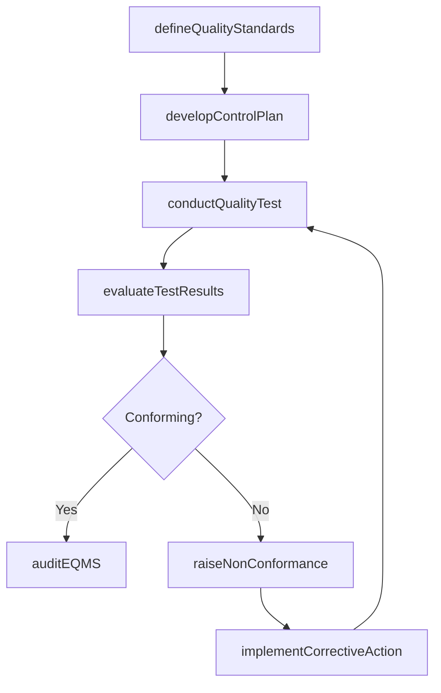

# Manage enterprise quality

> Business-as-Code definition for enterprise quality management. Models the complete quality lifecycle from requirements definition and control planning through testing, non-conformance resolution, and continuous EQMS governance.

## Overview

Managing organizational attributes that are closely associated with the quality of output. Determine the quality requirements. Evaluate the correspondence between the quality performance and requirements. Manage non-conformance activities. Ensure implementation and maintenance of the enterprise quality management system.

## Process Hierarchy

```mermaid
graph TD
    A[Manage enterprise quality]
    A --> B[Establish quality requirements]
    A --> C[Evaluate performance to requirements]
    A --> D[Manage non-conformance]
    A --> E[Implement and maintain the enterprise quality management system (EQMS)]
```

## GraphDL

```yaml
manage:
  object: Enterprise Quality
  actor: QualityManager
  result: QualityComplianceReport
```

## Actions

| Action | Description |
|--------|-------------|
| defineQualityStandards | Establish critical-to-quality characteristics and acceptance criteria |
| developControlPlan | Create sampling plans, measurement methods, and inspection procedures |
| conductQualityTest | Execute quality tests and collect conformance data |
| evaluateTestResults | Assess test outcomes against quality plan thresholds |
| raiseNonConformance | Log a non-conformance event with impact assessment and root cause |
| implementCorrectiveAction | Execute corrective or preventive actions to resolve quality gaps |
| auditEQMS | Perform internal audit of the enterprise quality management system |

## Events

| Event | Description |
|-------|-------------|
| qualityStandardsDefined | Critical-to-quality characteristics and acceptance criteria established |
| controlPlanDeveloped | Quality control plan finalized with sampling and measurement methods |
| qualityTestConducted | Quality inspection or test completed with data collected |
| testResultsEvaluated | Test outcomes assessed and disposition determined |
| nonConformanceRaised | Non-conformance event logged with severity and impact classification |
| correctiveActionImplemented | Corrective or preventive action completed and verified |
| eqmsAudited | Enterprise quality management system audit completed |

## Searches

| Search | Description |
|--------|-------------|
| findNonConformances | List non-conformance records filtered by severity, status, or date range |
| getQualityMetrics | Retrieve quality KPIs such as defect rate, yield, and first-pass quality |
| getControlPlan | Retrieve the active quality control plan for a process or product |
| findAuditFindings | List audit findings by category, status, or business unit |
| getCorrectiveActions | Retrieve open or closed corrective action records |

## Process Flow



## RACI Matrix

| Activity | Responsible | Accountable | Consulted | Informed |
|----------|-------------|-------------|-----------|----------|
| defineQualityStandards | QualityEngineer | QualityManager | ProductEngineering | Operations |
| conductQualityTest | QualityInspector | QualityManager | ProcessOwner | Production |
| raiseNonConformance | QualityInspector | QualityManager | Engineering | SupplyChain |
| implementCorrectiveAction | ProcessOwner | QualityManager | QualityEngineer | Executive |
| auditEQMS | InternalAuditor | VP Quality | QualityManager | Board |

## Sub-Processes

| ID | Name | Description |
|----|------|-------------|
| 13.3.1 | Establish quality requirements | Determining essential activities, processes, and attributes for securing enterprise quality. Outline |
| 13.3.2 | Evaluate performance to requirements | Analyzing if the performance of the quality plan has achieved the estimated and desired requirements |
| 13.3.3 | Manage non-conformance | Handling any nonconformance activities or events. Assess the potential impact of the nonconformity.  |
| 13.3.4 | Implement and maintain the enterprise quality management system (EQMS) | Establishing and administering the software that manages content and business processes for quality  |

## Related Processes

| Process | Relationship |
|---------|-------------|
| 13.1 Manage business processes | Upstream - process definitions provide the baseline for quality controls |
| 13.6 Measure and benchmark | Parallel - benchmarking data informs quality targets |
| 13.4 Manage change | Downstream - quality improvements trigger change initiatives |
| 4.3 Produce/Manufacture/Deliver product | Consumer - production relies on quality standards |

## Related Departments

| Department | Role |
|-----------|------|
| Quality Assurance | Primary owner of enterprise quality standards and audits |
| Operations | Executes processes subject to quality controls |
| Engineering | Designs products and processes to meet quality specifications |
| Supply Chain | Ensures supplier quality and incoming material conformance |
| Regulatory Affairs | Maintains alignment with external quality regulations |

## Related Occupations

| Occupation | Involvement |
|-----------|-------------|
| Quality Manager | Oversees the enterprise quality management system |
| Quality Engineer | Designs quality controls and sampling plans |
| Quality Inspector | Executes inspections and tests |
| Internal Auditor | Conducts EQMS compliance audits |

## KPIs

| KPI | Description | Unit |
|-----|-------------|------|
| First Pass Yield | Percentage of units passing quality inspection on first attempt | % |
| Defect Rate | Number of defects per million opportunities | DPMO |
| Cost of Poor Quality | Total cost attributable to internal and external failures | Currency |
| Non-Conformance Closure Time | Average time to resolve non-conformance events | Days |
| Audit Finding Resolution Rate | Percentage of audit findings resolved within target timeframe | % |

## Usage

```typescript
import { manageEnterpriseQuality } from '@headlessly/manage-enterprise-quality'

const quality = manageEnterpriseQuality()

// Define quality standards for a product line
const standards = await quality.defineQualityStandards({
  productLine: 'industrial-sensors',
  characteristics: ['accuracy', 'durability', 'response-time'],
  acceptanceCriteria: { accuracy: { tolerance: 0.01, unit: 'mm' } }
})

// Raise a non-conformance event
const ncr = await quality.raiseNonConformance({
  source: 'incoming-inspection',
  severity: 'major',
  description: 'Batch 4421 sensor calibration out of tolerance'
})
```
