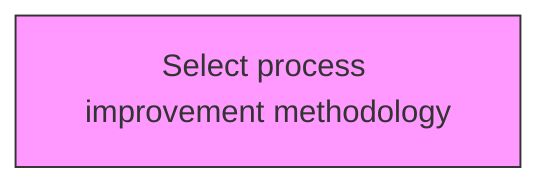
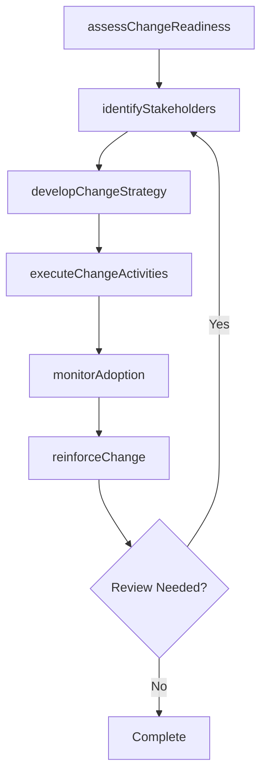

# Select process improvement methodology

> Business-as-Code definition for select process improvement methodology. Models the process of assessing and choosing methodologies to identify, analyze, and improve existing processes within an organization to meet new goals and objective.

## Overview

Assessing and choosing methodologies to identify, analyze, and improve existing processes within an organization to meet new goals and objective. Assess the various methodologies available such as process mapping, statistical process control, and simulation. Choose the most appropriate and effective methodology.

## Process Hierarchy



## GraphDL

```yaml
select:
  object: Process Improvement Methodology
  actor: ChangeManager
  result: processImprovementMethodologyResult
```

## Actions

| Action | Description |
|--------|-------------|
| assessChangeReadiness | Evaluate organizational readiness for process improvement methodology |
| identifyStakeholders | Map stakeholders impacted by process improvement methodology |
| developChangeStrategy | Create the strategic approach for process improvement methodology |
| executeChangeActivities | Implement planned change activities for process improvement methodology |
| monitorAdoption | Track adoption rates and resistance for process improvement methodology |
| reinforceChange | Sustain and reinforce the outcomes of process improvement methodology |

## Events

| Event | Description |
|-------|-------------|
| changeReadinessAssessed | Organizational readiness for change evaluated |
| stakeholdersIdentified | Impacted stakeholders mapped and categorized |
| changeStrategyDeveloped | Strategic approach for change initiative created |
| changeActivitiesExecuted | Planned change activities implemented |
| adoptionMonitored | Adoption rates and resistance tracked |
| changeReinforced | Change outcomes sustained and reinforced |

## Searches

| Search | Description |
|--------|-------------|
| findProcessImprovementMethodology | Retrieve process improvement methodology records filtered by status, date, or scope |
| getProcessImprovementMethodologyDetails | Get detailed information for a specific process improvement methodology record |
| listProcessImprovementMethodologyHistory | Query the history of changes and updates to process improvement methodology |
| getActiveItems | List currently active items related to process improvement methodology |

## Process Flow



## RACI Matrix

| Activity | Responsible | Accountable | Consulted | Informed |
|----------|-------------|-------------|-----------|----------|
| assessChangeReadiness | ChangeManager | TransformationLead | BusinessUnitHeads | Stakeholders |
| identifyStakeholders | ChangeChampion | ChangeManager | HRBusinessPartner | Stakeholders |
| developChangeStrategy | CommunicationsLead | ChangeManager | ExecutiveTeam | Stakeholders |
| executeChangeActivities | ChangeManager | TransformationLead | OrganizationalDevelopment | Stakeholders |

## Related Processes

| Process | Relationship |
|---------|-------------|
| 13.4.1 Plan for change | Upstream - planning precedes design and implementation |
| 13.4.2 Design the change | Parallel - change design informs implementation |
| 13.4.3 Implement change | Downstream - implementation executes the change plan |

## Related Departments

| Department | Role |
|-----------|------|
| Organizational Development | Leads enterprise change management capability |
| Human Resources | Supports people-side change impacts and training |
| Communications | Delivers change messaging and stakeholder engagement |
| Operations | Implements operational changes and process redesigns |

## Related Occupations

| Occupation | Involvement |
|-----------|-------------|
| Change Manager | Leads change planning and execution |
| Change Champion | Advocates for change adoption within business units |
| Organizational Development Specialist | Designs change interventions and support |

## KPIs

| KPI | Description | Unit |
|-----|-------------|------|
| Change Adoption Rate | Percentage of impacted employees who adopted the change | % |
| Resistance Level | Measured level of organizational resistance to change | Score (1-5) |
| Training Completion Rate | Percentage of required training completed on time | % |
| Change Sustainability | Percentage of changes sustained after 6 months | % |

## Usage

```typescript
import { selectProcessImprovementMethodology } from '@headlessly/select-process-improvement-methodology'

const client = selectProcessImprovementMethodology()

// Evaluate organizational readiness for process improvement methodology
const result = await client.assessChangeReadiness({
  scope: 'enterprise',
  period: 'Q1-2025'
})

// Map stakeholders impacted by process improvement methodology
const assessment = await client.identifyStakeholders({
  resultId: result.id,
  criteria: 'standard'
})

// Create the strategic approach for process improvement methodology
await client.developChangeStrategy({
  resultId: result.id,
  format: 'detailed',
  recipients: ['stakeholders']
})
```
