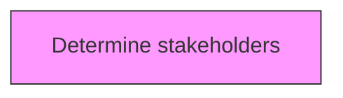
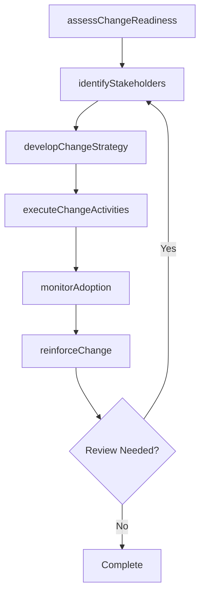

# Determine stakeholders

> Business-as-Code definition for determine stakeholders. Models the process of identifying and communicating with shareholders affected by the change.

## Overview

Identifying and communicating with shareholders affected by the change. Consider internal and external stakeholders that will be affected by the change. Determine the amount of influence the change will have on them. Ensure the involvement of these stakeholders in the change process by effectively communicating with them.

## Process Hierarchy



## GraphDL

```yaml
determine:
  object: Stakeholders
  actor: ChangeManager
  result: stakeholdersResult
```

## Actions

| Action | Description |
|--------|-------------|
| assessChangeReadiness | Evaluate organizational readiness for stakeholders |
| identifyStakeholders | Map stakeholders impacted by stakeholders |
| developChangeStrategy | Create the strategic approach for stakeholders |
| executeChangeActivities | Implement planned change activities for stakeholders |
| monitorAdoption | Track adoption rates and resistance for stakeholders |
| reinforceChange | Sustain and reinforce the outcomes of stakeholders |

## Events

| Event | Description |
|-------|-------------|
| changeReadinessAssessed | Organizational readiness for change evaluated |
| stakeholdersIdentified | Impacted stakeholders mapped and categorized |
| changeStrategyDeveloped | Strategic approach for change initiative created |
| changeActivitiesExecuted | Planned change activities implemented |
| adoptionMonitored | Adoption rates and resistance tracked |
| changeReinforced | Change outcomes sustained and reinforced |

## Searches

| Search | Description |
|--------|-------------|
| findStakeholders | Retrieve stakeholders records filtered by status, date, or scope |
| getStakeholdersDetails | Get detailed information for a specific stakeholders record |
| listStakeholdersHistory | Query the history of changes and updates to stakeholders |
| getActiveItems | List currently active items related to stakeholders |

## Process Flow



## RACI Matrix

| Activity | Responsible | Accountable | Consulted | Informed |
|----------|-------------|-------------|-----------|----------|
| assessChangeReadiness | ChangeManager | TransformationLead | BusinessUnitHeads | Stakeholders |
| identifyStakeholders | ChangeChampion | ChangeManager | HRBusinessPartner | Stakeholders |
| developChangeStrategy | CommunicationsLead | ChangeManager | ExecutiveTeam | Stakeholders |
| executeChangeActivities | ChangeManager | TransformationLead | OrganizationalDevelopment | Stakeholders |

## Related Processes

| Process | Relationship |
|---------|-------------|
| 13.4.1 Plan for change | Upstream - planning precedes design and implementation |
| 13.4.2 Design the change | Parallel - change design informs implementation |
| 13.4.3 Implement change | Downstream - implementation executes the change plan |

## Related Departments

| Department | Role |
|-----------|------|
| Organizational Development | Leads enterprise change management capability |
| Human Resources | Supports people-side change impacts and training |
| Communications | Delivers change messaging and stakeholder engagement |
| Operations | Implements operational changes and process redesigns |

## Related Occupations

| Occupation | Involvement |
|-----------|-------------|
| Change Manager | Leads change planning and execution |
| Change Champion | Advocates for change adoption within business units |
| Organizational Development Specialist | Designs change interventions and support |

## KPIs

| KPI | Description | Unit |
|-----|-------------|------|
| Change Adoption Rate | Percentage of impacted employees who adopted the change | % |
| Resistance Level | Measured level of organizational resistance to change | Score (1-5) |
| Training Completion Rate | Percentage of required training completed on time | % |
| Change Sustainability | Percentage of changes sustained after 6 months | % |

## Usage

```typescript
import { determineStakeholders } from '@headlessly/determine-stakeholders'

const client = determineStakeholders()

// Evaluate organizational readiness for stakeholders
const result = await client.assessChangeReadiness({
  scope: 'enterprise',
  period: 'Q1-2025'
})

// Map stakeholders impacted by stakeholders
const assessment = await client.identifyStakeholders({
  resultId: result.id,
  criteria: 'standard'
})

// Create the strategic approach for stakeholders
await client.developChangeStrategy({
  resultId: result.id,
  format: 'detailed',
  recipients: ['stakeholders']
})
```
