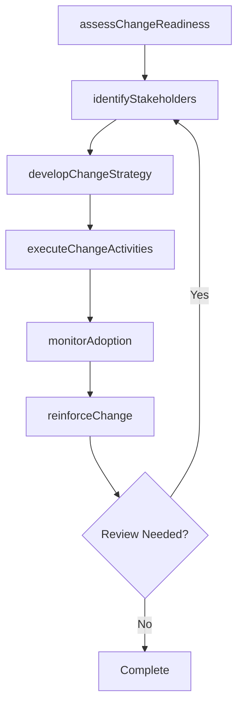

# Identify change champion(s)

> Business-as-Code definition for identify change champion(s). Models the process of identifying people exhibit an extraordinary interest in the adoption, implementation, and success of the change.

## Overview

Identifying people exhibit an extraordinary interest in the adoption, implementation, and success of the change. Engage champions in each division or team. Define the roles and responsibilities for the change champions. Determine criteria for selecting change champions. Provide training sessions to champions. Reward and recognize champions.

## Process Hierarchy

```mermaid
graph TD
    A[Identify change champion(s)]
    style A fill:#f9f,stroke:#333
```

## GraphDL

```yaml
identify:
  object: Change Champion(s)
  actor: ChangeManager
  result: changeChampionsResult
```

## Actions

| Action | Description |
|--------|-------------|
| assessChangeReadiness | Evaluate organizational readiness for change champion(s) |
| identifyStakeholders | Map stakeholders impacted by change champion(s) |
| developChangeStrategy | Create the strategic approach for change champion(s) |
| executeChangeActivities | Implement planned change activities for change champion(s) |
| monitorAdoption | Track adoption rates and resistance for change champion(s) |
| reinforceChange | Sustain and reinforce the outcomes of change champion(s) |

## Events

| Event | Description |
|-------|-------------|
| changeReadinessAssessed | Organizational readiness for change evaluated |
| stakeholdersIdentified | Impacted stakeholders mapped and categorized |
| changeStrategyDeveloped | Strategic approach for change initiative created |
| changeActivitiesExecuted | Planned change activities implemented |
| adoptionMonitored | Adoption rates and resistance tracked |
| changeReinforced | Change outcomes sustained and reinforced |

## Searches

| Search | Description |
|--------|-------------|
| findChangeChampions | Retrieve change champion(s) records filtered by status, date, or scope |
| getChangeChampionsDetails | Get detailed information for a specific change champion(s) record |
| listChangeChampionsHistory | Query the history of changes and updates to change champion(s) |
| getActiveItems | List currently active items related to change champion(s) |

## Process Flow



## RACI Matrix

| Activity | Responsible | Accountable | Consulted | Informed |
|----------|-------------|-------------|-----------|----------|
| assessChangeReadiness | ChangeManager | TransformationLead | BusinessUnitHeads | Stakeholders |
| identifyStakeholders | ChangeChampion | ChangeManager | HRBusinessPartner | Stakeholders |
| developChangeStrategy | CommunicationsLead | ChangeManager | ExecutiveTeam | Stakeholders |
| executeChangeActivities | ChangeManager | TransformationLead | OrganizationalDevelopment | Stakeholders |

## Related Processes

| Process | Relationship |
|---------|-------------|
| 13.4.1 Plan for change | Upstream - planning precedes design and implementation |
| 13.4.2 Design the change | Parallel - change design informs implementation |
| 13.4.3 Implement change | Downstream - implementation executes the change plan |

## Related Departments

| Department | Role |
|-----------|------|
| Organizational Development | Leads enterprise change management capability |
| Human Resources | Supports people-side change impacts and training |
| Communications | Delivers change messaging and stakeholder engagement |
| Operations | Implements operational changes and process redesigns |

## Related Occupations

| Occupation | Involvement |
|-----------|-------------|
| Change Manager | Leads change planning and execution |
| Change Champion | Advocates for change adoption within business units |
| Organizational Development Specialist | Designs change interventions and support |

## KPIs

| KPI | Description | Unit |
|-----|-------------|------|
| Change Adoption Rate | Percentage of impacted employees who adopted the change | % |
| Resistance Level | Measured level of organizational resistance to change | Score (1-5) |
| Training Completion Rate | Percentage of required training completed on time | % |
| Change Sustainability | Percentage of changes sustained after 6 months | % |

## Usage

```typescript
import { identifyChangeChampions } from '@headlessly/identify-change-champions'

const client = identifyChangeChampions()

// Evaluate organizational readiness for change champion(s)
const result = await client.assessChangeReadiness({
  scope: 'enterprise',
  period: 'Q1-2025'
})

// Map stakeholders impacted by change champion(s)
const assessment = await client.identifyStakeholders({
  resultId: result.id,
  criteria: 'standard'
})

// Create the strategic approach for change champion(s)
await client.developChangeStrategy({
  resultId: result.id,
  format: 'detailed',
  recipients: ['stakeholders']
})
```
