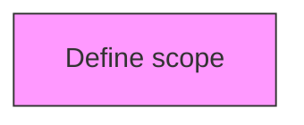
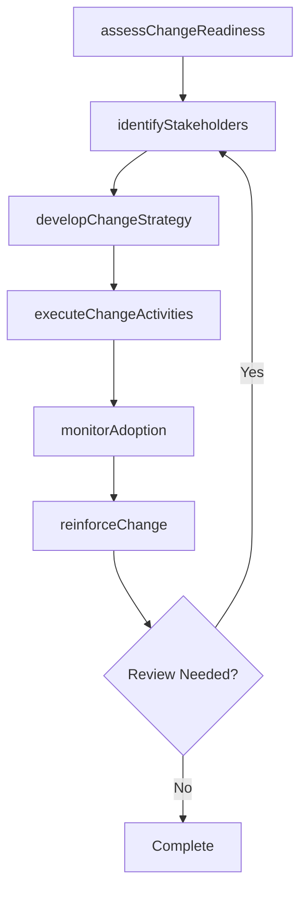

# Define scope

> Business-as-Code definition for define scope. Models the process of defining the extent of the area or subject matter that the change process deals with or to which it is relevant.

## Overview

Defining the extent of the area or subject matter that the change process deals with or to which it is relevant. Establish a set of tools, processes, skills, and principles for managing the people side of change to achieve the required outcomes of the change process.

## Process Hierarchy



## GraphDL

```yaml
define:
  object: Scope
  actor: ChangeManager
  result: scopeResult
```

## Actions

| Action | Description |
|--------|-------------|
| assessChangeReadiness | Evaluate organizational readiness for scope |
| identifyStakeholders | Map stakeholders impacted by scope |
| developChangeStrategy | Create the strategic approach for scope |
| executeChangeActivities | Implement planned change activities for scope |
| monitorAdoption | Track adoption rates and resistance for scope |
| reinforceChange | Sustain and reinforce the outcomes of scope |

## Events

| Event | Description |
|-------|-------------|
| changeReadinessAssessed | Organizational readiness for change evaluated |
| stakeholdersIdentified | Impacted stakeholders mapped and categorized |
| changeStrategyDeveloped | Strategic approach for change initiative created |
| changeActivitiesExecuted | Planned change activities implemented |
| adoptionMonitored | Adoption rates and resistance tracked |
| changeReinforced | Change outcomes sustained and reinforced |

## Searches

| Search | Description |
|--------|-------------|
| findScope | Retrieve scope records filtered by status, date, or scope |
| getScopeDetails | Get detailed information for a specific scope record |
| listScopeHistory | Query the history of changes and updates to scope |
| getActiveItems | List currently active items related to scope |

## Process Flow



## RACI Matrix

| Activity | Responsible | Accountable | Consulted | Informed |
|----------|-------------|-------------|-----------|----------|
| assessChangeReadiness | ChangeManager | TransformationLead | BusinessUnitHeads | Stakeholders |
| identifyStakeholders | ChangeChampion | ChangeManager | HRBusinessPartner | Stakeholders |
| developChangeStrategy | CommunicationsLead | ChangeManager | ExecutiveTeam | Stakeholders |
| executeChangeActivities | ChangeManager | TransformationLead | OrganizationalDevelopment | Stakeholders |

## Related Processes

| Process | Relationship |
|---------|-------------|
| 13.4.1 Plan for change | Upstream - planning precedes design and implementation |
| 13.4.2 Design the change | Parallel - change design informs implementation |
| 13.4.3 Implement change | Downstream - implementation executes the change plan |

## Related Departments

| Department | Role |
|-----------|------|
| Organizational Development | Leads enterprise change management capability |
| Human Resources | Supports people-side change impacts and training |
| Communications | Delivers change messaging and stakeholder engagement |
| Operations | Implements operational changes and process redesigns |

## Related Occupations

| Occupation | Involvement |
|-----------|-------------|
| Change Manager | Leads change planning and execution |
| Change Champion | Advocates for change adoption within business units |
| Organizational Development Specialist | Designs change interventions and support |

## KPIs

| KPI | Description | Unit |
|-----|-------------|------|
| Change Adoption Rate | Percentage of impacted employees who adopted the change | % |
| Resistance Level | Measured level of organizational resistance to change | Score (1-5) |
| Training Completion Rate | Percentage of required training completed on time | % |
| Change Sustainability | Percentage of changes sustained after 6 months | % |

## Usage

```typescript
import { defineScope } from '@headlessly/define-scope'

const client = defineScope()

// Evaluate organizational readiness for scope
const result = await client.assessChangeReadiness({
  scope: 'enterprise',
  period: 'Q1-2025'
})

// Map stakeholders impacted by scope
const assessment = await client.identifyStakeholders({
  resultId: result.id,
  criteria: 'standard'
})

// Create the strategic approach for scope
await client.developChangeStrategy({
  resultId: result.id,
  format: 'detailed',
  recipients: ['stakeholders']
})
```
