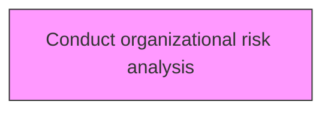
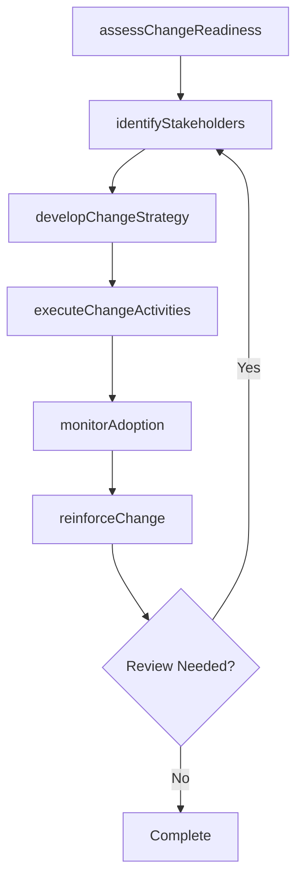

# Conduct organizational risk analysis

> Business-as-Code definition for conduct organizational risk analysis. Models the process of looking beyond the immediate consequences of the threat to a critical asset and placing it in the context of what is important to the organization.

## Overview

Looking beyond the immediate consequences of the threat to a critical asset and placing it in the context of what is important to the organization. Identify the impact of threats to critical assets. Create risk evaluation criteria. Evaluate the impact of threats to critical assets. Incorporate probability into the risk analysis.

## Process Hierarchy



## GraphDL

```yaml
conduct:
  object: Organizational Risk Analysis
  actor: ChangeManager
  result: organizationalRiskAnalysisResult
```

## Actions

| Action | Description |
|--------|-------------|
| assessChangeReadiness | Evaluate organizational readiness for organizational risk analysis |
| identifyStakeholders | Map stakeholders impacted by organizational risk analysis |
| developChangeStrategy | Create the strategic approach for organizational risk analysis |
| executeChangeActivities | Implement planned change activities for organizational risk analysis |
| monitorAdoption | Track adoption rates and resistance for organizational risk analysis |
| reinforceChange | Sustain and reinforce the outcomes of organizational risk analysis |

## Events

| Event | Description |
|-------|-------------|
| changeReadinessAssessed | Organizational readiness for change evaluated |
| stakeholdersIdentified | Impacted stakeholders mapped and categorized |
| changeStrategyDeveloped | Strategic approach for change initiative created |
| changeActivitiesExecuted | Planned change activities implemented |
| adoptionMonitored | Adoption rates and resistance tracked |
| changeReinforced | Change outcomes sustained and reinforced |

## Searches

| Search | Description |
|--------|-------------|
| findOrganizationalRiskAnalysis | Retrieve organizational risk analysis records filtered by status, date, or scope |
| getOrganizationalRiskAnalysisDetails | Get detailed information for a specific organizational risk analysis record |
| listOrganizationalRiskAnalysisHistory | Query the history of changes and updates to organizational risk analysis |
| getActiveItems | List currently active items related to organizational risk analysis |

## Process Flow



## RACI Matrix

| Activity | Responsible | Accountable | Consulted | Informed |
|----------|-------------|-------------|-----------|----------|
| assessChangeReadiness | ChangeManager | TransformationLead | BusinessUnitHeads | Stakeholders |
| identifyStakeholders | ChangeChampion | ChangeManager | HRBusinessPartner | Stakeholders |
| developChangeStrategy | CommunicationsLead | ChangeManager | ExecutiveTeam | Stakeholders |
| executeChangeActivities | ChangeManager | TransformationLead | OrganizationalDevelopment | Stakeholders |

## Related Processes

| Process | Relationship |
|---------|-------------|
| 13.4.1 Plan for change | Upstream - planning precedes design and implementation |
| 13.4.2 Design the change | Parallel - change design informs implementation |
| 13.4.3 Implement change | Downstream - implementation executes the change plan |

## Related Departments

| Department | Role |
|-----------|------|
| Organizational Development | Leads enterprise change management capability |
| Human Resources | Supports people-side change impacts and training |
| Communications | Delivers change messaging and stakeholder engagement |
| Operations | Implements operational changes and process redesigns |

## Related Occupations

| Occupation | Involvement |
|-----------|-------------|
| Change Manager | Leads change planning and execution |
| Change Champion | Advocates for change adoption within business units |
| Organizational Development Specialist | Designs change interventions and support |

## KPIs

| KPI | Description | Unit |
|-----|-------------|------|
| Change Adoption Rate | Percentage of impacted employees who adopted the change | % |
| Resistance Level | Measured level of organizational resistance to change | Score (1-5) |
| Training Completion Rate | Percentage of required training completed on time | % |
| Change Sustainability | Percentage of changes sustained after 6 months | % |

## Usage

```typescript
import { conductOrganizationalRiskAnalysis } from '@headlessly/conduct-organizational-risk-analysis'

const client = conductOrganizationalRiskAnalysis()

// Evaluate organizational readiness for organizational risk analysis
const result = await client.assessChangeReadiness({
  scope: 'enterprise',
  period: 'Q1-2025'
})

// Map stakeholders impacted by organizational risk analysis
const assessment = await client.identifyStakeholders({
  resultId: result.id,
  criteria: 'standard'
})

// Create the strategic approach for organizational risk analysis
await client.developChangeStrategy({
  resultId: result.id,
  format: 'detailed',
  recipients: ['stakeholders']
})
```
