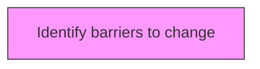
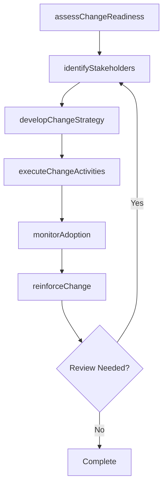

# Identify barriers to change

> Business-as-Code definition for identify barriers to change. Models the process of recognizing the circumstances or obstacles that keep the organization from progressing.

## Overview

Recognizing the circumstances or obstacles that keep the organization from progressing. Identify who and what are the resources resisting change. Identify integration failures, threats by competitive forces, and complexity failures.

## Process Hierarchy



## GraphDL

```yaml
identify:
  object: Barriers To Change
  actor: ChangeManager
  result: barriersToChangeResult
```

## Actions

| Action | Description |
|--------|-------------|
| assessChangeReadiness | Evaluate organizational readiness for barriers to change |
| identifyStakeholders | Map stakeholders impacted by barriers to change |
| developChangeStrategy | Create the strategic approach for barriers to change |
| executeChangeActivities | Implement planned change activities for barriers to change |
| monitorAdoption | Track adoption rates and resistance for barriers to change |
| reinforceChange | Sustain and reinforce the outcomes of barriers to change |

## Events

| Event | Description |
|-------|-------------|
| changeReadinessAssessed | Organizational readiness for change evaluated |
| stakeholdersIdentified | Impacted stakeholders mapped and categorized |
| changeStrategyDeveloped | Strategic approach for change initiative created |
| changeActivitiesExecuted | Planned change activities implemented |
| adoptionMonitored | Adoption rates and resistance tracked |
| changeReinforced | Change outcomes sustained and reinforced |

## Searches

| Search | Description |
|--------|-------------|
| findBarriersToChange | Retrieve barriers to change records filtered by status, date, or scope |
| getBarriersToChangeDetails | Get detailed information for a specific barriers to change record |
| listBarriersToChangeHistory | Query the history of changes and updates to barriers to change |
| getActiveItems | List currently active items related to barriers to change |

## Process Flow



## RACI Matrix

| Activity | Responsible | Accountable | Consulted | Informed |
|----------|-------------|-------------|-----------|----------|
| assessChangeReadiness | ChangeManager | TransformationLead | BusinessUnitHeads | Stakeholders |
| identifyStakeholders | ChangeChampion | ChangeManager | HRBusinessPartner | Stakeholders |
| developChangeStrategy | CommunicationsLead | ChangeManager | ExecutiveTeam | Stakeholders |
| executeChangeActivities | ChangeManager | TransformationLead | OrganizationalDevelopment | Stakeholders |

## Related Processes

| Process | Relationship |
|---------|-------------|
| 13.4.1 Plan for change | Upstream - planning precedes design and implementation |
| 13.4.2 Design the change | Parallel - change design informs implementation |
| 13.4.3 Implement change | Downstream - implementation executes the change plan |

## Related Departments

| Department | Role |
|-----------|------|
| Organizational Development | Leads enterprise change management capability |
| Human Resources | Supports people-side change impacts and training |
| Communications | Delivers change messaging and stakeholder engagement |
| Operations | Implements operational changes and process redesigns |

## Related Occupations

| Occupation | Involvement |
|-----------|-------------|
| Change Manager | Leads change planning and execution |
| Change Champion | Advocates for change adoption within business units |
| Organizational Development Specialist | Designs change interventions and support |

## KPIs

| KPI | Description | Unit |
|-----|-------------|------|
| Change Adoption Rate | Percentage of impacted employees who adopted the change | % |
| Resistance Level | Measured level of organizational resistance to change | Score (1-5) |
| Training Completion Rate | Percentage of required training completed on time | % |
| Change Sustainability | Percentage of changes sustained after 6 months | % |

## Usage

```typescript
import { identifyBarriersToChange } from '@headlessly/identify-barriers-to-change'

const client = identifyBarriersToChange()

// Evaluate organizational readiness for barriers to change
const result = await client.assessChangeReadiness({
  scope: 'enterprise',
  period: 'Q1-2025'
})

// Map stakeholders impacted by barriers to change
const assessment = await client.identifyStakeholders({
  resultId: result.id,
  criteria: 'standard'
})

// Create the strategic approach for barriers to change
await client.developChangeStrategy({
  resultId: result.id,
  format: 'detailed',
  recipients: ['stakeholders']
})
```
