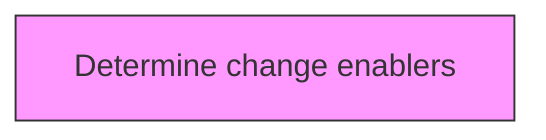
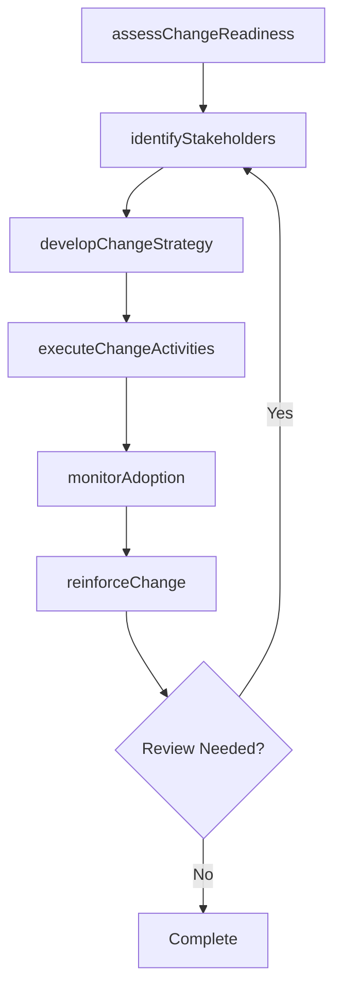

# Determine change enablers

> Business-as-Code definition for determine change enablers. Models the process of identifying the person(s) or thing(s)responsible for making the change possible.

## Overview

Identifying the person(s) or thing(s)responsible for making the change possible. Consider factors such as interdependence of efforts, reward to the integrators, sharing of power and responsibility, and employee understanding of why change is essential.

## Process Hierarchy



## GraphDL

```yaml
determine:
  object: Change Enablers
  actor: ChangeManager
  result: changeEnablersResult
```

## Actions

| Action | Description |
|--------|-------------|
| assessChangeReadiness | Evaluate organizational readiness for change enablers |
| identifyStakeholders | Map stakeholders impacted by change enablers |
| developChangeStrategy | Create the strategic approach for change enablers |
| executeChangeActivities | Implement planned change activities for change enablers |
| monitorAdoption | Track adoption rates and resistance for change enablers |
| reinforceChange | Sustain and reinforce the outcomes of change enablers |

## Events

| Event | Description |
|-------|-------------|
| changeReadinessAssessed | Organizational readiness for change evaluated |
| stakeholdersIdentified | Impacted stakeholders mapped and categorized |
| changeStrategyDeveloped | Strategic approach for change initiative created |
| changeActivitiesExecuted | Planned change activities implemented |
| adoptionMonitored | Adoption rates and resistance tracked |
| changeReinforced | Change outcomes sustained and reinforced |

## Searches

| Search | Description |
|--------|-------------|
| findChangeEnablers | Retrieve change enablers records filtered by status, date, or scope |
| getChangeEnablersDetails | Get detailed information for a specific change enablers record |
| listChangeEnablersHistory | Query the history of changes and updates to change enablers |
| getActiveItems | List currently active items related to change enablers |

## Process Flow



## RACI Matrix

| Activity | Responsible | Accountable | Consulted | Informed |
|----------|-------------|-------------|-----------|----------|
| assessChangeReadiness | ChangeManager | TransformationLead | BusinessUnitHeads | Stakeholders |
| identifyStakeholders | ChangeChampion | ChangeManager | HRBusinessPartner | Stakeholders |
| developChangeStrategy | CommunicationsLead | ChangeManager | ExecutiveTeam | Stakeholders |
| executeChangeActivities | ChangeManager | TransformationLead | OrganizationalDevelopment | Stakeholders |

## Related Processes

| Process | Relationship |
|---------|-------------|
| 13.4.1 Plan for change | Upstream - planning precedes design and implementation |
| 13.4.2 Design the change | Parallel - change design informs implementation |
| 13.4.3 Implement change | Downstream - implementation executes the change plan |

## Related Departments

| Department | Role |
|-----------|------|
| Organizational Development | Leads enterprise change management capability |
| Human Resources | Supports people-side change impacts and training |
| Communications | Delivers change messaging and stakeholder engagement |
| Operations | Implements operational changes and process redesigns |

## Related Occupations

| Occupation | Involvement |
|-----------|-------------|
| Change Manager | Leads change planning and execution |
| Change Champion | Advocates for change adoption within business units |
| Organizational Development Specialist | Designs change interventions and support |

## KPIs

| KPI | Description | Unit |
|-----|-------------|------|
| Change Adoption Rate | Percentage of impacted employees who adopted the change | % |
| Resistance Level | Measured level of organizational resistance to change | Score (1-5) |
| Training Completion Rate | Percentage of required training completed on time | % |
| Change Sustainability | Percentage of changes sustained after 6 months | % |

## Usage

```typescript
import { determineChangeEnablers } from '@headlessly/determine-change-enablers'

const client = determineChangeEnablers()

// Evaluate organizational readiness for change enablers
const result = await client.assessChangeReadiness({
  scope: 'enterprise',
  period: 'Q1-2025'
})

// Map stakeholders impacted by change enablers
const assessment = await client.identifyStakeholders({
  resultId: result.id,
  criteria: 'standard'
})

// Create the strategic approach for change enablers
await client.developChangeStrategy({
  resultId: result.id,
  format: 'detailed',
  recipients: ['stakeholders']
})
```
