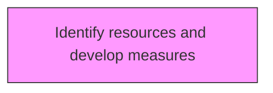
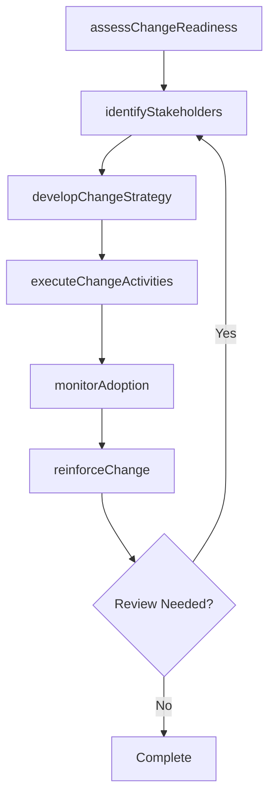

# Identify resources and develop measures

> Business-as-Code definition for identify resources and develop measures. Models the process of recognizing the resource requirements, and developing measures for change.

## Overview

Recognizing the resource requirements, and developing measures for change. Identify the financial, material, human, and informational resources needed to successfully implement the change. Develop programs, campaigns, etc. for establishing the change within the organization.

## Process Hierarchy



## GraphDL

```yaml
identify:
  object: Resources And Develop Measures
  actor: ChangeManager
  result: resourcesAndDevelopMeasuresResult
```

## Actions

| Action | Description |
|--------|-------------|
| assessChangeReadiness | Evaluate organizational readiness for resources and develop measures |
| identifyStakeholders | Map stakeholders impacted by resources and develop measures |
| developChangeStrategy | Create the strategic approach for resources and develop measures |
| executeChangeActivities | Implement planned change activities for resources and develop measures |
| monitorAdoption | Track adoption rates and resistance for resources and develop measures |
| reinforceChange | Sustain and reinforce the outcomes of resources and develop measures |

## Events

| Event | Description |
|-------|-------------|
| changeReadinessAssessed | Organizational readiness for change evaluated |
| stakeholdersIdentified | Impacted stakeholders mapped and categorized |
| changeStrategyDeveloped | Strategic approach for change initiative created |
| changeActivitiesExecuted | Planned change activities implemented |
| adoptionMonitored | Adoption rates and resistance tracked |
| changeReinforced | Change outcomes sustained and reinforced |

## Searches

| Search | Description |
|--------|-------------|
| findResourcesAndDevelopMeasures | Retrieve resources and develop measures records filtered by status, date, or scope |
| getResourcesAndDevelopMeasuresDetails | Get detailed information for a specific resources and develop measures record |
| listResourcesAndDevelopMeasuresHistory | Query the history of changes and updates to resources and develop measures |
| getActiveItems | List currently active items related to resources and develop measures |

## Process Flow



## RACI Matrix

| Activity | Responsible | Accountable | Consulted | Informed |
|----------|-------------|-------------|-----------|----------|
| assessChangeReadiness | ChangeManager | TransformationLead | BusinessUnitHeads | Stakeholders |
| identifyStakeholders | ChangeChampion | ChangeManager | HRBusinessPartner | Stakeholders |
| developChangeStrategy | CommunicationsLead | ChangeManager | ExecutiveTeam | Stakeholders |
| executeChangeActivities | ChangeManager | TransformationLead | OrganizationalDevelopment | Stakeholders |

## Related Processes

| Process | Relationship |
|---------|-------------|
| 13.4.1 Plan for change | Upstream - planning precedes design and implementation |
| 13.4.2 Design the change | Parallel - change design informs implementation |
| 13.4.3 Implement change | Downstream - implementation executes the change plan |

## Related Departments

| Department | Role |
|-----------|------|
| Organizational Development | Leads enterprise change management capability |
| Human Resources | Supports people-side change impacts and training |
| Communications | Delivers change messaging and stakeholder engagement |
| Operations | Implements operational changes and process redesigns |

## Related Occupations

| Occupation | Involvement |
|-----------|-------------|
| Change Manager | Leads change planning and execution |
| Change Champion | Advocates for change adoption within business units |
| Organizational Development Specialist | Designs change interventions and support |

## KPIs

| KPI | Description | Unit |
|-----|-------------|------|
| Change Adoption Rate | Percentage of impacted employees who adopted the change | % |
| Resistance Level | Measured level of organizational resistance to change | Score (1-5) |
| Training Completion Rate | Percentage of required training completed on time | % |
| Change Sustainability | Percentage of changes sustained after 6 months | % |

## Usage

```typescript
import { identifyResourcesAndDevelopMeasures } from '@headlessly/identify-resources-and-develop-measures'

const client = identifyResourcesAndDevelopMeasures()

// Evaluate organizational readiness for resources and develop measures
const result = await client.assessChangeReadiness({
  scope: 'enterprise',
  period: 'Q1-2025'
})

// Map stakeholders impacted by resources and develop measures
const assessment = await client.identifyStakeholders({
  resultId: result.id,
  criteria: 'standard'
})

// Create the strategic approach for resources and develop measures
await client.developChangeStrategy({
  resultId: result.id,
  format: 'detailed',
  recipients: ['stakeholders']
})
```
