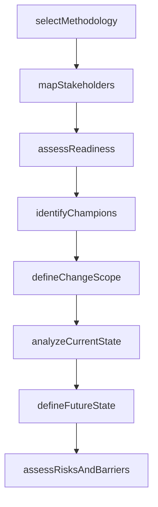

# Plan for change

> Business-as-Code definition for change planning. Models the assessment of organizational readiness, stakeholder analysis, scope definition, current and future state mapping, risk analysis, and resource identification for change initiatives.

## Overview

Crafting a plan for implementing change to the organization's multiple frameworks, systems, and functional areas. Chart a schematic plan that gives the organization a foundation to shape its change efforts.

## Process Hierarchy

```mermaid
graph TD
    A[Plan for change]
    A --> B[Select process improvement methodology]
    A --> C[Determine stakeholders]
    A --> D[Assess readiness for change]
    A --> E[Identify change champion(s)]
    A --> F[Form design team]
    A --> G[Define scope]
    A --> H[Understand current state]
    A --> I[Define future state]
    A --> J[Conduct organizational risk analysis]
    A --> K[Assess cultural issues]
    A --> L[Identify impacted groups]
    A --> M[Determine degree/extent of impact]
    A --> N[Establish accountability for change management]
    A --> O[Identify barriers to change]
    A --> P[Determine change enablers]
    A --> Q[Identify resources and develop measures]
```

## GraphDL

```yaml
plan:
  object: For Change
  actor: ChangeManager
  result: ChangePlan
```

## Actions

| Action | Description |
|--------|-------------|
| selectMethodology | Choose the process improvement methodology for the change initiative |
| mapStakeholders | Identify and categorize stakeholders by influence and impact |
| assessReadiness | Evaluate organizational preparedness for the proposed change |
| identifyChampions | Select change champions to drive adoption in impacted groups |
| defineChangeScope | Establish the boundaries and extent of the change effort |
| analyzeCurrentState | Document the as-is processes, systems, and organizational structure |
| defineFutureState | Articulate the target operating model and desired outcomes |
| assessRisksAndBarriers | Identify organizational risks, cultural issues, and barriers to change |

## Events

| Event | Description |
|-------|-------------|
| methodologySelected | Process improvement methodology chosen for the change initiative |
| stakeholdersMapped | Stakeholder analysis completed with influence and impact documented |
| readinessAssessed | Organizational readiness evaluation completed with scores |
| championsIdentified | Change champions selected and briefed |
| changeScopeDefined | Change scope boundaries and impacted areas documented |
| currentStateAnalyzed | As-is state documented with data and process maps |
| futureStateDefined | Target operating model and success criteria established |
| risksAndBarriersAssessed | Risk analysis and barrier identification completed |

## Searches

| Search | Description |
|--------|-------------|
| getReadinessAssessment | Retrieve readiness scores and findings for a change initiative |
| findStakeholders | List stakeholders by influence level, impact, or business unit |
| getChangeScope | Retrieve the scope definition for a change initiative |
| findBarriersAndEnablers | List identified barriers and enablers for a change initiative |

## Process Flow



## RACI Matrix

| Activity | Responsible | Accountable | Consulted | Informed |
|----------|-------------|-------------|-----------|----------|
| mapStakeholders | ChangeManager | VP Transformation | HRBusinessPartner | ExecutiveSponsor |
| assessReadiness | ChangeManager | VP Transformation | BusinessUnitLeads | SteeringCommittee |
| defineChangeScope | ChangeManager | ExecutiveSponsor | ProcessOwners | PMO |
| assessRisksAndBarriers | ChangeManager | VP Transformation | RiskManagement | AllManagers |

## Sub-Processes

| ID | Name | Description |
|----|------|-------------|
| 13.4.1.1 | Select process improvement methodology | Assessing and choosing methodologies to identify, analyze, and improve existing processes within an  |
| 13.4.1.2 | Determine stakeholders | Identifying and communicating with shareholders affected by the change. Consider internal and extern |
| 13.4.1.3 | Assess readiness for change | Determining the level of preparedness of the conditions, attitudes, and resources at all levels in t |
| 13.4.1.4 | Identify change champion(s) | Identifying people exhibit an extraordinary interest in the adoption, implementation, and success of |
| 13.4.1.5 | Form design team | Preparing a design team for implementing change throughout the organization. |
| 13.4.1.6 | Define scope | Defining the extent of the area or subject matter that the change process deals with or to which it  |
| 13.4.1.7 | Understand current state | Using graphical and statistical tools such as pareto diagrams, process flow diagrams, cause-and-effe |
| 13.4.1.8 | Define future state | Determining the state or position that the organization wants to be in after the implementation of t |
| 13.4.1.9 | Conduct organizational risk analysis | Looking beyond the immediate consequences of the threat to a critical asset and placing it in the co |
| 13.4.1.10 | Assess cultural issues | Evaluating the culture within the organization. Adopt a quantitative, multidimensional measurement a |
| 13.4.1.11 | Identify impacted groups | Recognizing the impact of threats to critical assets. Determine what groups are impacted by this imp |
| 13.4.1.12 | Determine degree/extent of impact | Evaluating the impact of threats to critical assets. Determine what assets will be impacted by the c |
| 13.4.1.13 | Establish accountability for change management | Identifying and assigning the people accountable for effective change management. Hold managers acco |
| 13.4.1.14 | Identify barriers to change | Recognizing the circumstances or obstacles that keep the organization from progressing. Identify who |
| 13.4.1.15 | Determine change enablers | Identifying the person(s) or thing(s)responsible for making the change possible. Consider factors su |
| 13.4.1.16 | Identify resources and develop measures | Recognizing the resource requirements, and developing measures for change. Identify the financial, m |

## Related Processes

| Process | Relationship |
|---------|-------------|
| 13.4.2 Design the change | Downstream - planning outputs feed change design |
| 13.4.3 Implement change | Downstream - plans guide implementation execution |
| 13.6 Measure and benchmark | Upstream - performance gaps motivate change planning |

## Related Departments

| Department | Role |
|-----------|------|
| Organizational Development | Primary owner of change planning methodology |
| Human Resources | Assesses cultural readiness and workforce impact |
| Strategy | Provides strategic context for the change initiative |
| Communications | Supports stakeholder analysis and messaging |

## Related Occupations

| Occupation | Involvement |
|-----------|-------------|
| Change Manager | Leads the planning process and stakeholder engagement |
| Organizational Development Specialist | Assesses readiness and cultural factors |
| Business Analyst | Documents current and future state |

## KPIs

| KPI | Description | Unit |
|-----|-------------|------|
| Readiness Score | Composite organizational readiness assessment score | Score (1-10) |
| Stakeholder Coverage | Percentage of impacted stakeholders identified and categorized | % |
| Planning Cycle Time | Time from change request to approved change plan | Days |
| Risk Identification Rate | Number of change risks identified per initiative | Count |

## Usage

```typescript
import { planForChange } from '@headlessly/plan-for-change'

const plan = planForChange()

// Assess organizational readiness
const readiness = await plan.assessReadiness({
  initiativeId: 'CHG-2026-015',
  dimensions: ['leadership', 'culture', 'capacity', 'governance'],
  method: 'survey-and-interview'
})

// Map stakeholders for the change
const stakeholders = await plan.mapStakeholders({
  initiativeId: 'CHG-2026-015',
  impactAreas: ['finance', 'operations', 'IT'],
  influenceLevels: ['high', 'medium', 'low']
})
```
