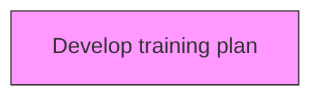
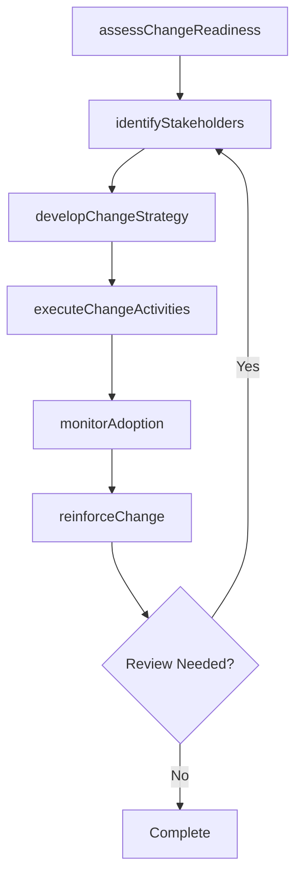

# Develop training plan

> Business-as-Code definition for develop training plan. Models the process of creating a detailed summary of all the actions relevant to teaching a person a particular skill or type of behavior.

## Overview

Creating a detailed summary of all the actions relevant to teaching a person a particular skill or type of behavior. Determine who will deliver the training. Determine when and where the apprentice or trainee needs to go to receive the structured component of the training.

## Process Hierarchy



## GraphDL

```yaml
develop:
  object: Training Plan
  actor: ChangeManager
  result: trainingPlanResult
```

## Actions

| Action | Description |
|--------|-------------|
| assessChangeReadiness | Evaluate organizational readiness for training plan |
| identifyStakeholders | Map stakeholders impacted by training plan |
| developChangeStrategy | Create the strategic approach for training plan |
| executeChangeActivities | Implement planned change activities for training plan |
| monitorAdoption | Track adoption rates and resistance for training plan |
| reinforceChange | Sustain and reinforce the outcomes of training plan |

## Events

| Event | Description |
|-------|-------------|
| changeReadinessAssessed | Organizational readiness for change evaluated |
| stakeholdersIdentified | Impacted stakeholders mapped and categorized |
| changeStrategyDeveloped | Strategic approach for change initiative created |
| changeActivitiesExecuted | Planned change activities implemented |
| adoptionMonitored | Adoption rates and resistance tracked |
| changeReinforced | Change outcomes sustained and reinforced |

## Searches

| Search | Description |
|--------|-------------|
| findTrainingPlan | Retrieve training plan records filtered by status, date, or scope |
| getTrainingPlanDetails | Get detailed information for a specific training plan record |
| listTrainingPlanHistory | Query the history of changes and updates to training plan |
| getActiveItems | List currently active items related to training plan |

## Process Flow



## RACI Matrix

| Activity | Responsible | Accountable | Consulted | Informed |
|----------|-------------|-------------|-----------|----------|
| assessChangeReadiness | ChangeManager | TransformationLead | BusinessUnitHeads | Stakeholders |
| identifyStakeholders | ChangeChampion | ChangeManager | HRBusinessPartner | Stakeholders |
| developChangeStrategy | CommunicationsLead | ChangeManager | ExecutiveTeam | Stakeholders |
| executeChangeActivities | ChangeManager | TransformationLead | OrganizationalDevelopment | Stakeholders |

## Related Processes

| Process | Relationship |
|---------|-------------|
| 13.4.1 Plan for change | Upstream - planning precedes design and implementation |
| 13.4.2 Design the change | Parallel - change design informs implementation |
| 13.4.3 Implement change | Downstream - implementation executes the change plan |

## Related Departments

| Department | Role |
|-----------|------|
| Organizational Development | Leads enterprise change management capability |
| Human Resources | Supports people-side change impacts and training |
| Communications | Delivers change messaging and stakeholder engagement |
| Operations | Implements operational changes and process redesigns |

## Related Occupations

| Occupation | Involvement |
|-----------|-------------|
| Change Manager | Leads change planning and execution |
| Change Champion | Advocates for change adoption within business units |
| Organizational Development Specialist | Designs change interventions and support |

## KPIs

| KPI | Description | Unit |
|-----|-------------|------|
| Change Adoption Rate | Percentage of impacted employees who adopted the change | % |
| Resistance Level | Measured level of organizational resistance to change | Score (1-5) |
| Training Completion Rate | Percentage of required training completed on time | % |
| Change Sustainability | Percentage of changes sustained after 6 months | % |

## Usage

```typescript
import { developTrainingPlan } from '@headlessly/develop-training-plan'

const client = developTrainingPlan()

// Evaluate organizational readiness for training plan
const result = await client.assessChangeReadiness({
  scope: 'enterprise',
  period: 'Q1-2025'
})

// Map stakeholders impacted by training plan
const assessment = await client.identifyStakeholders({
  resultId: result.id,
  criteria: 'standard'
})

// Create the strategic approach for training plan
await client.developChangeStrategy({
  resultId: result.id,
  format: 'detailed',
  recipients: ['stakeholders']
})
```
