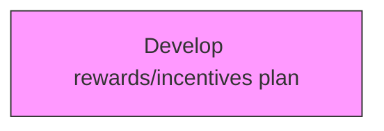
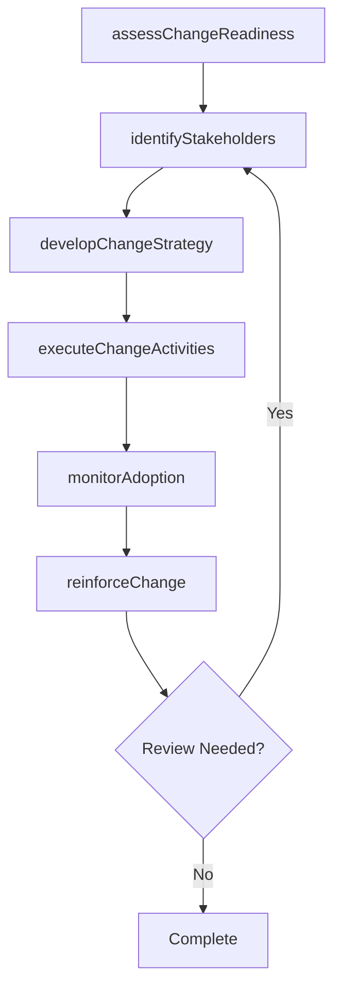

# Develop rewards/incentives plan

> Business-as-Code definition for develop rewards/incentives plan. Models the process of creating and designing the plan for rewarding the employees exhibiting the desired behavior.

## Overview

Creating and designing the plan for rewarding the employees exhibiting the desired behavior. Specify rewards in recognition of service, effort, or achievement regarding the change, including bonuses, compensation, stock options, profit sharing, vacations, and flexible time.

## Process Hierarchy



## GraphDL

```yaml
develop:
  object: Rewards/incentives Plan
  actor: ChangeManager
  result: rewardsincentivesPlanResult
```

## Actions

| Action | Description |
|--------|-------------|
| assessChangeReadiness | Evaluate organizational readiness for rewards/incentives plan |
| identifyStakeholders | Map stakeholders impacted by rewards/incentives plan |
| developChangeStrategy | Create the strategic approach for rewards/incentives plan |
| executeChangeActivities | Implement planned change activities for rewards/incentives plan |
| monitorAdoption | Track adoption rates and resistance for rewards/incentives plan |
| reinforceChange | Sustain and reinforce the outcomes of rewards/incentives plan |

## Events

| Event | Description |
|-------|-------------|
| changeReadinessAssessed | Organizational readiness for change evaluated |
| stakeholdersIdentified | Impacted stakeholders mapped and categorized |
| changeStrategyDeveloped | Strategic approach for change initiative created |
| changeActivitiesExecuted | Planned change activities implemented |
| adoptionMonitored | Adoption rates and resistance tracked |
| changeReinforced | Change outcomes sustained and reinforced |

## Searches

| Search | Description |
|--------|-------------|
| findRewardsincentivesPlan | Retrieve rewards/incentives plan records filtered by status, date, or scope |
| getRewardsincentivesPlanDetails | Get detailed information for a specific rewards/incentives plan record |
| listRewardsincentivesPlanHistory | Query the history of changes and updates to rewards/incentives plan |
| getActiveItems | List currently active items related to rewards/incentives plan |

## Process Flow



## RACI Matrix

| Activity | Responsible | Accountable | Consulted | Informed |
|----------|-------------|-------------|-----------|----------|
| assessChangeReadiness | ChangeManager | TransformationLead | BusinessUnitHeads | Stakeholders |
| identifyStakeholders | ChangeChampion | ChangeManager | HRBusinessPartner | Stakeholders |
| developChangeStrategy | CommunicationsLead | ChangeManager | ExecutiveTeam | Stakeholders |
| executeChangeActivities | ChangeManager | TransformationLead | OrganizationalDevelopment | Stakeholders |

## Related Processes

| Process | Relationship |
|---------|-------------|
| 13.4.1 Plan for change | Upstream - planning precedes design and implementation |
| 13.4.2 Design the change | Parallel - change design informs implementation |
| 13.4.3 Implement change | Downstream - implementation executes the change plan |

## Related Departments

| Department | Role |
|-----------|------|
| Organizational Development | Leads enterprise change management capability |
| Human Resources | Supports people-side change impacts and training |
| Communications | Delivers change messaging and stakeholder engagement |
| Operations | Implements operational changes and process redesigns |

## Related Occupations

| Occupation | Involvement |
|-----------|-------------|
| Change Manager | Leads change planning and execution |
| Change Champion | Advocates for change adoption within business units |
| Organizational Development Specialist | Designs change interventions and support |

## KPIs

| KPI | Description | Unit |
|-----|-------------|------|
| Change Adoption Rate | Percentage of impacted employees who adopted the change | % |
| Resistance Level | Measured level of organizational resistance to change | Score (1-5) |
| Training Completion Rate | Percentage of required training completed on time | % |
| Change Sustainability | Percentage of changes sustained after 6 months | % |

## Usage

```typescript
import { developRewardsincentivesPlan } from '@headlessly/develop-rewardsincentives-plan'

const client = developRewardsincentivesPlan()

// Evaluate organizational readiness for rewards/incentives plan
const result = await client.assessChangeReadiness({
  scope: 'enterprise',
  period: 'Q1-2025'
})

// Map stakeholders impacted by rewards/incentives plan
const assessment = await client.identifyStakeholders({
  resultId: result.id,
  criteria: 'standard'
})

// Create the strategic approach for rewards/incentives plan
await client.developChangeStrategy({
  resultId: result.id,
  format: 'detailed',
  recipients: ['stakeholders']
})
```
