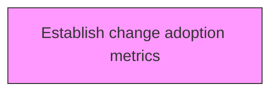
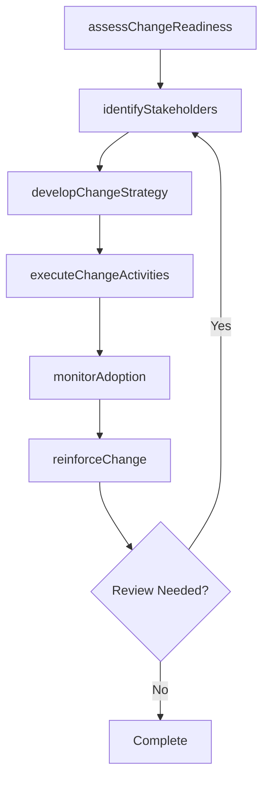

# Establish change adoption metrics

> Business-as-Code definition for establish change adoption metrics. Models the process of establishing a system or standard of measurement for measuring the adoption of the change.

## Overview

Establishing a system or standard of measurement for measuring the adoption of the change. Consider activities such as the number of people who have adopted the change, how quickly have they adopted, number of unique adopters, and adopters by teams/divisions.

## Process Hierarchy



## GraphDL

```yaml
establish:
  object: Change Adoption Metrics
  actor: ChangeManager
  result: changeAdoptionMetricsResult
```

## Actions

| Action | Description |
|--------|-------------|
| assessChangeReadiness | Evaluate organizational readiness for change adoption metrics |
| identifyStakeholders | Map stakeholders impacted by change adoption metrics |
| developChangeStrategy | Create the strategic approach for change adoption metrics |
| executeChangeActivities | Implement planned change activities for change adoption metrics |
| monitorAdoption | Track adoption rates and resistance for change adoption metrics |
| reinforceChange | Sustain and reinforce the outcomes of change adoption metrics |

## Events

| Event | Description |
|-------|-------------|
| changeReadinessAssessed | Organizational readiness for change evaluated |
| stakeholdersIdentified | Impacted stakeholders mapped and categorized |
| changeStrategyDeveloped | Strategic approach for change initiative created |
| changeActivitiesExecuted | Planned change activities implemented |
| adoptionMonitored | Adoption rates and resistance tracked |
| changeReinforced | Change outcomes sustained and reinforced |

## Searches

| Search | Description |
|--------|-------------|
| findChangeAdoptionMetrics | Retrieve change adoption metrics records filtered by status, date, or scope |
| getChangeAdoptionMetricsDetails | Get detailed information for a specific change adoption metrics record |
| listChangeAdoptionMetricsHistory | Query the history of changes and updates to change adoption metrics |
| getActiveItems | List currently active items related to change adoption metrics |

## Process Flow



## RACI Matrix

| Activity | Responsible | Accountable | Consulted | Informed |
|----------|-------------|-------------|-----------|----------|
| assessChangeReadiness | ChangeManager | TransformationLead | BusinessUnitHeads | Stakeholders |
| identifyStakeholders | ChangeChampion | ChangeManager | HRBusinessPartner | Stakeholders |
| developChangeStrategy | CommunicationsLead | ChangeManager | ExecutiveTeam | Stakeholders |
| executeChangeActivities | ChangeManager | TransformationLead | OrganizationalDevelopment | Stakeholders |

## Related Processes

| Process | Relationship |
|---------|-------------|
| 13.4.1 Plan for change | Upstream - planning precedes design and implementation |
| 13.4.2 Design the change | Parallel - change design informs implementation |
| 13.4.3 Implement change | Downstream - implementation executes the change plan |

## Related Departments

| Department | Role |
|-----------|------|
| Organizational Development | Leads enterprise change management capability |
| Human Resources | Supports people-side change impacts and training |
| Communications | Delivers change messaging and stakeholder engagement |
| Operations | Implements operational changes and process redesigns |

## Related Occupations

| Occupation | Involvement |
|-----------|-------------|
| Change Manager | Leads change planning and execution |
| Change Champion | Advocates for change adoption within business units |
| Organizational Development Specialist | Designs change interventions and support |

## KPIs

| KPI | Description | Unit |
|-----|-------------|------|
| Change Adoption Rate | Percentage of impacted employees who adopted the change | % |
| Resistance Level | Measured level of organizational resistance to change | Score (1-5) |
| Training Completion Rate | Percentage of required training completed on time | % |
| Change Sustainability | Percentage of changes sustained after 6 months | % |

## Usage

```typescript
import { establishChangeAdoptionMetrics } from '@headlessly/establish-change-adoption-metrics'

const client = establishChangeAdoptionMetrics()

// Evaluate organizational readiness for change adoption metrics
const result = await client.assessChangeReadiness({
  scope: 'enterprise',
  period: 'Q1-2025'
})

// Map stakeholders impacted by change adoption metrics
const assessment = await client.identifyStakeholders({
  resultId: result.id,
  criteria: 'standard'
})

// Create the strategic approach for change adoption metrics
await client.developChangeStrategy({
  resultId: result.id,
  format: 'detailed',
  recipients: ['stakeholders']
})
```
