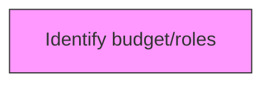
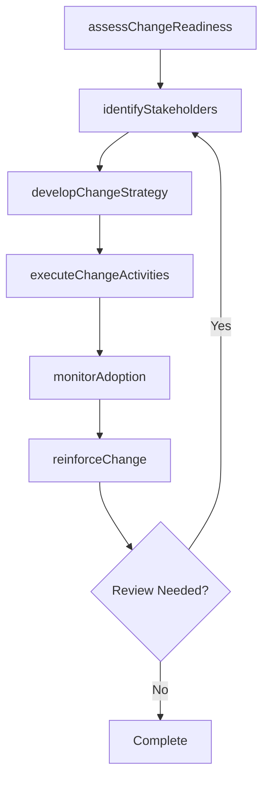

# Identify budget/roles

> Business-as-Code definition for identify budget/roles. Models the process of creating a plan of financial outlay for the newly defined roles.

## Overview

Creating a plan of financial outlay for the newly defined roles. Determine the amount of capital the organization is willing to invest in effectuating these new roles, how would the roles be financed, and what would comprise the ROI from these flows. Coordinate personnel responsible for change management and the finance division.

## Process Hierarchy



## GraphDL

```yaml
identify:
  object: Budget/roles
  actor: ChangeManager
  result: budgetrolesResult
```

## Actions

| Action | Description |
|--------|-------------|
| assessChangeReadiness | Evaluate organizational readiness for budget/roles |
| identifyStakeholders | Map stakeholders impacted by budget/roles |
| developChangeStrategy | Create the strategic approach for budget/roles |
| executeChangeActivities | Implement planned change activities for budget/roles |
| monitorAdoption | Track adoption rates and resistance for budget/roles |
| reinforceChange | Sustain and reinforce the outcomes of budget/roles |

## Events

| Event | Description |
|-------|-------------|
| changeReadinessAssessed | Organizational readiness for change evaluated |
| stakeholdersIdentified | Impacted stakeholders mapped and categorized |
| changeStrategyDeveloped | Strategic approach for change initiative created |
| changeActivitiesExecuted | Planned change activities implemented |
| adoptionMonitored | Adoption rates and resistance tracked |
| changeReinforced | Change outcomes sustained and reinforced |

## Searches

| Search | Description |
|--------|-------------|
| findBudgetroles | Retrieve budget/roles records filtered by status, date, or scope |
| getBudgetrolesDetails | Get detailed information for a specific budget/roles record |
| listBudgetrolesHistory | Query the history of changes and updates to budget/roles |
| getActiveItems | List currently active items related to budget/roles |

## Process Flow



## RACI Matrix

| Activity | Responsible | Accountable | Consulted | Informed |
|----------|-------------|-------------|-----------|----------|
| assessChangeReadiness | ChangeManager | TransformationLead | BusinessUnitHeads | Stakeholders |
| identifyStakeholders | ChangeChampion | ChangeManager | HRBusinessPartner | Stakeholders |
| developChangeStrategy | CommunicationsLead | ChangeManager | ExecutiveTeam | Stakeholders |
| executeChangeActivities | ChangeManager | TransformationLead | OrganizationalDevelopment | Stakeholders |

## Related Processes

| Process | Relationship |
|---------|-------------|
| 13.4.1 Plan for change | Upstream - planning precedes design and implementation |
| 13.4.2 Design the change | Parallel - change design informs implementation |
| 13.4.3 Implement change | Downstream - implementation executes the change plan |

## Related Departments

| Department | Role |
|-----------|------|
| Organizational Development | Leads enterprise change management capability |
| Human Resources | Supports people-side change impacts and training |
| Communications | Delivers change messaging and stakeholder engagement |
| Operations | Implements operational changes and process redesigns |

## Related Occupations

| Occupation | Involvement |
|-----------|-------------|
| Change Manager | Leads change planning and execution |
| Change Champion | Advocates for change adoption within business units |
| Organizational Development Specialist | Designs change interventions and support |

## KPIs

| KPI | Description | Unit |
|-----|-------------|------|
| Change Adoption Rate | Percentage of impacted employees who adopted the change | % |
| Resistance Level | Measured level of organizational resistance to change | Score (1-5) |
| Training Completion Rate | Percentage of required training completed on time | % |
| Change Sustainability | Percentage of changes sustained after 6 months | % |

## Usage

```typescript
import { identifyBudgetroles } from '@headlessly/identify-budgetroles'

const client = identifyBudgetroles()

// Evaluate organizational readiness for budget/roles
const result = await client.assessChangeReadiness({
  scope: 'enterprise',
  period: 'Q1-2025'
})

// Map stakeholders impacted by budget/roles
const assessment = await client.identifyStakeholders({
  resultId: result.id,
  criteria: 'standard'
})

// Create the strategic approach for budget/roles
await client.developChangeStrategy({
  resultId: result.id,
  format: 'detailed',
  recipients: ['stakeholders']
})
```
