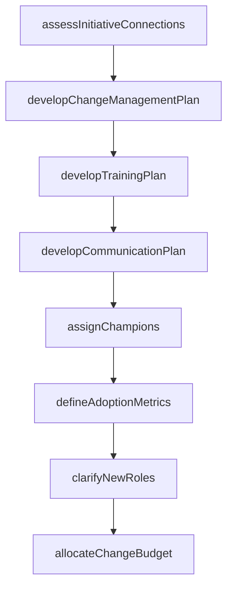

# Design the change

> Business-as-Code definition for change design. Models the development of change management, training, communication, and incentive plans along with adoption metrics, role definitions, and budget allocation.

## Overview

Developing plans for change management, training, communication, and rewards/incentives. Establish metrics for measuring the change adoption. Clarify new roles for employees. Identify budgets.

## Process Hierarchy

```mermaid
graph TD
    A[Design the change]
    A --> B[Assess connection to other initiatives]
    A --> C[Develop change management plans]
    A --> D[Develop training plan]
    A --> E[Develop communication plan]
    A --> F[Assign change champion(s)]
    A --> G[Develop rewards/incentives plan]
    A --> H[Establish change adoption metrics]
    A --> I[Establish/Clarify new roles]
    A --> J[Identify budget/roles]
```

## GraphDL

```yaml
design:
  object: Change
  actor: ChangeManager
  result: ChangeDesignPackage
```

## Actions

| Action | Description |
|--------|-------------|
| assessInitiativeConnections | Evaluate alignment between the change initiative and other active programs |
| developChangeManagementPlan | Create the comprehensive change management plan with timeline and milestones |
| developTrainingPlan | Design training programs to build skills needed for the new way of working |
| developCommunicationPlan | Define messaging strategy, channels, cadence, and target audiences |
| assignChampions | Deploy trained change champions to impacted business units |
| defineAdoptionMetrics | Establish quantitative measures for tracking change adoption |
| clarifyNewRoles | Document new role definitions, responsibilities, and reporting lines |
| allocateChangeBudget | Identify and allocate financial resources for the change effort |

## Events

| Event | Description |
|-------|-------------|
| initiativeConnectionsAssessed | Alignment with other programs evaluated and documented |
| changeManagementPlanDeveloped | Comprehensive change management plan approved |
| trainingPlanDeveloped | Training curriculum and schedule finalized |
| communicationPlanDeveloped | Communication strategy and calendar approved |
| championsAssigned | Change champions deployed to impacted groups |
| adoptionMetricsDefined | Change adoption measurement framework established |
| newRolesClarified | Updated role definitions published to impacted employees |
| changeBudgetAllocated | Financial resources assigned to change activities |

## Searches

| Search | Description |
|--------|-------------|
| getChangeDesign | Retrieve the complete change design package for an initiative |
| findTrainingPlans | List training plans by change initiative or business unit |
| getCommunicationCalendar | Retrieve the communication schedule for a change initiative |
| getAdoptionMetrics | Retrieve defined adoption metrics and their targets |

## Process Flow



## RACI Matrix

| Activity | Responsible | Accountable | Consulted | Informed |
|----------|-------------|-------------|-----------|----------|
| developChangeManagementPlan | ChangeManager | VP Transformation | PMO | ExecutiveSponsor |
| developTrainingPlan | TrainingCoordinator | ChangeManager | HR | ImpactedManagers |
| developCommunicationPlan | CommunicationsLead | ChangeManager | Marketing | AllStakeholders |
| defineAdoptionMetrics | ChangeManager | VP Transformation | Analytics | SteeringCommittee |

## Sub-Processes

| ID | Name | Description |
|----|------|-------------|
| 13.4.2.1 | Assess connection to other initiatives | Correlating the change initiative with the other initiatives. Create an alignment between the goals  |
| 13.4.2.2 | Develop change management plans | Creating a detailed structure summary for the purposes of managing the change. Demonstrate the reaso |
| 13.4.2.3 | Develop training plan | Creating a detailed summary of all the actions relevant to teaching a person a particular skill or t |
| 13.4.2.4 | Develop communication plan | Developing a plan for imparting or exchanging information relevant the to change. Define goals, obje |
| 13.4.2.5 | Assign change champion(s) | Utilizing champions that have been trained to carry out needed changes. Engage champions to communic |
| 13.4.2.6 | Develop rewards/incentives plan | Creating and designing the plan for rewarding the employees exhibiting the desired behavior. Specify |
| 13.4.2.7 | Establish change adoption metrics | Establishing a system or standard of measurement for measuring the adoption of the change. Consider  |
| 13.4.2.8 | Establish/Clarify new roles | Establishing and explaining the new roles to employees. Assign roles and responsibilities to resourc |
| 13.4.2.9 | Identify budget/roles | Creating a plan of financial outlay for the newly defined roles. Determine the amount of capital the |

## Related Processes

| Process | Relationship |
|---------|-------------|
| 13.4.1 Plan for change | Upstream - planning outputs inform change design |
| 13.4.3 Implement change | Downstream - design guides implementation execution |
| 13.4.4 Sustain improvement | Downstream - metrics established here are monitored during sustainment |

## Related Departments

| Department | Role |
|-----------|------|
| Organizational Development | Leads change design methodology and planning |
| Training and Development | Builds and delivers training programs |
| Communications | Creates stakeholder messaging and engagement materials |
| Human Resources | Supports role redesign and incentive planning |
| Finance | Approves change management budget allocation |

## Related Occupations

| Occupation | Involvement |
|-----------|-------------|
| Change Manager | Designs the overall change approach and adoption strategy |
| Training Coordinator | Develops training curriculum for impacted employees |
| Communications Specialist | Creates messaging for stakeholder engagement |

## KPIs

| KPI | Description | Unit |
|-----|-------------|------|
| Design Completeness | Percentage of required change design components documented | % |
| Champion Coverage | Ratio of change champions to impacted employee groups | Ratio |
| Training Plan Readiness | Percentage of training materials developed before go-live | % |
| Budget Accuracy | Variance between estimated and actual change budget | % |

## Usage

```typescript
import { designTheChange } from '@headlessly/design-change'

const design = designTheChange()

// Develop the change management plan
const plan = await design.developChangeManagementPlan({
  initiativeId: 'CHG-2026-015',
  scope: 'enterprise-erp-rollout',
  phases: ['awareness', 'desire', 'knowledge', 'ability', 'reinforcement'],
  timeline: { start: '2026-03-01', end: '2026-09-30' }
})

// Define adoption metrics
const metrics = await design.defineAdoptionMetrics({
  initiativeId: 'CHG-2026-015',
  metrics: [
    { name: 'system-login-rate', target: 0.90, frequency: 'weekly' },
    { name: 'training-completion', target: 0.95, frequency: 'monthly' }
  ]
})
```
