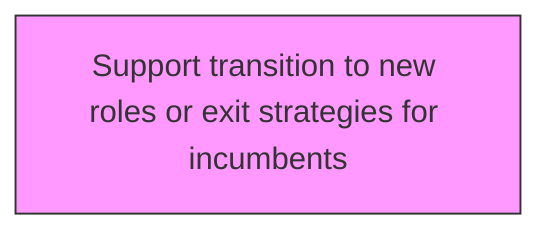
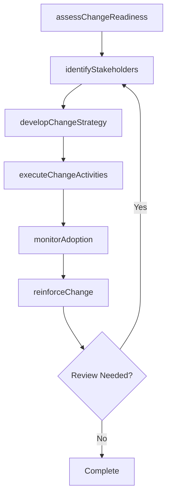

# Support transition to new roles or exit strategies for incumbents

> Business-as-Code definition for support transition to new roles or exit strategies for incumbents. Models the process of supporting the transition of personnel to new roles and the dismissal of any existing employees, necessitated for the desired change.

## Overview

Supporting the transition of personnel to new roles and the dismissal of any existing employees, necessitated for the desired change. Create an on-boarding process for seamlessly transitioning personnel to new roles. Offer orientation and training. Address any concerns. Create a structured procedure for the discharge of incumbents from their positions.

## Process Hierarchy



## GraphDL

```yaml
support:
  object: Transition To New Roles Or Exit Strategies For Incumbents
  actor: ChangeManager
  result: transitionToNewRolesOrExitStrategiesForIncumbentsResult
```

## Actions

| Action | Description |
|--------|-------------|
| assessChangeReadiness | Evaluate organizational readiness for transition to new roles or exit strategies for incumbents |
| identifyStakeholders | Map stakeholders impacted by transition to new roles or exit strategies for incumbents |
| developChangeStrategy | Create the strategic approach for transition to new roles or exit strategies for incumbents |
| executeChangeActivities | Implement planned change activities for transition to new roles or exit strategies for incumbents |
| monitorAdoption | Track adoption rates and resistance for transition to new roles or exit strategies for incumbents |
| reinforceChange | Sustain and reinforce the outcomes of transition to new roles or exit strategies for incumbents |

## Events

| Event | Description |
|-------|-------------|
| changeReadinessAssessed | Organizational readiness for change evaluated |
| stakeholdersIdentified | Impacted stakeholders mapped and categorized |
| changeStrategyDeveloped | Strategic approach for change initiative created |
| changeActivitiesExecuted | Planned change activities implemented |
| adoptionMonitored | Adoption rates and resistance tracked |
| changeReinforced | Change outcomes sustained and reinforced |

## Searches

| Search | Description |
|--------|-------------|
| findTransitionToNewRolesOrExitStrategiesForIncumbents | Retrieve transition to new roles or exit strategies for incumbents records filtered by status, date, or scope |
| getTransitionToNewRolesOrExitStrategiesForIncumbentsDetails | Get detailed information for a specific transition to new roles or exit strategies for incumbents record |
| listTransitionToNewRolesOrExitStrategiesForIncumbentsHistory | Query the history of changes and updates to transition to new roles or exit strategies for incumbents |
| getActiveItems | List currently active items related to transition to new roles or exit strategies for incumbents |

## Process Flow



## RACI Matrix

| Activity | Responsible | Accountable | Consulted | Informed |
|----------|-------------|-------------|-----------|----------|
| assessChangeReadiness | ChangeManager | TransformationLead | BusinessUnitHeads | Stakeholders |
| identifyStakeholders | ChangeChampion | ChangeManager | HRBusinessPartner | Stakeholders |
| developChangeStrategy | CommunicationsLead | ChangeManager | ExecutiveTeam | Stakeholders |
| executeChangeActivities | ChangeManager | TransformationLead | OrganizationalDevelopment | Stakeholders |

## Related Processes

| Process | Relationship |
|---------|-------------|
| 13.4.1 Plan for change | Upstream - planning precedes design and implementation |
| 13.4.2 Design the change | Parallel - change design informs implementation |
| 13.4.3 Implement change | Downstream - implementation executes the change plan |

## Related Departments

| Department | Role |
|-----------|------|
| Organizational Development | Leads enterprise change management capability |
| Human Resources | Supports people-side change impacts and training |
| Communications | Delivers change messaging and stakeholder engagement |
| Operations | Implements operational changes and process redesigns |

## Related Occupations

| Occupation | Involvement |
|-----------|-------------|
| Change Manager | Leads change planning and execution |
| Change Champion | Advocates for change adoption within business units |
| Organizational Development Specialist | Designs change interventions and support |

## KPIs

| KPI | Description | Unit |
|-----|-------------|------|
| Change Adoption Rate | Percentage of impacted employees who adopted the change | % |
| Resistance Level | Measured level of organizational resistance to change | Score (1-5) |
| Training Completion Rate | Percentage of required training completed on time | % |
| Change Sustainability | Percentage of changes sustained after 6 months | % |

## Usage

```typescript
import { supportTransitionToNewRolesOrExitStrategiesForIncumbents } from '@headlessly/support-transition-to-new-roles-or-exit-strategies-for-incumbents'

const client = supportTransitionToNewRolesOrExitStrategiesForIncumbents()

// Evaluate organizational readiness for transition to new roles or exit strategies for incumbents
const result = await client.assessChangeReadiness({
  scope: 'enterprise',
  period: 'Q1-2025'
})

// Map stakeholders impacted by transition to new roles or exit strategies for incumbents
const assessment = await client.identifyStakeholders({
  resultId: result.id,
  criteria: 'standard'
})

// Create the strategic approach for transition to new roles or exit strategies for incumbents
await client.developChangeStrategy({
  resultId: result.id,
  format: 'detailed',
  recipients: ['stakeholders']
})
```
