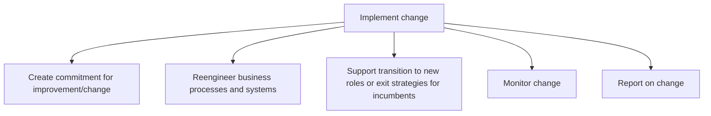
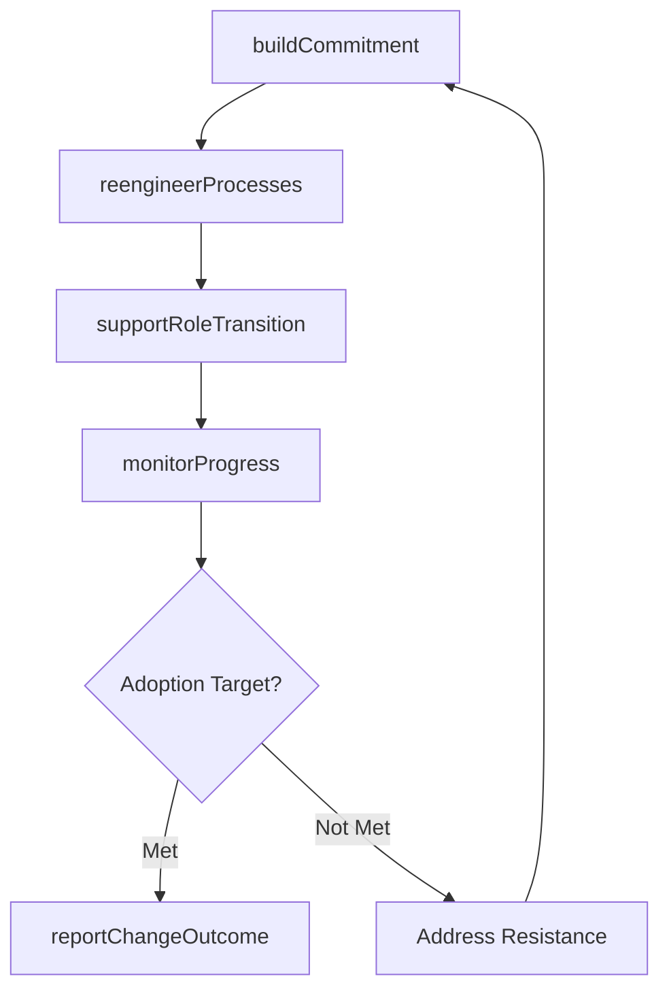

# Implement change

> Business-as-Code definition for change implementation. Models the execution of organizational change including commitment building, process reengineering, role transitions, progress monitoring, and outcome reporting.

## Overview

Effectuating the change within the desired impact areas of the organization. Ensure adequate commitment from all corners of the organization for the desired change. Create support structures. Refashion all processes deemed necessary. Observe the progress.

## Process Hierarchy



## GraphDL

```yaml
implement:
  object: Change
  actor: ChangeManager
  result: ChangeImplementationReport
```

## Actions

| Action | Description |
|--------|-------------|
| buildCommitment | Communicate the business case and engage leaders to champion the change |
| reengineerProcesses | Redesign and deploy modified business processes and supporting systems |
| supportRoleTransition | Assist employees transitioning to new roles or exiting current positions |
| monitorProgress | Track adoption metrics, milestone completion, and resistance indicators |
| reportChangeOutcome | Document the results and impact of the change implementation |

## Events

| Event | Description |
|-------|-------------|
| commitmentBuilt | Organizational commitment secured from leadership and key stakeholders |
| processesReengineered | Modified business processes and systems deployed |
| roleTransitionSupported | Employee transitions to new roles completed with support |
| progressMonitored | Change adoption and milestone data collected and reviewed |
| changeOutcomeReported | Change implementation results documented and distributed |

## Searches

| Search | Description |
|--------|-------------|
| getImplementationStatus | Retrieve current status of a change implementation |
| findAdoptionMetrics | List adoption metric values by initiative, group, or period |
| getResistanceIndicators | Retrieve identified resistance points and their severity |
| findRoleTransitions | List employee role transitions by status or department |

## Process Flow



## RACI Matrix

| Activity | Responsible | Accountable | Consulted | Informed |
|----------|-------------|-------------|-----------|----------|
| buildCommitment | ChangeChampions | ChangeManager | ExecutiveSponsor | AllEmployees |
| reengineerProcesses | ProcessOwners | ChangeManager | IT | Operations |
| supportRoleTransition | HRBusinessPartner | ChangeManager | LineManagers | AffectedEmployees |
| monitorProgress | ChangeManager | VP Transformation | Analytics | SteeringCommittee |

## Sub-Processes

| ID | Name | Description |
|----|------|-------------|
| 13.4.3.1 | Create commitment for improvement/change | Kindling an organization wide commitment for effectuating the change. Effectively communicate the ad |
| 13.4.3.2 | Reengineer business processes and systems | Restructuring, redesigning, repurposing, and/or retrofitting existing business processes, activities |
| 13.4.3.3 | Support transition to new roles or exit strategies for incumbents | Supporting the transition of personnel to new roles and the dismissal of any existing employees, nec |
| 13.4.3.4 | Monitor change | Monitoring activities in the change process in order to assess the performance of individual agents  |
| 13.4.3.5 | Report on change | Reporting on the outcome of the change. Document changes and the impact those changes had on critica |

## Related Processes

| Process | Relationship |
|---------|-------------|
| 13.4.2 Design the change | Upstream - design provides plans executed during implementation |
| 13.4.4 Sustain improvement | Downstream - implementation transitions to sustainment monitoring |
| 13.2.3 Manage projects | Parallel - change is often delivered through project structures |

## Related Departments

| Department | Role |
|-----------|------|
| Organizational Development | Leads change implementation methodology |
| Human Resources | Supports role transitions and workforce adjustments |
| IT | Deploys system changes and technology enablement |
| Operations | Adopts reengineered processes on the front line |

## Related Occupations

| Occupation | Involvement |
|-----------|-------------|
| Change Manager | Coordinates implementation activities and monitors progress |
| Change Champion | Drives adoption within their assigned business unit |
| HR Business Partner | Supports employee transitions and role changes |

## KPIs

| KPI | Description | Unit |
|-----|-------------|------|
| Adoption Rate | Percentage of impacted employees actively using new processes | % |
| Milestone Completion | Percentage of implementation milestones completed on schedule | % |
| Resistance Rate | Percentage of employees exhibiting active or passive resistance | % |
| Go-Live Readiness | Composite score of readiness criteria met at each deployment wave | Score (1-10) |

## Usage

```typescript
import { implementChange } from '@headlessly/implement-change'

const impl = implementChange()

// Build commitment with leadership communication
const commitment = await impl.buildCommitment({
  initiativeId: 'CHG-2026-015',
  channels: ['town-hall', 'email', 'intranet'],
  executiveSponsor: 'coo'
})

// Monitor implementation progress
const progress = await impl.monitorProgress({
  initiativeId: 'CHG-2026-015',
  metrics: ['adoption-rate', 'training-completion', 'help-desk-tickets'],
  asOfDate: '2026-06-15'
})
```
