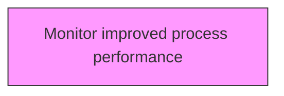
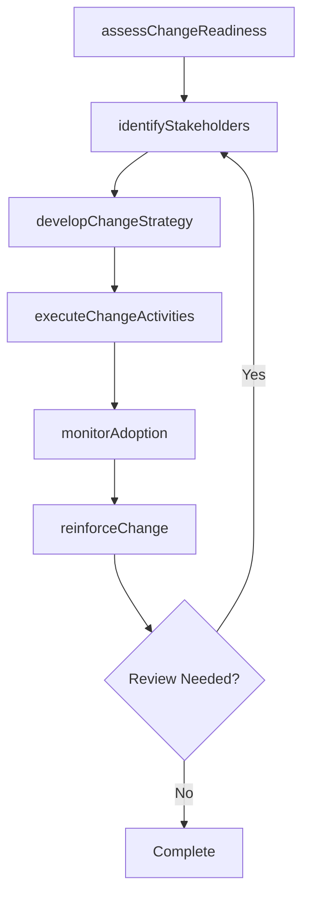

# Monitor improved process performance

> Business-as-Code definition for monitor improved process performance. Models the process of monitoring the performance of improved business processes.

## Overview

Monitoring the performance of improved business processes. Track the key performance indicators of the upgraded processes in order to gauge its contribution to the desired change. Expedite through the use of business process management software.

## Process Hierarchy



## GraphDL

```yaml
monitor:
  object: Improved Process Performance
  actor: ChangeManager
  result: improvedProcessPerformanceResult
```

## Actions

| Action | Description |
|--------|-------------|
| assessChangeReadiness | Evaluate organizational readiness for improved process performance |
| identifyStakeholders | Map stakeholders impacted by improved process performance |
| developChangeStrategy | Create the strategic approach for improved process performance |
| executeChangeActivities | Implement planned change activities for improved process performance |
| monitorAdoption | Track adoption rates and resistance for improved process performance |
| reinforceChange | Sustain and reinforce the outcomes of improved process performance |

## Events

| Event | Description |
|-------|-------------|
| changeReadinessAssessed | Organizational readiness for change evaluated |
| stakeholdersIdentified | Impacted stakeholders mapped and categorized |
| changeStrategyDeveloped | Strategic approach for change initiative created |
| changeActivitiesExecuted | Planned change activities implemented |
| adoptionMonitored | Adoption rates and resistance tracked |
| changeReinforced | Change outcomes sustained and reinforced |

## Searches

| Search | Description |
|--------|-------------|
| findImprovedProcessPerformance | Retrieve improved process performance records filtered by status, date, or scope |
| getImprovedProcessPerformanceDetails | Get detailed information for a specific improved process performance record |
| listImprovedProcessPerformanceHistory | Query the history of changes and updates to improved process performance |
| getActiveItems | List currently active items related to improved process performance |

## Process Flow



## RACI Matrix

| Activity | Responsible | Accountable | Consulted | Informed |
|----------|-------------|-------------|-----------|----------|
| assessChangeReadiness | ChangeManager | TransformationLead | BusinessUnitHeads | Stakeholders |
| identifyStakeholders | ChangeChampion | ChangeManager | HRBusinessPartner | Stakeholders |
| developChangeStrategy | CommunicationsLead | ChangeManager | ExecutiveTeam | Stakeholders |
| executeChangeActivities | ChangeManager | TransformationLead | OrganizationalDevelopment | Stakeholders |

## Related Processes

| Process | Relationship |
|---------|-------------|
| 13.4.1 Plan for change | Upstream - planning precedes design and implementation |
| 13.4.2 Design the change | Parallel - change design informs implementation |
| 13.4.3 Implement change | Downstream - implementation executes the change plan |

## Related Departments

| Department | Role |
|-----------|------|
| Organizational Development | Leads enterprise change management capability |
| Human Resources | Supports people-side change impacts and training |
| Communications | Delivers change messaging and stakeholder engagement |
| Operations | Implements operational changes and process redesigns |

## Related Occupations

| Occupation | Involvement |
|-----------|-------------|
| Change Manager | Leads change planning and execution |
| Change Champion | Advocates for change adoption within business units |
| Organizational Development Specialist | Designs change interventions and support |

## KPIs

| KPI | Description | Unit |
|-----|-------------|------|
| Change Adoption Rate | Percentage of impacted employees who adopted the change | % |
| Resistance Level | Measured level of organizational resistance to change | Score (1-5) |
| Training Completion Rate | Percentage of required training completed on time | % |
| Change Sustainability | Percentage of changes sustained after 6 months | % |

## Usage

```typescript
import { monitorImprovedProcessPerformance } from '@headlessly/monitor-improved-process-performance'

const client = monitorImprovedProcessPerformance()

// Evaluate organizational readiness for improved process performance
const result = await client.assessChangeReadiness({
  scope: 'enterprise',
  period: 'Q1-2025'
})

// Map stakeholders impacted by improved process performance
const assessment = await client.identifyStakeholders({
  resultId: result.id,
  criteria: 'standard'
})

// Create the strategic approach for improved process performance
await client.developChangeStrategy({
  resultId: result.id,
  format: 'detailed',
  recipients: ['stakeholders']
})
```
