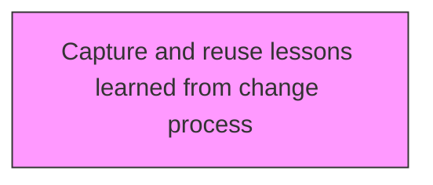
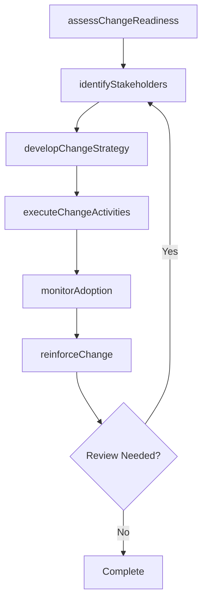

# Capture and reuse lessons learned from change process

> Business-as-Code definition for capture and reuse lessons learned from change process. Models the process of documenting and standardizing insights gleaned and the knowledge acquired from studying the change process already implemented.

## Overview

Documenting and standardizing insights gleaned and the knowledge acquired from studying the change process already implemented. Create case studies/best practices guides from the process of implementing change. Include experienced personnel.

## Process Hierarchy



## GraphDL

```yaml
capture:
  object: And Reuse Lessons Learned From Change Process
  actor: ChangeManager
  result: reuseLessonsLearnedFromChangeProcessResult
```

## Actions

| Action | Description |
|--------|-------------|
| assessChangeReadiness | Evaluate organizational readiness for reuse lessons learned from change process |
| identifyStakeholders | Map stakeholders impacted by reuse lessons learned from change process |
| developChangeStrategy | Create the strategic approach for reuse lessons learned from change process |
| executeChangeActivities | Implement planned change activities for reuse lessons learned from change process |
| monitorAdoption | Track adoption rates and resistance for reuse lessons learned from change process |
| reinforceChange | Sustain and reinforce the outcomes of reuse lessons learned from change process |

## Events

| Event | Description |
|-------|-------------|
| changeReadinessAssessed | Organizational readiness for change evaluated |
| stakeholdersIdentified | Impacted stakeholders mapped and categorized |
| changeStrategyDeveloped | Strategic approach for change initiative created |
| changeActivitiesExecuted | Planned change activities implemented |
| adoptionMonitored | Adoption rates and resistance tracked |
| changeReinforced | Change outcomes sustained and reinforced |

## Searches

| Search | Description |
|--------|-------------|
| findReuseLessonsLearnedFromChangeProcess | Retrieve reuse lessons learned from change process records filtered by status, date, or scope |
| getReuseLessonsLearnedFromChangeProcessDetails | Get detailed information for a specific reuse lessons learned from change process record |
| listReuseLessonsLearnedFromChangeProcessHistory | Query the history of changes and updates to reuse lessons learned from change process |
| getActiveItems | List currently active items related to reuse lessons learned from change process |

## Process Flow



## RACI Matrix

| Activity | Responsible | Accountable | Consulted | Informed |
|----------|-------------|-------------|-----------|----------|
| assessChangeReadiness | ChangeManager | TransformationLead | BusinessUnitHeads | Stakeholders |
| identifyStakeholders | ChangeChampion | ChangeManager | HRBusinessPartner | Stakeholders |
| developChangeStrategy | CommunicationsLead | ChangeManager | ExecutiveTeam | Stakeholders |
| executeChangeActivities | ChangeManager | TransformationLead | OrganizationalDevelopment | Stakeholders |

## Related Processes

| Process | Relationship |
|---------|-------------|
| 13.4.1 Plan for change | Upstream - planning precedes design and implementation |
| 13.4.2 Design the change | Parallel - change design informs implementation |
| 13.4.3 Implement change | Downstream - implementation executes the change plan |

## Related Departments

| Department | Role |
|-----------|------|
| Organizational Development | Leads enterprise change management capability |
| Human Resources | Supports people-side change impacts and training |
| Communications | Delivers change messaging and stakeholder engagement |
| Operations | Implements operational changes and process redesigns |

## Related Occupations

| Occupation | Involvement |
|-----------|-------------|
| Change Manager | Leads change planning and execution |
| Change Champion | Advocates for change adoption within business units |
| Organizational Development Specialist | Designs change interventions and support |

## KPIs

| KPI | Description | Unit |
|-----|-------------|------|
| Change Adoption Rate | Percentage of impacted employees who adopted the change | % |
| Resistance Level | Measured level of organizational resistance to change | Score (1-5) |
| Training Completion Rate | Percentage of required training completed on time | % |
| Change Sustainability | Percentage of changes sustained after 6 months | % |

## Usage

```typescript
import { captureAndReuseLessonsLearnedFromChangeProcess } from '@headlessly/capture-and-reuse-lessons-learned-from-change-process'

const client = captureAndReuseLessonsLearnedFromChangeProcess()

// Evaluate organizational readiness for reuse lessons learned from change process
const result = await client.assessChangeReadiness({
  scope: 'enterprise',
  period: 'Q1-2025'
})

// Map stakeholders impacted by reuse lessons learned from change process
const assessment = await client.identifyStakeholders({
  resultId: result.id,
  criteria: 'standard'
})

// Create the strategic approach for reuse lessons learned from change process
await client.developChangeStrategy({
  resultId: result.id,
  format: 'detailed',
  recipients: ['stakeholders']
})
```
