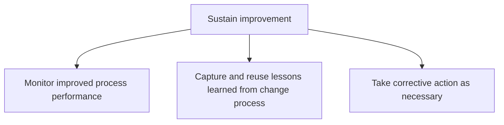
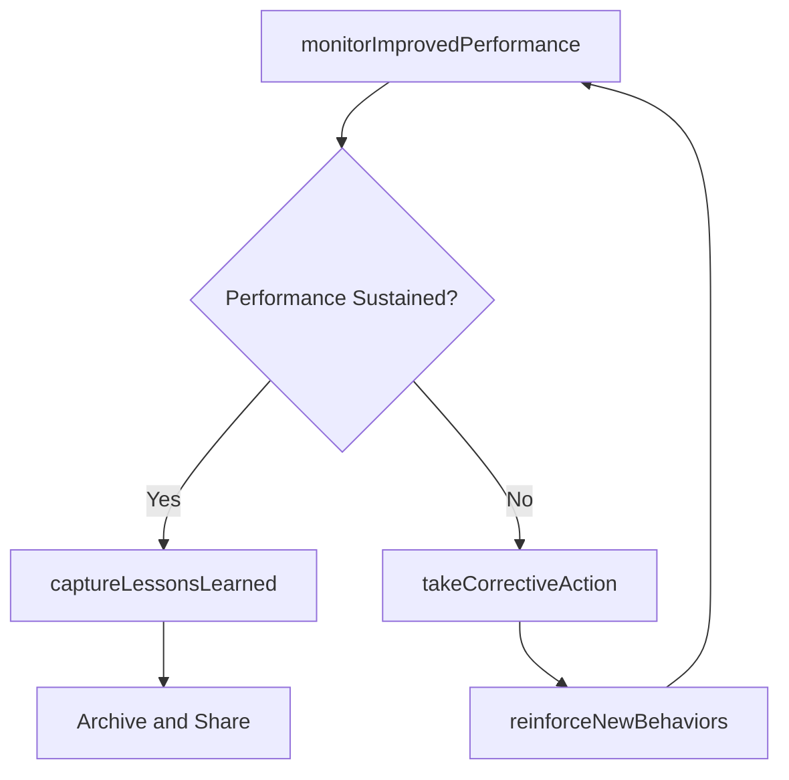

# Sustain improvement

> Business-as-Code definition for improvement sustainment. Models the ongoing monitoring of reengineered processes, capture and reuse of lessons learned, and execution of corrective actions to ensure change benefits persist.

## Overview

Sustaining the impact of the change process in order to enact continual process improvement. Monitor the performance of re-engineered business processes. Identify best practices and potential issues. Effectuate remedial steps.

## Process Hierarchy



## GraphDL

```yaml
sustain:
  object: Improvement
  actor: ContinuousImprovementLead
  result: SustainmentReport
```

## Actions

| Action | Description |
|--------|-------------|
| monitorImprovedPerformance | Track KPIs of reengineered processes against expected performance levels |
| captureLessonsLearned | Document insights, best practices, and pitfalls from the change process |
| takeCorrectiveAction | Implement remedial steps when improved processes regress or underperform |
| reinforceNewBehaviors | Sustain adoption through ongoing recognition and reinforcement activities |

## Events

| Event | Description |
|-------|-------------|
| improvedPerformanceMonitored | Post-change process performance data collected and reviewed |
| lessonsLearnedCaptured | Change process retrospective completed and insights documented |
| correctiveActionTaken | Remedial action executed to address performance regression |
| newBehaviorsReinforced | Adoption reinforcement activities completed |

## Searches

| Search | Description |
|--------|-------------|
| getPostChangeMetrics | Retrieve performance metrics for processes after change implementation |
| findLessonsLearned | List documented lessons learned by initiative or topic |
| getCorrectiveActions | Retrieve open corrective actions for sustained improvements |

## Process Flow



## RACI Matrix

| Activity | Responsible | Accountable | Consulted | Informed |
|----------|-------------|-------------|-----------|----------|
| monitorImprovedPerformance | ProcessOwner | ContinuousImprovementLead | Analytics | ChangeManager |
| captureLessonsLearned | ChangeManager | VP Transformation | ProcessOwners | KM Team |
| takeCorrectiveAction | ProcessOwner | ContinuousImprovementLead | QualityTeam | Executive |

## Sub-Processes

| ID | Name | Description |
|----|------|-------------|
| 13.4.4.1 | Monitor improved process performance | Monitoring the performance of improved business processes. Track the key performance indicators of t |
| 13.4.4.2 | Capture and reuse lessons learned from change process | Documenting and standardizing insights gleaned and the knowledge acquired from studying the change p |
| 13.4.4.3 | Take corrective action as necessary | Implement corrective action to adjust the re-engineered processes for maximizing the desired impact. |

## Related Processes

| Process | Relationship |
|---------|-------------|
| 13.4.3 Implement change | Upstream - implementation transitions into sustainment |
| 13.1.5 Improve processes | Parallel - continuous improvement activities overlap with sustainment |
| 13.5 Develop and manage enterprise-wide KM capability | Downstream - lessons learned feed the knowledge base |

## Related Departments

| Department | Role |
|-----------|------|
| Continuous Improvement | Monitors sustained process performance |
| Organizational Development | Ensures change adoption reinforcement continues |
| Quality Assurance | Validates that improved processes meet quality standards |

## Related Occupations

| Occupation | Involvement |
|-----------|-------------|
| Continuous Improvement Lead | Monitors long-term process performance and takes corrective action |
| Process Owner | Maintains improved processes in daily operations |
| Knowledge Manager | Archives lessons learned for organizational reuse |

## KPIs

| KPI | Description | Unit |
|-----|-------------|------|
| Sustainment Rate | Percentage of improvements still delivering target benefits after 6 months | % |
| Regression Incidents | Number of times improved processes regress below target thresholds | Count |
| Lessons Learned Reuse Rate | Percentage of documented lessons referenced in subsequent initiatives | % |

## Usage

```typescript
import { sustainImprovement } from '@headlessly/sustain-improvement'

const sustain = sustainImprovement()

// Monitor post-change process performance
const metrics = await sustain.monitorImprovedPerformance({
  initiativeId: 'CHG-2026-015',
  processes: ['order-to-cash', 'procurement-cycle'],
  baselinePeriod: '2025-Q4',
  currentPeriod: '2026-Q2'
})

// Capture lessons learned
const lessons = await sustain.captureLessonsLearned({
  initiativeId: 'CHG-2026-015',
  categories: ['what-worked', 'what-did-not', 'recommendations'],
  participants: ['change-team', 'process-owners', 'champions']
})
```
