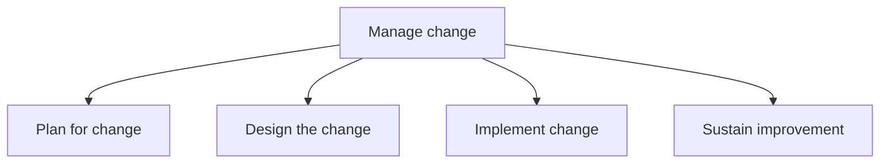
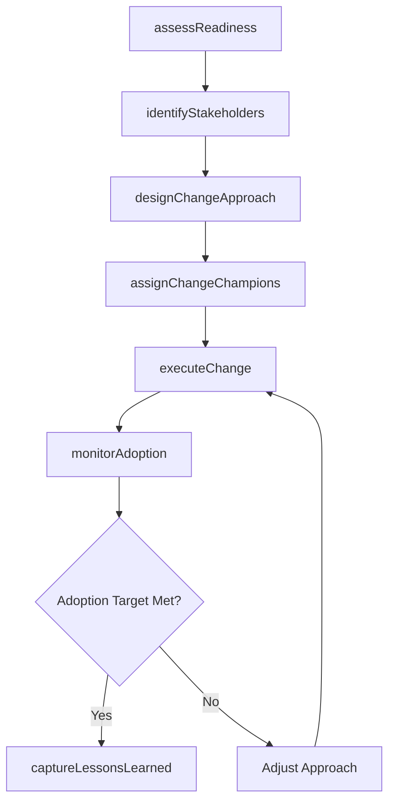

# Manage change

> Business-as-Code definition for organizational change management. Models the full change lifecycle from readiness assessment and stakeholder analysis through design, implementation, and sustained adoption.

## Overview

Planning, designing, and implementing the change. Ensure improvement in the change process.

## Process Hierarchy



## GraphDL

```yaml
manage:
  object: Change
  actor: ChangeManager
  result: ChangeOutcomeReport
```

## Actions

| Action | Description |
|--------|-------------|
| assessReadiness | Evaluate organizational readiness and cultural factors for proposed change |
| identifyStakeholders | Map stakeholders, their influence, and their degree of impact |
| designChangeApproach | Develop change management, training, and communication plans |
| assignChangeChampions | Designate change champions to drive adoption across impacted groups |
| executeChange | Implement the change initiative including process reengineering and role transitions |
| monitorAdoption | Track adoption metrics and gather feedback from impacted groups |
| captureLessonsLearned | Document insights and corrective actions for future change initiatives |

## Events

| Event | Description |
|-------|-------------|
| readinessAssessed | Organizational readiness evaluation completed |
| stakeholdersIdentified | Stakeholder map with impact and influence documented |
| changeApproachDesigned | Change management and communication plans approved |
| changeChampionsAssigned | Change champions designated and onboarded |
| changeExecuted | Change initiative deployed to impacted groups |
| adoptionMonitored | Adoption metrics collected and reviewed |
| lessonsLearnedCaptured | Post-change retrospective completed and documented |

## Searches

| Search | Description |
|--------|-------------|
| findChangeInitiatives | List change initiatives filtered by status, business unit, or type |
| getAdoptionMetrics | Retrieve adoption rates and resistance indicators for a change initiative |
| getStakeholderMap | Get the stakeholder analysis for a specific change effort |
| findBarriers | List identified barriers and enablers for an active change initiative |

## Process Flow



## RACI Matrix

| Activity | Responsible | Accountable | Consulted | Informed |
|----------|-------------|-------------|-----------|----------|
| assessReadiness | ChangeManager | VP Transformation | HRBusinessPartner | ExecutiveSponsor |
| designChangeApproach | ChangeManager | VP Transformation | Communications | ImpactedManagers |
| executeChange | ChangeChampions | ChangeManager | TrainingTeam | AllEmployees |
| monitorAdoption | ChangeManager | VP Transformation | Analytics | SteeringCommittee |
| captureLessonsLearned | ChangeManager | VP Transformation | ProcessOwners | PMO |

## Sub-Processes

| ID | Name | Description |
|----|------|-------------|
| 13.4.1 | Plan for change | Crafting a plan for implementing change to the organization's multiple frameworks, systems, and func |
| 13.4.2 | Design the change | Developing plans for change management, training, communication, and rewards/incentives. Establish m |
| 13.4.3 | Implement change | Effectuating the change within the desired impact areas of the organization. Ensure adequate commitm |
| 13.4.4 | Sustain improvement | Sustaining the impact of the change process in order to enact continual process improvement. Monitor |

## Related Processes

| Process | Relationship |
|---------|-------------|
| 13.1 Manage business processes | Upstream - process definitions often trigger change initiatives |
| 13.2 Manage portfolio, program, and project | Parallel - change is delivered through project structures |
| 13.5 Develop and manage enterprise-wide KM capability | Downstream - knowledge capture sustains change outcomes |
| 13.6 Measure and benchmark | Upstream - performance gaps establish the need for change |

## Related Departments

| Department | Role |
|-----------|------|
| Organizational Development | Primary owner of change management methodology |
| Human Resources | Supports workforce transition and role redesign |
| Communications | Develops and distributes change messaging |
| Training | Delivers skill-building programs for new processes |
| IT | Enables technology changes supporting transformation |

## Related Occupations

| Occupation | Involvement |
|-----------|-------------|
| Change Manager | Leads change planning, design, and implementation |
| Organizational Development Specialist | Assesses readiness and cultural factors |
| Training Coordinator | Develops and delivers change-related training |
| Communications Specialist | Creates stakeholder messaging and engagement campaigns |

## KPIs

| KPI | Description | Unit |
|-----|-------------|------|
| Adoption Rate | Percentage of impacted employees actively using new processes or systems | % |
| Change Readiness Score | Composite score reflecting organizational preparedness for change | Score (1-10) |
| Time to Full Adoption | Elapsed time from go-live to target adoption rate | Weeks |
| Stakeholder Satisfaction | Survey-based satisfaction with change communication and support | Score (1-5) |
| Sustainment Rate | Percentage of changes still in effect after 6 months | % |

## Usage

```typescript
import { manageChange } from '@headlessly/manage-change'

const change = manageChange()

// Assess readiness for a new ERP rollout
const readiness = await change.assessReadiness({
  initiativeId: 'CHG-2026-015',
  scope: 'enterprise',
  impactAreas: ['finance', 'procurement', 'supply-chain']
})

// Monitor adoption metrics
const adoption = await change.monitorAdoption({
  initiativeId: 'CHG-2026-015',
  targetRate: 0.85,
  asOfDate: '2026-03-01'
})
```
