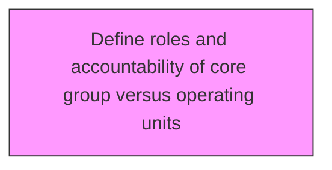
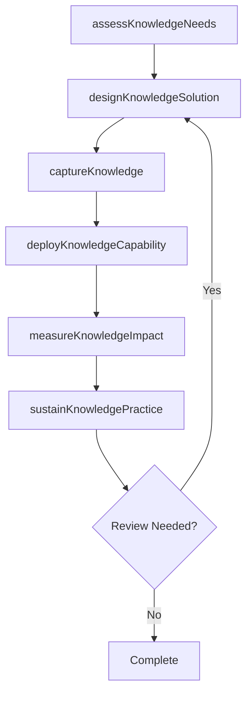

# Define roles and accountability of core group versus operating units

> Business-as-Code definition for define roles and accountability of core group versus operating units. Models the process of clearly determining the roles and responsibilities of all personnel involved in the management of the organization's corpus of knowledge.

## Overview

Clearly determining the roles and responsibilities of all personnel involved in the management of the organization's corpus of knowledge. Flesh out the roles and responsibilities of the KM core group, as well as the operational staff involved in the upkeep of the knowledge management program.

## Process Hierarchy



## GraphDL

```yaml
define:
  object: Roles And Accountability Of Core Group Versus Operating Units
  actor: KnowledgeManager
  result: rolesAndAccountabilityOfCoreGroupVersusOperatingUnitsResult
```

## Actions

| Action | Description |
|--------|-------------|
| assessKnowledgeNeeds | Evaluate knowledge requirements for roles and accountability of core group versus operating units |
| designKnowledgeSolution | Create the approach and design for roles and accountability of core group versus operating units |
| captureKnowledge | Collect and codify knowledge assets for roles and accountability of core group versus operating units |
| deployKnowledgeCapability | Roll out knowledge capabilities for roles and accountability of core group versus operating units |
| measureKnowledgeImpact | Assess the value and impact of roles and accountability of core group versus operating units |
| sustainKnowledgePractice | Maintain and evolve roles and accountability of core group versus operating units over time |

## Events

| Event | Description |
|-------|-------------|
| knowledgeNeedsAssessed | Knowledge requirements evaluated |
| knowledgeSolutionDesigned | Knowledge management solution approach created |
| knowledgeCaptured | Knowledge assets collected and codified |
| knowledgeCapabilityDeployed | Knowledge capabilities rolled out |
| knowledgeImpactMeasured | Value and impact of knowledge initiative assessed |
| knowledgePracticeSustained | Knowledge practices maintained and evolved |

## Searches

| Search | Description |
|--------|-------------|
| findRolesAndAccountabilityOfCoreGroupVersusOperatingUnits | Retrieve roles and accountability of core group versus operating units records filtered by status, date, or scope |
| getRolesAndAccountabilityOfCoreGroupVersusOperatingUnitsDetails | Get detailed information for a specific roles and accountability of core group versus operating units record |
| listRolesAndAccountabilityOfCoreGroupVersusOperatingUnitsHistory | Query the history of changes and updates to roles and accountability of core group versus operating units |
| getActiveItems | List currently active items related to roles and accountability of core group versus operating units |

## Process Flow



## RACI Matrix

| Activity | Responsible | Accountable | Consulted | Informed |
|----------|-------------|-------------|-----------|----------|
| assessKnowledgeNeeds | KnowledgeManager | KMStrategist | BusinessUnitLeads | Stakeholders |
| designKnowledgeSolution | ContentCurator | KnowledgeManager | SubjectMatterExperts | Stakeholders |
| captureKnowledge | KMStrategist | ChiefKnowledgeOfficer | ITArchitecture | Stakeholders |
| deployKnowledgeCapability | KnowledgeManager | KMStrategist | LearningDevelopment | Stakeholders |

## Related Processes

| Process | Relationship |
|---------|-------------|
| 13.5.1 Develop KM strategy | Upstream - strategy guides KM capability development |
| 13.5.2 Assess KM capabilities | Parallel - assessment informs capability design |
| 13.5.3 Design and implement KM capabilities | Downstream - capabilities are designed and deployed |

## Related Departments

| Department | Role |
|-----------|------|
| Knowledge Management | Primary owner of KM strategy and operations |
| IT | Provides KM platforms and technology infrastructure |
| Human Resources | Integrates KM with learning and development programs |
| Operations | Contributes and consumes operational knowledge assets |

## Related Occupations

| Occupation | Involvement |
|-----------|-------------|
| Knowledge Manager | Leads KM strategy and program delivery |
| KM Strategist | Designs KM approaches and governance models |
| Content Curator | Manages knowledge repositories and content quality |

## KPIs

| KPI | Description | Unit |
|-----|-------------|------|
| Knowledge Reuse Rate | Frequency of knowledge asset reuse across the organization | % |
| Knowledge Capture Rate | Percentage of critical knowledge formally captured | % |
| Time to Find Knowledge | Average time for employees to locate needed knowledge | Minutes |
| KM Engagement Rate | Percentage of employees actively contributing to KM | % |

## Usage

```typescript
import { defineRolesAndAccountabilityOfCoreGroupVersusOperatingUnits } from '@headlessly/define-roles-and-accountability-of-core-group-versus-operating-units'

const client = defineRolesAndAccountabilityOfCoreGroupVersusOperatingUnits()

// Evaluate knowledge requirements for roles and accountability of core group versus operating units
const result = await client.assessKnowledgeNeeds({
  scope: 'enterprise',
  period: 'Q1-2025'
})

// Create the approach and design for roles and accountability of core group versus operating units
const assessment = await client.designKnowledgeSolution({
  resultId: result.id,
  criteria: 'standard'
})

// Collect and codify knowledge assets for roles and accountability of core group versus operating units
await client.captureKnowledge({
  resultId: result.id,
  format: 'detailed',
  recipients: ['stakeholders']
})
```
