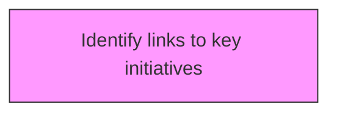
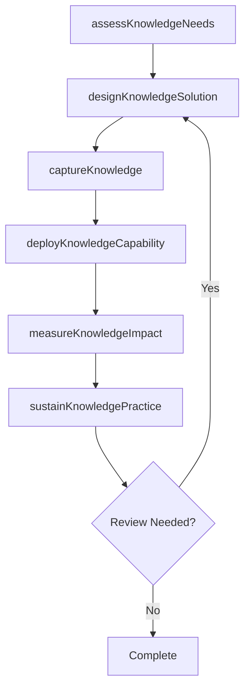

# Identify links to key initiatives

> Business-as-Code definition for identify links to key initiatives. Models the process of identifying any links that exist between the strategy for knowledge management and any other functional areas.

## Overview

Identifying any links that exist between the strategy for knowledge management and any other functional areas. Determine any correlations that exist between the strategic road map for the knowledge management and any other functional areas. Study each function's/unit's attributes.

## Process Hierarchy



## GraphDL

```yaml
identify:
  object: Links To Key Initiatives
  actor: KnowledgeManager
  result: linksToKeyInitiativesResult
```

## Actions

| Action | Description |
|--------|-------------|
| assessKnowledgeNeeds | Evaluate knowledge requirements for links to key initiatives |
| designKnowledgeSolution | Create the approach and design for links to key initiatives |
| captureKnowledge | Collect and codify knowledge assets for links to key initiatives |
| deployKnowledgeCapability | Roll out knowledge capabilities for links to key initiatives |
| measureKnowledgeImpact | Assess the value and impact of links to key initiatives |
| sustainKnowledgePractice | Maintain and evolve links to key initiatives over time |

## Events

| Event | Description |
|-------|-------------|
| knowledgeNeedsAssessed | Knowledge requirements evaluated |
| knowledgeSolutionDesigned | Knowledge management solution approach created |
| knowledgeCaptured | Knowledge assets collected and codified |
| knowledgeCapabilityDeployed | Knowledge capabilities rolled out |
| knowledgeImpactMeasured | Value and impact of knowledge initiative assessed |
| knowledgePracticeSustained | Knowledge practices maintained and evolved |

## Searches

| Search | Description |
|--------|-------------|
| findLinksToKeyInitiatives | Retrieve links to key initiatives records filtered by status, date, or scope |
| getLinksToKeyInitiativesDetails | Get detailed information for a specific links to key initiatives record |
| listLinksToKeyInitiativesHistory | Query the history of changes and updates to links to key initiatives |
| getActiveItems | List currently active items related to links to key initiatives |

## Process Flow



## RACI Matrix

| Activity | Responsible | Accountable | Consulted | Informed |
|----------|-------------|-------------|-----------|----------|
| assessKnowledgeNeeds | KnowledgeManager | KMStrategist | BusinessUnitLeads | Stakeholders |
| designKnowledgeSolution | ContentCurator | KnowledgeManager | SubjectMatterExperts | Stakeholders |
| captureKnowledge | KMStrategist | ChiefKnowledgeOfficer | ITArchitecture | Stakeholders |
| deployKnowledgeCapability | KnowledgeManager | KMStrategist | LearningDevelopment | Stakeholders |

## Related Processes

| Process | Relationship |
|---------|-------------|
| 13.5.1 Develop KM strategy | Upstream - strategy guides KM capability development |
| 13.5.2 Assess KM capabilities | Parallel - assessment informs capability design |
| 13.5.3 Design and implement KM capabilities | Downstream - capabilities are designed and deployed |

## Related Departments

| Department | Role |
|-----------|------|
| Knowledge Management | Primary owner of KM strategy and operations |
| IT | Provides KM platforms and technology infrastructure |
| Human Resources | Integrates KM with learning and development programs |
| Operations | Contributes and consumes operational knowledge assets |

## Related Occupations

| Occupation | Involvement |
|-----------|-------------|
| Knowledge Manager | Leads KM strategy and program delivery |
| KM Strategist | Designs KM approaches and governance models |
| Content Curator | Manages knowledge repositories and content quality |

## KPIs

| KPI | Description | Unit |
|-----|-------------|------|
| Knowledge Reuse Rate | Frequency of knowledge asset reuse across the organization | % |
| Knowledge Capture Rate | Percentage of critical knowledge formally captured | % |
| Time to Find Knowledge | Average time for employees to locate needed knowledge | Minutes |
| KM Engagement Rate | Percentage of employees actively contributing to KM | % |

## Usage

```typescript
import { identifyLinksToKeyInitiatives } from '@headlessly/identify-links-to-key-initiatives'

const client = identifyLinksToKeyInitiatives()

// Evaluate knowledge requirements for links to key initiatives
const result = await client.assessKnowledgeNeeds({
  scope: 'enterprise',
  period: 'Q1-2025'
})

// Create the approach and design for links to key initiatives
const assessment = await client.designKnowledgeSolution({
  resultId: result.id,
  criteria: 'standard'
})

// Collect and codify knowledge assets for links to key initiatives
await client.captureKnowledge({
  resultId: result.id,
  format: 'detailed',
  recipients: ['stakeholders']
})
```
