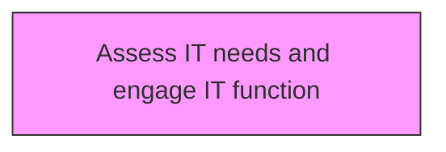
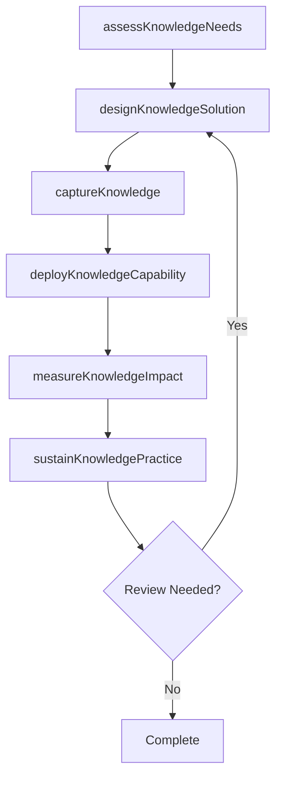

# Assess IT needs and engage IT function

> Business-as-Code definition for assess it needs and engage it function. Models the process of determining the it needs for developing the knowledge management strategy, and collaborating with the it function to implement the strategy.

## Overview

Determining the IT needs for developing the knowledge management strategy, and collaborating with the IT function to implement the strategy. Assess requirements for technologies such as computer hardware, software, electronics, semiconductors, internet, and telecommunications equipment in order to effectively build and implement the strategy for knowledge management.

## Process Hierarchy



## GraphDL

```yaml
assess:
  object: IT Needs And Engage IT Function
  actor: KnowledgeManager
  result: itNeedsAndEngageItFunctionResult
```

## Actions

| Action | Description |
|--------|-------------|
| assessKnowledgeNeeds | Evaluate knowledge requirements for it needs and engage it function |
| designKnowledgeSolution | Create the approach and design for it needs and engage it function |
| captureKnowledge | Collect and codify knowledge assets for it needs and engage it function |
| deployKnowledgeCapability | Roll out knowledge capabilities for it needs and engage it function |
| measureKnowledgeImpact | Assess the value and impact of it needs and engage it function |
| sustainKnowledgePractice | Maintain and evolve it needs and engage it function over time |

## Events

| Event | Description |
|-------|-------------|
| knowledgeNeedsAssessed | Knowledge requirements evaluated |
| knowledgeSolutionDesigned | Knowledge management solution approach created |
| knowledgeCaptured | Knowledge assets collected and codified |
| knowledgeCapabilityDeployed | Knowledge capabilities rolled out |
| knowledgeImpactMeasured | Value and impact of knowledge initiative assessed |
| knowledgePracticeSustained | Knowledge practices maintained and evolved |

## Searches

| Search | Description |
|--------|-------------|
| findItNeedsAndEngageItFunction | Retrieve it needs and engage it function records filtered by status, date, or scope |
| getItNeedsAndEngageItFunctionDetails | Get detailed information for a specific it needs and engage it function record |
| listItNeedsAndEngageItFunctionHistory | Query the history of changes and updates to it needs and engage it function |
| getActiveItems | List currently active items related to it needs and engage it function |

## Process Flow



## RACI Matrix

| Activity | Responsible | Accountable | Consulted | Informed |
|----------|-------------|-------------|-----------|----------|
| assessKnowledgeNeeds | KnowledgeManager | KMStrategist | BusinessUnitLeads | Stakeholders |
| designKnowledgeSolution | ContentCurator | KnowledgeManager | SubjectMatterExperts | Stakeholders |
| captureKnowledge | KMStrategist | ChiefKnowledgeOfficer | ITArchitecture | Stakeholders |
| deployKnowledgeCapability | KnowledgeManager | KMStrategist | LearningDevelopment | Stakeholders |

## Related Processes

| Process | Relationship |
|---------|-------------|
| 13.5.1 Develop KM strategy | Upstream - strategy guides KM capability development |
| 13.5.2 Assess KM capabilities | Parallel - assessment informs capability design |
| 13.5.3 Design and implement KM capabilities | Downstream - capabilities are designed and deployed |

## Related Departments

| Department | Role |
|-----------|------|
| Knowledge Management | Primary owner of KM strategy and operations |
| IT | Provides KM platforms and technology infrastructure |
| Human Resources | Integrates KM with learning and development programs |
| Operations | Contributes and consumes operational knowledge assets |

## Related Occupations

| Occupation | Involvement |
|-----------|-------------|
| Knowledge Manager | Leads KM strategy and program delivery |
| KM Strategist | Designs KM approaches and governance models |
| Content Curator | Manages knowledge repositories and content quality |

## KPIs

| KPI | Description | Unit |
|-----|-------------|------|
| Knowledge Reuse Rate | Frequency of knowledge asset reuse across the organization | % |
| Knowledge Capture Rate | Percentage of critical knowledge formally captured | % |
| Time to Find Knowledge | Average time for employees to locate needed knowledge | Minutes |
| KM Engagement Rate | Percentage of employees actively contributing to KM | % |

## Usage

```typescript
import { assessItNeedsAndEngageItFunction } from '@headlessly/assess-it-needs-and-engage-it-function'

const client = assessItNeedsAndEngageItFunction()

// Evaluate knowledge requirements for it needs and engage it function
const result = await client.assessKnowledgeNeeds({
  scope: 'enterprise',
  period: 'Q1-2025'
})

// Create the approach and design for it needs and engage it function
const assessment = await client.designKnowledgeSolution({
  resultId: result.id,
  criteria: 'standard'
})

// Collect and codify knowledge assets for it needs and engage it function
await client.captureKnowledge({
  resultId: result.id,
  format: 'detailed',
  recipients: ['stakeholders']
})
```
