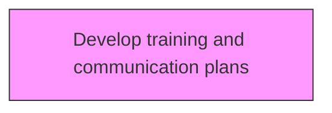
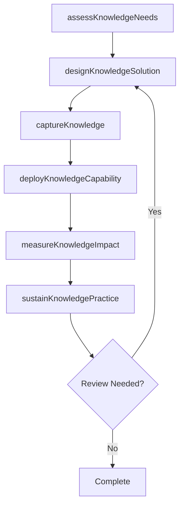

# Develop training and communication plans

> Business-as-Code definition for develop training and communication plans. Models the process of creating plans for km training plans and conveying the knowledge management strategy within the organization.

## Overview

Creating plans for KM training plans and conveying the knowledge management strategy within the organization. Create training programs, sessions, and activities in order to familiarize employees and management with the concept of knowledge management.

## Process Hierarchy



## GraphDL

```yaml
develop:
  object: Training And Communication Plans
  actor: KnowledgeManager
  result: trainingAndCommunicationPlansResult
```

## Actions

| Action | Description |
|--------|-------------|
| assessKnowledgeNeeds | Evaluate knowledge requirements for training and communication plans |
| designKnowledgeSolution | Create the approach and design for training and communication plans |
| captureKnowledge | Collect and codify knowledge assets for training and communication plans |
| deployKnowledgeCapability | Roll out knowledge capabilities for training and communication plans |
| measureKnowledgeImpact | Assess the value and impact of training and communication plans |
| sustainKnowledgePractice | Maintain and evolve training and communication plans over time |

## Events

| Event | Description |
|-------|-------------|
| knowledgeNeedsAssessed | Knowledge requirements evaluated |
| knowledgeSolutionDesigned | Knowledge management solution approach created |
| knowledgeCaptured | Knowledge assets collected and codified |
| knowledgeCapabilityDeployed | Knowledge capabilities rolled out |
| knowledgeImpactMeasured | Value and impact of knowledge initiative assessed |
| knowledgePracticeSustained | Knowledge practices maintained and evolved |

## Searches

| Search | Description |
|--------|-------------|
| findTrainingAndCommunicationPlans | Retrieve training and communication plans records filtered by status, date, or scope |
| getTrainingAndCommunicationPlansDetails | Get detailed information for a specific training and communication plans record |
| listTrainingAndCommunicationPlansHistory | Query the history of changes and updates to training and communication plans |
| getActiveItems | List currently active items related to training and communication plans |

## Process Flow



## RACI Matrix

| Activity | Responsible | Accountable | Consulted | Informed |
|----------|-------------|-------------|-----------|----------|
| assessKnowledgeNeeds | KnowledgeManager | KMStrategist | BusinessUnitLeads | Stakeholders |
| designKnowledgeSolution | ContentCurator | KnowledgeManager | SubjectMatterExperts | Stakeholders |
| captureKnowledge | KMStrategist | ChiefKnowledgeOfficer | ITArchitecture | Stakeholders |
| deployKnowledgeCapability | KnowledgeManager | KMStrategist | LearningDevelopment | Stakeholders |

## Related Processes

| Process | Relationship |
|---------|-------------|
| 13.5.1 Develop KM strategy | Upstream - strategy guides KM capability development |
| 13.5.2 Assess KM capabilities | Parallel - assessment informs capability design |
| 13.5.3 Design and implement KM capabilities | Downstream - capabilities are designed and deployed |

## Related Departments

| Department | Role |
|-----------|------|
| Knowledge Management | Primary owner of KM strategy and operations |
| IT | Provides KM platforms and technology infrastructure |
| Human Resources | Integrates KM with learning and development programs |
| Operations | Contributes and consumes operational knowledge assets |

## Related Occupations

| Occupation | Involvement |
|-----------|-------------|
| Knowledge Manager | Leads KM strategy and program delivery |
| KM Strategist | Designs KM approaches and governance models |
| Content Curator | Manages knowledge repositories and content quality |

## KPIs

| KPI | Description | Unit |
|-----|-------------|------|
| Knowledge Reuse Rate | Frequency of knowledge asset reuse across the organization | % |
| Knowledge Capture Rate | Percentage of critical knowledge formally captured | % |
| Time to Find Knowledge | Average time for employees to locate needed knowledge | Minutes |
| KM Engagement Rate | Percentage of employees actively contributing to KM | % |

## Usage

```typescript
import { developTrainingAndCommunicationPlans } from '@headlessly/develop-training-and-communication-plans'

const client = developTrainingAndCommunicationPlans()

// Evaluate knowledge requirements for training and communication plans
const result = await client.assessKnowledgeNeeds({
  scope: 'enterprise',
  period: 'Q1-2025'
})

// Create the approach and design for training and communication plans
const assessment = await client.designKnowledgeSolution({
  resultId: result.id,
  criteria: 'standard'
})

// Collect and codify knowledge assets for training and communication plans
await client.captureKnowledge({
  resultId: result.id,
  format: 'detailed',
  recipients: ['stakeholders']
})
```
