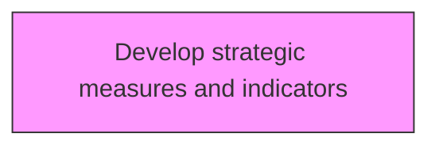
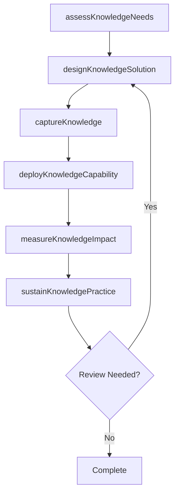

# Develop strategic measures and indicators

> Business-as-Code definition for develop strategic measures and indicators. Models the process of establishing measures and indicators for evaluating the performance of the knowledge management function.

## Overview

Establishing measures and indicators for evaluating the performance of the knowledge management function. Define key performance indicators such as the amount of knowledge assets created and number of knowledge projects undertaken.

## Process Hierarchy



## GraphDL

```yaml
develop:
  object: Strategic Measures And Indicators
  actor: KnowledgeManager
  result: strategicMeasuresAndIndicatorsResult
```

## Actions

| Action | Description |
|--------|-------------|
| assessKnowledgeNeeds | Evaluate knowledge requirements for strategic measures and indicators |
| designKnowledgeSolution | Create the approach and design for strategic measures and indicators |
| captureKnowledge | Collect and codify knowledge assets for strategic measures and indicators |
| deployKnowledgeCapability | Roll out knowledge capabilities for strategic measures and indicators |
| measureKnowledgeImpact | Assess the value and impact of strategic measures and indicators |
| sustainKnowledgePractice | Maintain and evolve strategic measures and indicators over time |

## Events

| Event | Description |
|-------|-------------|
| knowledgeNeedsAssessed | Knowledge requirements evaluated |
| knowledgeSolutionDesigned | Knowledge management solution approach created |
| knowledgeCaptured | Knowledge assets collected and codified |
| knowledgeCapabilityDeployed | Knowledge capabilities rolled out |
| knowledgeImpactMeasured | Value and impact of knowledge initiative assessed |
| knowledgePracticeSustained | Knowledge practices maintained and evolved |

## Searches

| Search | Description |
|--------|-------------|
| findStrategicMeasuresAndIndicators | Retrieve strategic measures and indicators records filtered by status, date, or scope |
| getStrategicMeasuresAndIndicatorsDetails | Get detailed information for a specific strategic measures and indicators record |
| listStrategicMeasuresAndIndicatorsHistory | Query the history of changes and updates to strategic measures and indicators |
| getActiveItems | List currently active items related to strategic measures and indicators |

## Process Flow



## RACI Matrix

| Activity | Responsible | Accountable | Consulted | Informed |
|----------|-------------|-------------|-----------|----------|
| assessKnowledgeNeeds | KnowledgeManager | KMStrategist | BusinessUnitLeads | Stakeholders |
| designKnowledgeSolution | ContentCurator | KnowledgeManager | SubjectMatterExperts | Stakeholders |
| captureKnowledge | KMStrategist | ChiefKnowledgeOfficer | ITArchitecture | Stakeholders |
| deployKnowledgeCapability | KnowledgeManager | KMStrategist | LearningDevelopment | Stakeholders |

## Related Processes

| Process | Relationship |
|---------|-------------|
| 13.5.1 Develop KM strategy | Upstream - strategy guides KM capability development |
| 13.5.2 Assess KM capabilities | Parallel - assessment informs capability design |
| 13.5.3 Design and implement KM capabilities | Downstream - capabilities are designed and deployed |

## Related Departments

| Department | Role |
|-----------|------|
| Knowledge Management | Primary owner of KM strategy and operations |
| IT | Provides KM platforms and technology infrastructure |
| Human Resources | Integrates KM with learning and development programs |
| Operations | Contributes and consumes operational knowledge assets |

## Related Occupations

| Occupation | Involvement |
|-----------|-------------|
| Knowledge Manager | Leads KM strategy and program delivery |
| KM Strategist | Designs KM approaches and governance models |
| Content Curator | Manages knowledge repositories and content quality |

## KPIs

| KPI | Description | Unit |
|-----|-------------|------|
| Knowledge Reuse Rate | Frequency of knowledge asset reuse across the organization | % |
| Knowledge Capture Rate | Percentage of critical knowledge formally captured | % |
| Time to Find Knowledge | Average time for employees to locate needed knowledge | Minutes |
| KM Engagement Rate | Percentage of employees actively contributing to KM | % |

## Usage

```typescript
import { developStrategicMeasuresAndIndicators } from '@headlessly/develop-strategic-measures-and-indicators'

const client = developStrategicMeasuresAndIndicators()

// Evaluate knowledge requirements for strategic measures and indicators
const result = await client.assessKnowledgeNeeds({
  scope: 'enterprise',
  period: 'Q1-2025'
})

// Create the approach and design for strategic measures and indicators
const assessment = await client.designKnowledgeSolution({
  resultId: result.id,
  criteria: 'standard'
})

// Collect and codify knowledge assets for strategic measures and indicators
await client.captureKnowledge({
  resultId: result.id,
  format: 'detailed',
  recipients: ['stakeholders']
})
```
