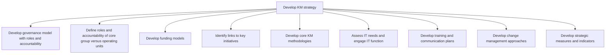
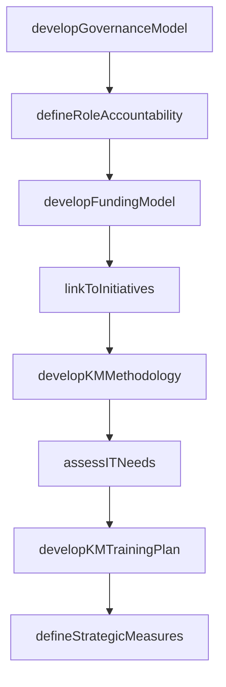

# Develop KM strategy

> Business-as-Code definition for knowledge management strategy development. Models the creation of KM governance, funding models, methodology selection, IT alignment, training plans, and strategic performance indicators.

## Overview

Creating a plan for managing the organization's knowledge base. Determine what kind of specialized knowledge the organization possesses, which elements of this collective knowledge can prove beneficial, how to capture and maintain this knowledge, how to grant access to this library of information, and how the organization should proceed.

## Process Hierarchy



## GraphDL

```yaml
develop:
  object: KM Strategy
  actor: KMDirector
  result: KMStrategyDocument
```

## Actions

| Action | Description |
|--------|-------------|
| developGovernanceModel | Define KM governance structure with roles, accountability, and decision rights |
| defineRoleAccountability | Clarify responsibilities between the core KM group and operating units |
| developFundingModel | Design sustainable funding approaches for KM initiatives |
| linkToInitiatives | Map KM strategy connections to other strategic business initiatives |
| developKMMethodology | Create core KM methodologies including capture, transfer, and reuse processes |
| assessITNeeds | Evaluate technology requirements and engage IT for platform support |
| developKMTrainingPlan | Create training and communication plans for KM rollout |
| defineStrategicMeasures | Establish KPIs and indicators for tracking KM strategy effectiveness |

## Events

| Event | Description |
|-------|-------------|
| governanceModelDeveloped | KM governance structure with roles and accountability approved |
| roleAccountabilityDefined | Core group and operating unit responsibilities clarified |
| fundingModelDeveloped | KM funding approach approved by finance |
| initiativesLinked | KM strategy aligned with other strategic business programs |
| kmMethodologyDeveloped | Core KM methodologies documented and approved |
| itNeedsAssessed | Technology requirements evaluated and IT engagement confirmed |
| kmTrainingPlanDeveloped | KM training and communication plans finalized |
| strategicMeasuresDefined | KM performance indicators baselined |

## Searches

| Search | Description |
|--------|-------------|
| getKMStrategy | Retrieve the current KM strategy document and governance framework |
| findKMInitiativeLinks | List connections between KM strategy and other business initiatives |
| getKMFundingModel | Retrieve the approved funding model for KM operations |
| getKMStrategicMeasures | Retrieve KM strategic KPIs and their current values |

## Process Flow



## RACI Matrix

| Activity | Responsible | Accountable | Consulted | Informed |
|----------|-------------|-------------|-----------|----------|
| developGovernanceModel | KMDirector | CKO | ExecutiveLeadership | HR |
| developFundingModel | KMDirector | CFO | Finance | BusinessUnitLeads |
| developKMMethodology | KMArchitect | KMDirector | SubjectMatterExperts | IT |
| defineStrategicMeasures | KMAnalyst | KMDirector | Analytics | Board |

## Sub-Processes

| ID | Name | Description |
|----|------|-------------|
| 13.5.1.1 | Develop governance model with roles and accountability | Developing a structure for the governance of the organization's collective knowledge. Gather, mainta |
| 13.5.1.2 | Define roles and accountability of core group versus operating units | Clearly determining the roles and responsibilities of all personnel involved in the management of th |
| 13.5.1.3 | Develop funding models | Analyze the organization's current approach to funding. Learn from the funding approaches of peer or |
| 13.5.1.4 | Identify links to key initiatives | Identifying any links that exist between the strategy for knowledge management and any other functio |
| 13.5.1.5 | Develop core KM methodologies | Creating core knowledge management procedures and methodologies. Initiate developing a strategy, pla |
| 13.5.1.6 | Assess IT needs and engage IT function | Determining the IT needs for developing the knowledge management strategy, and collaborating with th |
| 13.5.1.7 | Develop training and communication plans | Creating plans for KM training plans and conveying the knowledge management strategy within the orga |
| 13.5.1.8 | Develop change management approaches | Creating approaches for effectively administering the changes in knowledge management. Design an app |
| 13.5.1.9 | Develop strategic measures and indicators | Establishing measures and indicators for evaluating the performance of the knowledge management func |

## Related Processes

| Process | Relationship |
|---------|-------------|
| 13.5.2 Assess KM capabilities | Downstream - strategy guides capability assessment criteria |
| 13.5.3 Design and implement KM capabilities | Downstream - strategy defines what capabilities to build |
| 13.4 Manage change | Parallel - KM strategy deployment requires change management |

## Related Departments

| Department | Role |
|-----------|------|
| Knowledge Management | Primary owner of strategy development |
| Information Technology | Provides platform and integration assessment |
| Finance | Approves funding models and budget allocation |
| Human Resources | Supports KM role definitions and training programs |

## Related Occupations

| Occupation | Involvement |
|-----------|-------------|
| KM Director | Leads strategy development and governance design |
| KM Architect | Designs core methodologies and taxonomy frameworks |
| IT Business Partner | Evaluates technology needs and platform options |

## KPIs

| KPI | Description | Unit |
|-----|-------------|------|
| Strategy Alignment Score | Degree to which KM strategy aligns with enterprise objectives | Score (1-5) |
| Governance Maturity | KM governance maturity level across the organization | Level (1-5) |
| Funding Utilization | Percentage of allocated KM budget effectively deployed | % |
| Initiative Linkage | Number of strategic initiatives with active KM integration | Count |

## Usage

```typescript
import { developKMStrategy } from '@headlessly/develop-km-strategy'

const strategy = developKMStrategy()

// Develop the KM governance model
const governance = await strategy.developGovernanceModel({
  structure: 'federated',
  coreTeamSize: 5,
  operatingUnitRepresentatives: ['engineering', 'sales', 'operations', 'finance'],
  decisionFramework: 'RACI'
})

// Link KM strategy to business initiatives
const links = await strategy.linkToInitiatives({
  initiatives: ['digital-transformation', 'employee-onboarding', 'innovation-pipeline'],
  alignmentCriteria: 'knowledge-dependency'
})
```
