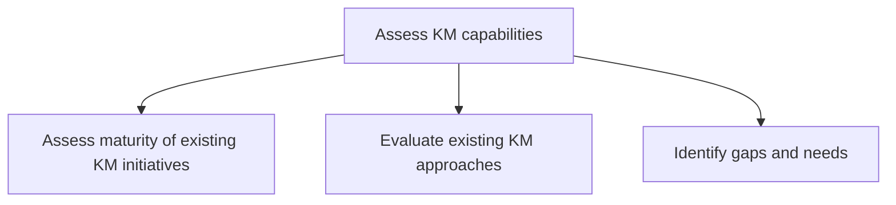
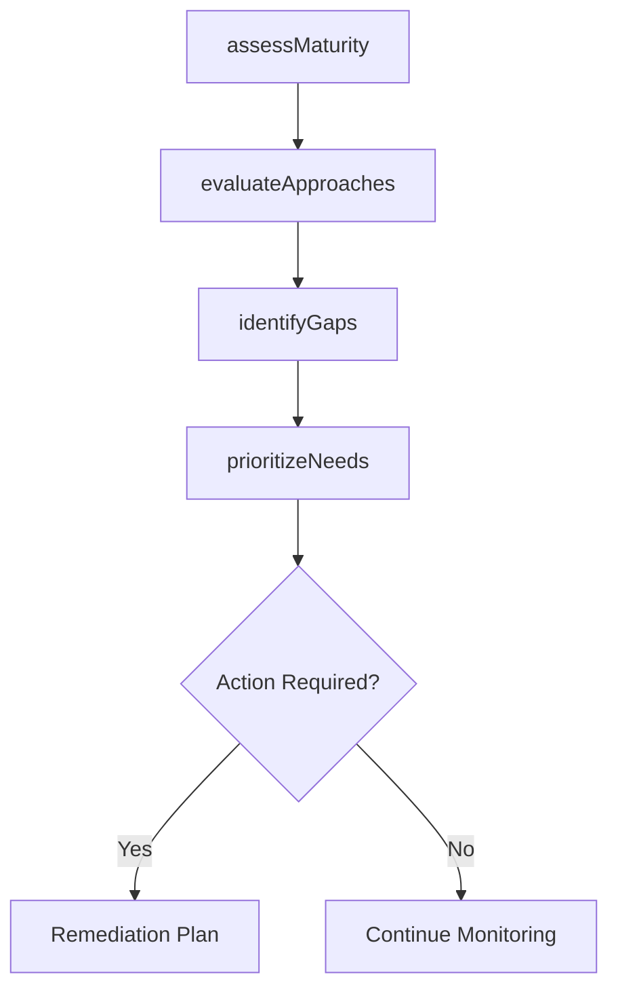

# Assess KM capabilities

> Business-as-Code definition for KM capability assessment. Models the evaluation of existing KM initiative maturity, review of current approaches, and identification of gaps and needs for improvement.

## Overview

Assessing the maturity of the existing initiatives in knowledge management, and evaluating existing KM approaches. Identify the gaps and needs in order to enhance the existing KM approaches. Develop and implement new KM approaches.

## Process Hierarchy



## GraphDL

```yaml
assess:
  object: KM Capabilities
  actor: KMAnalyst
  result: KMCapabilityAssessment
```

## Actions

| Action | Description |
|--------|-------------|
| assessMaturity | Evaluate the maturity level of existing KM initiatives against a framework |
| evaluateApproaches | Review current KM policies, procedures, and tools for effectiveness |
| identifyGaps | Compare current KM capabilities against organizational needs to find gaps |
| prioritizeNeeds | Rank identified gaps by business impact and feasibility of remediation |

## Events

| Event | Description |
|-------|-------------|
| maturityAssessed | KM maturity assessment completed with scores by dimension |
| approachesEvaluated | Existing KM approaches reviewed with findings documented |
| gapsIdentified | KM capability gaps documented with impact analysis |
| needsPrioritized | Gap remediation priorities established |

## Searches

| Search | Description |
|--------|-------------|
| getMaturityScores | Retrieve KM maturity scores by business unit or initiative |
| findKMGaps | List identified KM capability gaps by priority or domain |
| getApproachEvaluations | Retrieve evaluation results for current KM approaches |

## Process Flow



## RACI Matrix

| Activity | Responsible | Accountable | Consulted | Informed |
|----------|-------------|-------------|-----------|----------|
| assessMaturity | KMAnalyst | KMDirector | BusinessUnitLeads | CKO |
| evaluateApproaches | KMAnalyst | KMDirector | IT | ProcessOwners |
| identifyGaps | KMAnalyst | KMDirector | SubjectMatterExperts | HR |

## Sub-Processes

| ID | Name | Description |
|----|------|-------------|
| 13.5.2.1 | Assess maturity of existing KM initiatives | Evaluating if initiatives are effective or should be discarded. Design a framework for assessing mat |
| 13.5.2.2 | Evaluate existing KM approaches | Evaluating existing procedures, policies, and guidelines for knowledge management. Study and examine |
| 13.5.2.3 | Identify gaps and needs | Assessing the KM approach evaluations in order to identify any gaps or needs. Compare the performanc |

## Related Processes

| Process | Relationship |
|---------|-------------|
| 13.5.1 Develop KM strategy | Upstream - strategy defines the assessment criteria |
| 13.5.3 Design and implement KM capabilities | Downstream - gaps drive capability design priorities |

## Related Departments

| Department | Role |
|-----------|------|
| Knowledge Management | Primary owner of capability assessment |
| IT | Evaluates technology platform capabilities |
| Operations | Provides input on operational KM needs |

## Related Occupations

| Occupation | Involvement |
|-----------|-------------|
| KM Analyst | Conducts maturity assessments and gap analysis |
| KM Director | Approves assessment methodology and prioritization |

## KPIs

| KPI | Description | Unit |
|-----|-------------|------|
| Assessment Coverage | Percentage of business units assessed for KM maturity | % |
| Gap Identification Rate | Number of actionable gaps identified per assessment cycle | Count |
| Maturity Improvement Rate | Year-over-year change in KM maturity scores | Points |

## Usage

```typescript
import { assessKMCapabilities } from '@headlessly/assess-km-capabilities'

const assess = assessKMCapabilities()

// Assess KM maturity across the enterprise
const maturity = await assess.assessMaturity({
  framework: 'APQC-KM-Maturity',
  departments: ['engineering', 'sales', 'operations'],
  dimensions: ['people', 'process', 'technology', 'governance']
})

// Identify capability gaps
const gaps = await assess.identifyGaps({
  assessmentId: maturity.id,
  threshold: 'level-3-target'
})
```
