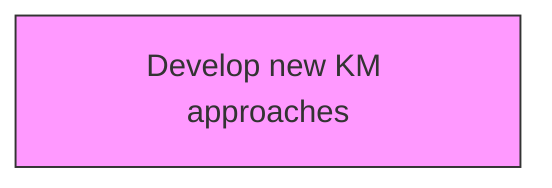
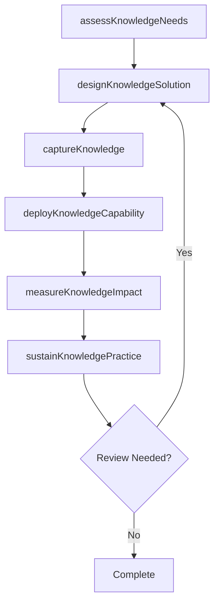

# Develop new KM approaches

> Business-as-Code definition for develop new km approaches. Models the process of designing new policies, procedures, and guidelines to support knowledge management.

## Overview

Designing new policies, procedures, and guidelines to support knowledge management.

## Process Hierarchy



## GraphDL

```yaml
develop:
  object: New KM Approaches
  actor: KnowledgeManager
  result: KmApproachDesign
```

## Actions

| Action | Description |
|--------|-------------|
| assessKnowledgeNeeds | Evaluate knowledge requirements for new km approaches |
| designKnowledgeSolution | Create the approach and design for new km approaches |
| captureKnowledge | Collect and codify knowledge assets for new km approaches |
| deployKnowledgeCapability | Roll out knowledge capabilities for new km approaches |
| measureKnowledgeImpact | Assess the value and impact of new km approaches |
| sustainKnowledgePractice | Maintain and evolve new km approaches over time |

## Events

| Event | Description |
|-------|-------------|
| knowledgeNeedsAssessed | Knowledge gaps and requirements identified across the organization |
| knowledgeSolutionDesigned | New KM approach architecture and design finalized |
| knowledgeCaptured | Critical knowledge assets collected and codified |
| knowledgeCapabilityDeployed | KM capabilities rolled out to target user groups |
| knowledgeImpactMeasured | Value and adoption metrics for KM approach evaluated |
| knowledgePracticeSustained | KM approach updated and maintained for ongoing relevance |

## Searches

| Search | Description |
|--------|-------------|
| findKmApproaches | List KM approaches filtered by domain, maturity level, or deployment status |
| getKnowledgeGaps | Retrieve identified knowledge gaps by business unit or function |
| getKmAdoptionMetrics | Access adoption and engagement metrics for deployed KM approaches |
| getKmApproachHistory | Query the evolution and version history of a specific KM approach |

## Process Flow



## RACI Matrix

| Activity | Responsible | Accountable | Consulted | Informed |
|----------|-------------|-------------|-----------|----------|
| assessKnowledgeNeeds | KnowledgeManager | KMStrategist | BusinessUnitLeads | Stakeholders |
| designKnowledgeSolution | ContentCurator | KnowledgeManager | SubjectMatterExperts | Stakeholders |
| captureKnowledge | KMStrategist | ChiefKnowledgeOfficer | ITArchitecture | Stakeholders |
| deployKnowledgeCapability | KnowledgeManager | KMStrategist | LearningDevelopment | Stakeholders |

## Related Processes

| Process | Relationship |
|---------|-------------|
| 13.5.1 Develop KM strategy | Upstream - strategy guides KM capability development |
| 13.5.2 Assess KM capabilities | Parallel - assessment informs capability design |
| 13.5.3 Design and implement KM capabilities | Downstream - capabilities are designed and deployed |

## Related Departments

| Department | Role |
|-----------|------|
| Knowledge Management | Primary owner of KM strategy and operations |
| IT | Provides KM platforms and technology infrastructure |
| Human Resources | Integrates KM with learning and development programs |
| Operations | Contributes and consumes operational knowledge assets |

## Related Occupations

| Occupation | Involvement |
|-----------|-------------|
| Knowledge Manager | Leads KM strategy and program delivery |
| KM Strategist | Designs KM approaches and governance models |
| Content Curator | Manages knowledge repositories and content quality |

## KPIs

| KPI | Description | Unit |
|-----|-------------|------|
| Knowledge Reuse Rate | Frequency of knowledge asset reuse across the organization | % |
| Knowledge Capture Rate | Percentage of critical knowledge formally captured | % |
| Time to Find Knowledge | Average time for employees to locate needed knowledge | Minutes |
| KM Engagement Rate | Percentage of employees actively contributing to KM | % |

## Usage

```typescript
import { developNewKmApproaches } from '@headlessly/develop-new-km-approaches'

const km = developNewKmApproaches()

// Assess knowledge needs across engineering teams
const needs = await km.assessKnowledgeNeeds({
  scope: 'Engineering',
  domains: ['incident-response', 'architecture-decisions', 'onboarding'],
  methodology: 'knowledge-audit'
})

// Design a knowledge solution for the highest-priority gap
const solution = await km.designKnowledgeSolution({
  needsAssessmentId: needs.id,
  approachType: 'community-of-practice',
  platform: 'confluence-wiki',
  governanceModel: 'federated'
})

// Deploy the knowledge capability
const deployment = await km.deployKnowledgeCapability({
  solutionId: solution.id,
  pilotGroup: 'engineering-platform-team',
  rolloutPhases: ['pilot', 'early-adopters', 'general-availability'],
  trainingRequired: true
})
```
