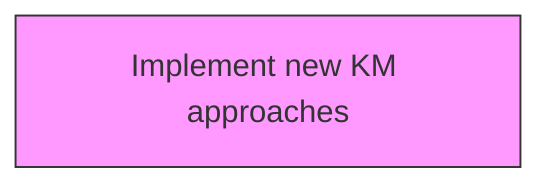
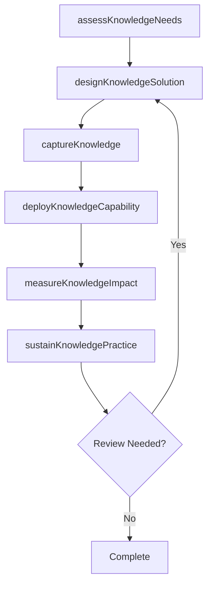

# Implement new KM approaches

> Business-as-Code definition for implement new km approaches. Models the process of implementing new policies, procedures, and guidelines to support knowledge management.

## Overview

Implementing new policies, procedures, and guidelines to support knowledge management across the enterprise. This includes deploying new knowledge sharing platforms, communities of practice, taxonomies, and content governance frameworks. The process covers pilot testing of KM approaches with select business units, training knowledge contributors and consumers, integrating KM tools with existing workflows, and establishing feedback mechanisms to refine the approach before full-scale rollout.

## Process Hierarchy



## GraphDL

```yaml
implement:
  object: New KM Approaches
  actor: KnowledgeManager
  result: newKmApproachesResult
```

## Actions

| Action | Description |
|--------|-------------|
| assessKnowledgeNeeds | Evaluate knowledge requirements for new km approaches |
| designKnowledgeSolution | Create the approach and design for new km approaches |
| captureKnowledge | Collect and codify knowledge assets for new km approaches |
| deployKnowledgeCapability | Roll out knowledge capabilities for new km approaches |
| measureKnowledgeImpact | Assess the value and impact of new km approaches |
| sustainKnowledgePractice | Maintain and evolve new km approaches over time |

## Events

| Event | Description |
|-------|-------------|
| knowledgeNeedsAssessed | Knowledge requirements for the new KM approach evaluated |
| knowledgeSolutionDesigned | KM approach design and architecture completed |
| knowledgeCaptured | Knowledge assets collected, codified, and stored |
| knowledgeCapabilityDeployed | New KM capabilities rolled out to target user groups |
| knowledgeImpactMeasured | Value and impact of the KM approach assessed with metrics |
| knowledgePracticeSustained | KM approach maintenance and evolution plan established |

## Searches

| Search | Description |
|--------|-------------|
| findNewKmApproaches | Retrieve new km approaches records filtered by status, date, or scope |
| getNewKmApproachesDetails | Get detailed information for a specific new km approaches record |
| listNewKmApproachesHistory | Query the history of changes and updates to new km approaches |
| getActiveItems | List currently active items related to new km approaches |

## Process Flow



## RACI Matrix

| Activity | Responsible | Accountable | Consulted | Informed |
|----------|-------------|-------------|-----------|----------|
| assessKnowledgeNeeds | KnowledgeManager | KMStrategist | BusinessUnitLeads | Stakeholders |
| designKnowledgeSolution | ContentCurator | KnowledgeManager | SubjectMatterExperts | Stakeholders |
| captureKnowledge | KMStrategist | ChiefKnowledgeOfficer | ITArchitecture | Stakeholders |
| deployKnowledgeCapability | KnowledgeManager | KMStrategist | LearningDevelopment | Stakeholders |

## Related Processes

| Process | Relationship |
|---------|-------------|
| 13.5.1 Develop KM strategy | Upstream - strategy guides KM capability development |
| 13.5.2 Assess KM capabilities | Parallel - assessment informs capability design |
| 13.5.3 Design and implement KM capabilities | Downstream - capabilities are designed and deployed |

## Related Departments

| Department | Role |
|-----------|------|
| Knowledge Management | Primary owner of KM strategy and operations |
| IT | Provides KM platforms and technology infrastructure |
| Human Resources | Integrates KM with learning and development programs |
| Operations | Contributes and consumes operational knowledge assets |

## Related Occupations

| Occupation | Involvement |
|-----------|-------------|
| Knowledge Manager | Leads KM strategy and program delivery |
| KM Strategist | Designs KM approaches and governance models |
| Content Curator | Manages knowledge repositories and content quality |

## KPIs

| KPI | Description | Unit |
|-----|-------------|------|
| Knowledge Reuse Rate | Frequency of knowledge asset reuse across the organization | % |
| Knowledge Capture Rate | Percentage of critical knowledge formally captured | % |
| Time to Find Knowledge | Average time for employees to locate needed knowledge | Minutes |
| KM Engagement Rate | Percentage of employees actively contributing to KM | % |

## Usage

```typescript
import { implementNewKmApproaches } from '@headlessly/implement-new-km-approaches'

const client = implementNewKmApproaches()

// Evaluate knowledge requirements for new km approaches
const result = await client.assessKnowledgeNeeds({
  scope: 'enterprise',
  period: 'Q1-2025'
})

// Create the approach and design for new km approaches
const assessment = await client.designKnowledgeSolution({
  resultId: result.id,
  criteria: 'standard'
})

// Collect and codify knowledge assets for new km approaches
await client.captureKnowledge({
  resultId: result.id,
  format: 'detailed',
  recipients: ['stakeholders']
})
```
